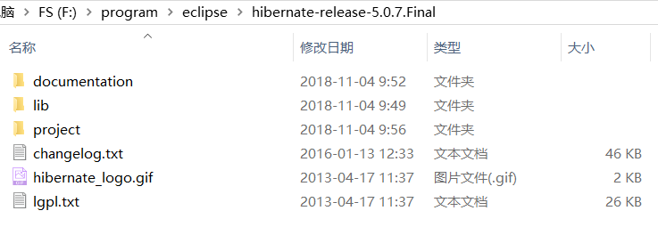
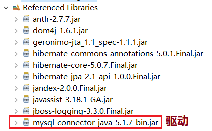
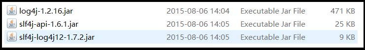
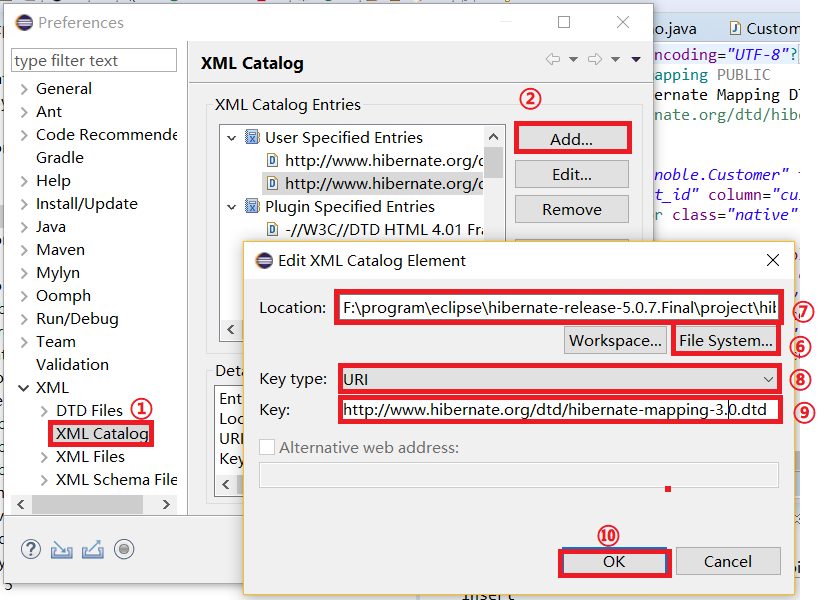

# hibernate框架搭建

## 1.Hibernate简介
``Hibernate``框架是当今主流的``Java``持久层框架之一，由于它具有简单易学、灵活性强、扩展性强等特点，能大大简化程序代码量，提高工作效率。<br>
``Hibernate``是一个开源的``ORM``(``Object Relational Mapping`` 对象关系映射)框架，它对``JDBC``进行了轻量级的对象封装，使得``Java``开发人员可以使用面向对象的编程思想来操作数据库。<br>

所谓ORM就是利用描述对象和数据库之间映射的元数据，自动把``Java``应用程序中的对象，持久化到关系型数据库的表中。通过操作``Java``对象，就可以完成对数据库表的操作。可以把``ORM``理解为关系型数据和对象的纽带，开发人员只需要关注纽带一端映射的对象即可。<br>

``Hibernate``是对``JDBC``的轻量级保障，它的优势在于开源，当本身功能不够用时，可以自行编码进行扩展。<br>

## 2.Hibernate搭建实例

### 1.下载hibernate5
[https://sourceforge.net/projects/hibernate/files/hibernate-orm/5.3.7.Final/](https://sourceforge.net/projects/hibernate/files/hibernate-orm/5.3.7.Final/)<br>
我们以``hibernate5.0.7``为例。<br>
下载后解压其目录结构如下：<br>
<br>
- documentation:存放Hibernate的帮助文档
- lib：存放Hibernate编译和运行所依赖的JAR包。子目录require下包含了运行Hibernate5项目必须的jar包
- project：存放Hibernate各种相关的源代码

### 2.创建数据库和表
我们提前在数据库内创建好库和表。<br>
```sql
CREATE TABLE `cst_customer` (
  `cust_id` BIGINT(32) NOT NULL AUTO_INCREMENT COMMENT '客户编号(主键)',
  `cust_name` VARCHAR(32) NOT NULL COMMENT '客户名称(公司名称)',
  `cust_user_id` BIGINT(32) DEFAULT NULL COMMENT '负责人id',
  `cust_create_id` BIGINT(32) DEFAULT NULL COMMENT '创建人id',
  `cust_source` VARCHAR(32) DEFAULT NULL COMMENT '客户信息来源',
  `cust_industry` VARCHAR(32) DEFAULT NULL COMMENT '客户所属行业',
  `cust_level` VARCHAR(32) DEFAULT NULL COMMENT '客户级别',
  `cust_linkman` VARCHAR(64) DEFAULT NULL COMMENT '联系人',
  `cust_phone` VARCHAR(64) DEFAULT NULL COMMENT '固定电话',
  `cust_mobile` VARCHAR(16) DEFAULT NULL COMMENT '移动电话',
  PRIMARY KEY (`cust_id`)
) ENGINE=INNODB AUTO_INCREMENT=1 DEFAULT CHARSET=utf8;
```

### 3.导入Hibernate的开发包
我们需要导入Hibernate的开发包和数据库的驱动包。<br>
<br>
还有何日志有关的包：<br>
<br>

### 4.创建实体(持久化类)
持久化类是应用程序中的业务实体类，这里的持久化是指类的对象能够被持久化的保存到数据库中。``Hibernate``使用普通``Java``对象(``Plain Old Java Object``),及``POJO``的编程模式来进行持久化。``POJO``类中包含的是与数据库表相对应的各个属性，这些属性通过getter和setter方法访问，对外部隐藏了内部实现细节。下面就来编写Customer持久化类。<br>

在项目``src``目录下，创建``com.noble.domain``包，并在包中创建实体类Customer(对应数据库表``cst_customer``)，``Customer``类包含于``cst_customer``数据表字段相对应的属性，以及相应的``getXxx()``和``setXxx()``方法。<br>

```java
package com.noble;

public class Customer {
	/*
	 * CREATE TABLE `cst_customer` (
	  `cust_id` BIGINT(32) NOT NULL AUTO_INCREMENT COMMENT '客户编号(主键)',
	  `cust_name` VARCHAR(32) NOT NULL COMMENT '客户名称(公司名称)',
	  `cust_source` VARCHAR(32) DEFAULT NULL COMMENT '客户信息来源',
	  `cust_industry` VARCHAR(32) DEFAULT NULL COMMENT '客户所属行业',
	  `cust_level` VARCHAR(32) DEFAULT NULL COMMENT '客户级别',
	  `cust_linkman` VARCHAR(64) DEFAULT NULL COMMENT '联系人',
	  `cust_phone` VARCHAR(64) DEFAULT NULL COMMENT '固定电话',
	  `cust_mobile` VARCHAR(16) DEFAULT NULL COMMENT '移动电话',
	  PRIMARY KEY (`cust_id`)
	) ENGINE=INNODB AUTO_INCREMENT=1 DEFAULT CHARSET=utf8;
	 */
	private Long cust_id;
	private String cust_name;
	private String cust_source;
	private String cust_industry;
	private String cust_level;
	private String cust_linkman;
	private String cust_phone;
	private String cust_mobile;
	public Long getCust_id() {
		return cust_id;
	}
	public void setCust_id(Long cust_id) {
		this.cust_id = cust_id;
	}
	public String getCust_name() {
		return cust_name;
	}
	public void setCust_name(String cust_name) {
		this.cust_name = cust_name;
	}
	public String getCust_source() {
		return cust_source;
	}
	public void setCust_source(String cust_source) {
		this.cust_source = cust_source;
	}
	public String getCust_industry() {
		return cust_industry;
	}
	public void setCust_industry(String cust_industry) {
		this.cust_industry = cust_industry;
	}
	public String getCust_level() {
		return cust_level;
	}
	public void setCust_level(String cust_level) {
		this.cust_level = cust_level;
	}
	public String getCust_linkman() {
		return cust_linkman;
	}
	public void setCust_linkman(String cust_linkman) {
		this.cust_linkman = cust_linkman;
	}
	public String getCust_phone() {
		return cust_phone;
	}
	public void setCust_phone(String cust_phone) {
		this.cust_phone = cust_phone;
	}
	public String getCust_mobile() {
		return cust_mobile;
	}
	public void setCust_mobile(String cust_mobile) {
		this.cust_mobile = cust_mobile;
	}

	@Override
	public String toString() {
		return "Customer [cust_id=" + cust_id + ", cust_name=" + cust_name + ", cust_source=" + cust_source
				+ ", cust_industry=" + cust_industry + ", cust_level=" + cust_level + ", cust_linkman=" + cust_linkman
				+ ", cust_phone=" + cust_phone + ", cust_mobile=" + cust_mobile + "]";
	}
}
```

### 5.创建映射文件
实体类``Customer``目前还不具备持久化操作的能力，``Hibernate``需要知道实体类``Customer``映射到数据库``Hibernate``中的那个表，以及类中的哪个属性对应数据表中哪个字段，这些都需要在映射文件中配置。<br>
在实体类``Customer``所在的包中，创建一个名称为``Customer.hbm.xml``的映射文件，在该文件中定义了实体类``Customer``的属性是如何映射到``cst_customer``表的列上的。<br>

在编写xml文件前我们现在eclipse上添加dtd文件约束：<br>
``eclipse->Window->Preferece``<br>
<br>
其中Location 填写本地hibernate-mapping-3.0.dtd文件的路径。
它在``hibernate-release-5.0.7.Final\project\hibernate-core\src\main\resources\org\hibernate``中。<br>
Key 填写上述文件中内容的<!DOCTYPE 标签的URL属性值。<br>

Customer.hbm.xml内容如下：<br>
```xml
<?xml version="1.0" encoding="UTF-8"?>
<!DOCTYPE hibernate-mapping PUBLIC
    "-//Hibernate/Hibernate Mapping DTD 3.0//EN"
    "http://www.hibernate.org/dtd/hibernate-mapping-3.0.dtd">

<hibernate-mapping>
	<class name="com.noble.Customer" table="cst_customer">
		<id name="cust_id" column="cust_id">
			<generator class="native"></generator>
		</id>
		<property name="cust_name" column="cust_name"></property>
		<property name="cust_source" column="cust_source"></property>
		<property name="cust_industry" column="cust_industry"></property>
		<property name="cust_level" column="cust_level"></property>
		<property name="cust_linkman" column="cust_linkman"></property>
		<property name="cust_phone" column="cust_phone"></property>
		<property name="cust_mobile" column="cust_mobile"></property>

	</class>
</hibernate-mapping>
```

### 6.创建Hibernate的核心配置文件
``Hibernate``的映射文件反映了持久化和数据库表的映射信息，而``Hibernate``的配置文件则主要用来配置数据库连接以及``Hibernate``运行时所需要的各个属性值。在项目``src``下创建一个名称为``hibernate.cfg.xml``的文件。<br>

在编写该文件前我们同样需要导入``DTD``约束文件``hibernate-configuration-3.0.dtd``。其目录和``hibernate-mapping-3.0.dtd``在同一个地方。导入方法相同。<br>

``hibernate.cfg.xml``文件的内容如下：<br>

```xml
<?xml version="1.0" encoding="UTF-8"?>
<!DOCTYPE hibernate-configuration PUBLIC
	"-//Hibernate/Hibernate Configuration DTD 3.0//EN"
	"http://www.hibernate.org/dtd/hibernate-configuration-3.0.dtd">
<hibernate-configuration>
	<session-factory>
	<!--
	#hibernate.dialect org.hibernate.dialect.MySQLDialect
	#hibernate.dialect org.hibernate.dialect.MySQLInnoDBDialect
	#hibernate.dialect org.hibernate.dialect.MySQLMyISAMDialect
	#hibernate.connection.driver_class com.mysql.jdbc.Driver
	#hibernate.connection.url jdbc:mysql:///test
	#hibernate.connection.username gavin
	#hibernate.connection.password
	 -->
	 	<property name="hibernate.dialect">org.hibernate.dialect.MySQLMyISAMDialect</property>
		<property name="hibernate.connection.driver_class">com.mysql.jdbc.Driver</property>
		<property name="hibernate.connection.url">jdbc:mysql://10.0.0.21/noble</property>
		<property name="hibernate.connection.username">root</property>
		<property name="hibernate.connection.password">123456</property>

	<!--
		#hibernate.show_sql true
		#hibernate.format_sql true
	 -->
		<property name="hibernate.show_sql">true</property>
		<property name="hibernate.format_sql">true</property>
	<!--
		## auto schema export

		#hibernate.hbm2ddl.auto create-drop
		#hibernate.hbm2ddl.auto create
		#hibernate.hbm2ddl.auto update
		#hibernate.hbm2ddl.auto validate
	 -->
		<property name="hibernate.hbm2ddl.auto">update</property>

		<mapping resource="com/noble/Customer.hbm.xml"/>
	</session-factory>
</hibernate-configuration>
```
该配置文件设置了数据库连接的相关信息和常用属性，并通过``mapping``的``resource``属性将对象的映射信息加入到了``HIbernate``的配置文件中。<br>

### 7.编写测试代码
在``src``下新建一个``com.noble.test``的包。然后建一个``Demo.java``文件，来写测试程序。<br>
```java
package com.noble.test;


import org.hibernate.Session;
import org.hibernate.SessionFactory;
import org.hibernate.Transaction;
import org.hibernate.cfg.Configuration;
import org.junit.jupiter.api.Test;

import com.noble.Customer;

public class Demo {
	@Test
	public void fun1() {
		Configuration conf = new Configuration().configure();

		SessionFactory sessionFactory = conf.buildSessionFactory();

		Session session = sessionFactory.openSession();

		Transaction tx = session.beginTransaction();
		//----------------------------------------------
		Customer c = new Customer();
		c.setCust_name("google公司");

		session.save(c);//执行保存

		//----------------------------------------------
		tx.commit();
		session.close();
		sessionFactory.close();
	}
}
```

首先创建``Configuration``类的实例，并通过它来读取并解析配置文件``hibernate.cfg.xml``。然后创建``SessionFactory``读取解析映射文件信息，并将``Configuration``对象中的所有配置信息拷贝到``SessionFactory``内存中。接下来，打开``Session``，让``SessionFactory``提供连接，并开启一个事务，之后创建对象，并向对象添加数据，通过``session.save()``方法完成数据库中保存数据操作。最后提交事务，并关闭资源。<br>``


#
