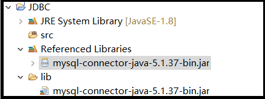

# JDBC介绍和使用

## 1.JDBC的简介
JDBC（Java Data Base Connectivity,java数据库连接）是一种用于执行SQL语句的Java API，可以为多种关系数据库提供统一访问，它由一组用Java语言编写的类和接口组成。是Java访问数据库的标准规范 
JDBC提供了一种基准,据此可以构建更高级的工具和接口，使数据库开发人员能够编写数据库应用程序。 
JDBC需要连接驱动，驱动是两个设备要进行通信，满足一定通信数据格式，数据格式由设备提供商规定，设备提供商为设备提供驱动软件，通过软件可以与该设备进行通信。 

## 2.JDBC的一般使用步骤
- 1.注册驱动
- 2.获得连接
- 3.获得语句执行平台
- 4.执行sql语句
- 5.处理结果
- 6.释放资源

### 1.导入jar包
在实例演示中使用的是``mysql-connector-java-5.1.37-bin.jar`` 
 

#
