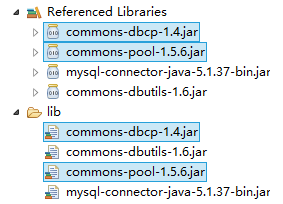

# Java数据库连接池
java中数据库连接池是由第三方实现的，为了规范连接池的使用，sun公司设计了连接池的接口：<br>
``javax.sql.DataSource``<br>

## 1.DBCP连接池
DBCP也是一个开源的连接池，是Apache Common成员之一，在企业开发中也比较常见，tomcat内置的连接池<br>

### 1.导入jar包
<br>

### 2.DBCP基本使用
通过查看API文档，可以发现DBCP具体类BasicDataSource实现了java中的DataSource接口。<br>
我们使用具体的连接池BasicDataSource类。<br>

**BasicDataSource常见配置项**<br>

| 分类 | 属性 | 描述 |
|-----|------|------|
| 必须项  | driverClassName  | 数据库驱动名称  |
| 必须项  | url  | 数据库的地址  |
| 必须项  | username  | 用户名  |
| 必须项  | password  | 密码  |
| 扩展项  | maxActive  | 最大连接数量  |
| 扩展项  | minldle  | 最小空闲连接  |
| 扩展项  | maxldle  | 最大空闲连接  |
| 扩展项  | initialSize  | 初始化连接  |


```java
public class JDBCUtils{
  public static final String DRIVER = "com.mysql.jdbc.Driver";
  public static final String URL = "jdbc:mysql://10.0.0.21:3306/mydb";
  public static final String USERNAME = "root";
  public static final String PASSWORD = "123456";

  /*
  create connection pool
  */
  public static BasicDataSource dataSource = new BasicDataSource();

  static {
    dataSource.setDriverClassName(DRIVER);//要连接的数据库驱动
    dataSource.setUrl(URL);//数据库地址
    dataSource.setUsername(USERNAME);
    dataSource.setPassword(PASSWORD);
  }

  public static DataSource getDataSource() {
    return dataSource;
  }
}
```


#
