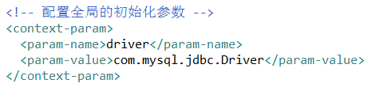
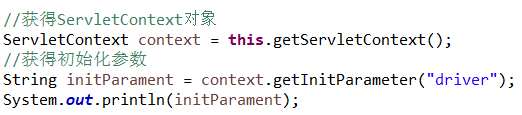

# ServletContext对象

## 1.ServletContext简介
ServletContext的作用：<br>
- 1.获得Web应用的全局初始化参数
- 2.获得web应用中任何资源的绝对路径

## 2.ServletContext使用方法
### 1.获得ServletContext对象
我们编写的函数一般会继承HttpServlet类，而HttpServlet类一般会继承GenericServlet类。在GenericServlet类中有getServletContext方法。基于此，我们完全可以使用下面这条语句获得ServletContext对象。<br>
```java
ServletContext servletContext =this.getServletContext();
```

### 2.获得Web应用的全局初始化参数
- web.xml中配置的初始化参数
  - 
- 通过ServletContext对象获得初始化参数
  - 

### 3.获得web应用中任何资源的绝对路径
这是非常重要的一件事，我们在开发中经常要通过ServletContext类获得文件的绝对路径。<br>
我们使用的方法是getRealPath()如下：<br>
```java
String javax.servlet.ServletContext.getRealPath(String path)
```
这个函数传递的参数是相对路径(相对于WebContent目录)<br>

**注意：** 特别的当我们要加载src目录(发布到Tomcat时是classes目录)下的资源时，我们可以使用类加载器。(这也是重要的)<br>
通常我们的写法是：<br>
```java
//使用加载ContextServ类的加载器去加载1.txt(相对路径的根路径是classes)
String path = ContextServlet.class.getClassLoader().getResource("1.txt").getPath();
```


#
