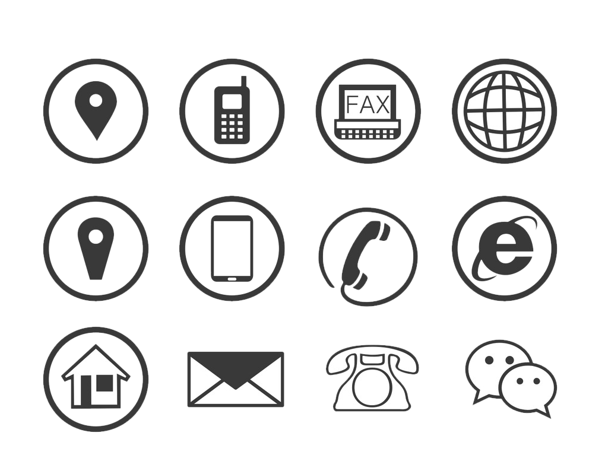

# CSS常用样式

## 1.CSS选择器扩展
### 1.1.伪类
根据伪类的性质,特别适合作为``<a>``标签的样式定制<br>
伪类有四种模式``:link``,``:hover``,``active``,``visited``.分别对应默认效果,鼠标悬停效果,激活(点击时)效果,点击后效果.<br>
```css
<style>
    a:link{
        color: lightblue;
    }
    a:hover{
        color: lightcoral;
    }
    a:active{
        color: lightgreen;
    }
    a:visited{
        color: lightgray;
    }
</style>
```

### 1.2.为元素
```css
::before
::after
```
对选中元素创建一个虚拟元素,``::before``在被选中元素之前创建一个虚拟元素,``::after``在后面创建.<br>
```css
<style>
    q::before {            /*p 是p标签*/
        content: "<<";     /*content 表示虚元素在页面上显示的内容*/
        color: lightgreen;
    }
    q::after {
        content: ">>";
        color: lightcoral;
    }
</style>
```

## 2.CSS样式

### 2.1.背景
```CSS
background           /*简写属性,作用是将背景属性设置在一个声明中*/
background-color     /*设置元素的背景颜色*/
background-image     /*把图片设置为背景*/
background-position  /*设置背景图像的起始位置*/
background-repeat    /*设置背景图像是否及如何重复*/
```
```css
<style>
    #p1 {
        background-color: lightcoral;
    }
    #p2 {
        background-image: url("imgs/...");
        width: 20px; /*设置p3的宽和高,来避免图片重复显示*/
        height: 20px;/*并没有去掉图片重复显示的属性,只是当前元素的显示区域刚好只能显示一个元素其他图片被隐藏了*/
    }
    #p3 {
        background-image: url("imgs/....");
        width: 16px;
        height: 16px;
        background-position: -64px -80px;
    }
</style>
```

<br>