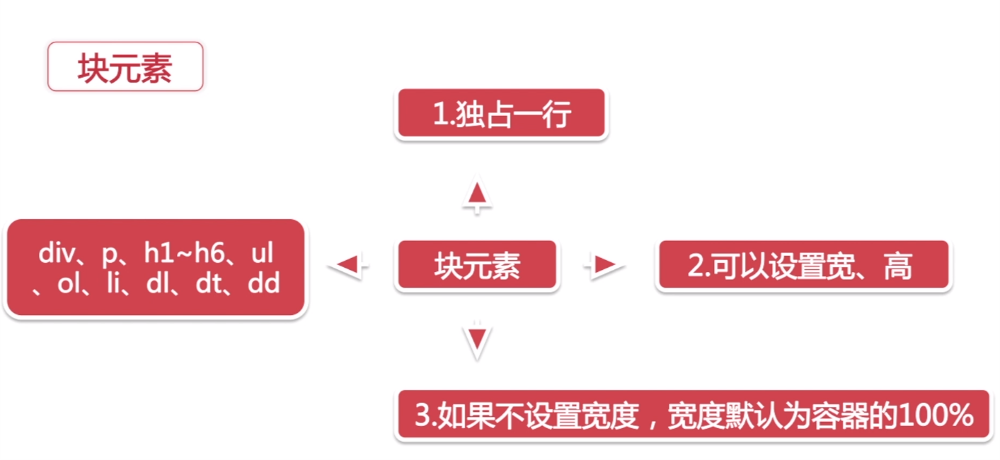
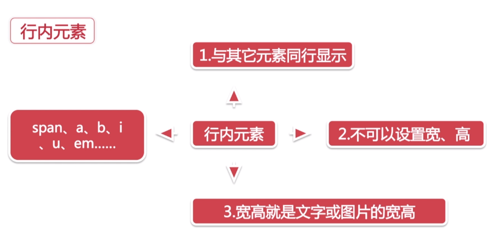

# CSS浮动

## 1.CSS定位机制

### 1.1.普通流(标准流)
默认状态,元素自动从左往右,从上往下排列.<br>

### 1.2.浮动

### 1.3.绝对定位

## 2.元素特征

### 2.1.块元素
<br>

### 2.2.行内元素
<br>

## 3.CSS Float(浮动)的基础知识
- 1.会使元素向左移或向右移,只能左右,不能上下.
- 2.浮动元素碰到包含框或另一个浮动框,浮动停止
- 3.浮动元素之后的元素将围绕它,之前的不受影响
- 4.浮动元素会脱离标准流

```css
float: left;
float: right;
float: none;
float: inherit; /* 继承上级标签的浮动 */
```

## 4.清除浮动
```css
clear: left;
clear: right;
clear: both;
clear: inherit;
```

### 4.1.清除浮动的常用方法
#### 4.1.1.方法一
```css
.clearfix:after{
    content:".";
    display:block;
    height:0;
    visibility:hidden;
    clear:both;
}
.clearfix{*zoom:1;/* 触发hasLayout兼容IE 6,7 */}
```
clearfix加到要被清除浮动的父级标签中<br>

#### 4.1.2.方法二
在父级元素添加:<br>
```css
overflow: hidden;
zoom:1;
```