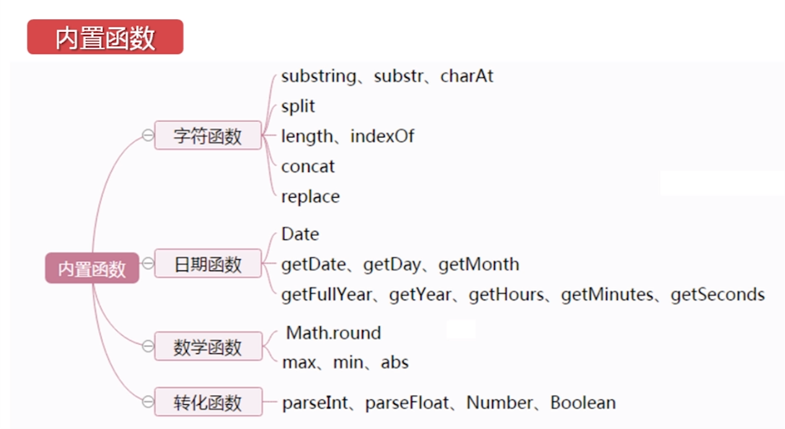

# JavaScript概述
Javascript是一种直译式的脚本语言.<br>

## 1.JS的介绍
ECMAScrpt: 核心部分,定义了Javascript的语法关键字等.<br>
DOM: document Object Model 文档对象模块,主要是用来管理页面的<br>
BOM: Browser Object Model 浏览器对象模型(前进,后退,页面刷新,地址栏,历史记录,屏幕宽高)<br>

### 1.1.调试
```js
alert();               /* 弹出提示框 */
console.log();         /* 在控制台输出 */
```

## 2.JS的语法
变量弱类型<br>
区分大小写<br>
语句结束之后的分号,可有可无<br>
JS代码写在script标签<br>

### 2.1.JS变量和数据类型
```js
var 变量名称=变量的值;
var 变量名;
```

- 基本类型
```js
string        /* 字符串类型,必须放在单引号或者双引号中 */
number        /* 数字类型,整型浮点型都包括 */
boolean       /* 布尔类型,只有true和false两种值 */
undefine      /* 未定义,一般指的是已经声明,但是没有赋值的变量 */
null          /* 空对象类型 (var a = null, 和var a = ""有区别) */
```

### 2.2.JS变量类型强制转换
```js
parseInt();
parseFloat();
Number();
Boolean();
```
**判断变量是否可以转换成数字:**<br>
```js
isNaN();   /* 可以转换时返回false */
```

### 2.2.JS函数
#### 2.2.1.自定义函数
自定义函数是完成某一功能的代码段,可重复执行,方便管理和维护.<br>
**创建方法:**<br>
```js
/* 创建方法1 */
function fun1(){
  代码片段
  return ***;
}

/* 创建方法2 */
var fun1=function(x){
  return x+1;
}
```

### 2.3.JS程序控制语句

#### 2.3.1.if-else判断
```js
if(Extension){
  Extension2
}else{
  Extension3
}
```

#### 2.3.2.switch-case语法
```js
switch(flag){
  case flag1:
    Extension1;
    break;
  case flag2:
    Extension2;
    break;
  default:
    Extension;
    break;
}
```

#### 2.3.3.循环语句
同java<br>

### 2.4.数组
**数组的创建:**<br>
```js
//声明或创建一个不指定长度的数组,又称为实例化创建:
var arrayObj = new Array();
//声明一个数组并指定长度:
var arrayObj = new Array(5);
//声明一个带有默认值的数组:
var arrayObj = new Array(1,2,"a",4);
//声明一个带有默认值的数组2:

```

## 3.内置函数
<br>

### 3.1.字符函数
```js
String.substr(a, b);     /* (起始位置,长度) */
String.substring(a, b);  /* (起始位置,介绍位置[a, b) */
String.charAt(n);       /* 获取第n个字符 */
String.length;          /* 返回字符串的长度 */
String.indexOf(c);      /* 查找c在第一次出现的下标 */
String.indexOf(c,n);      /* (从n开始)查找c在第一次出现的下标 */
String.split(" ");        /* 返回数组,将字符串以" "为分割线 */
String.concat(String,String,..); /* 字符串拼接 */
String[].concat(String,String,..);/* 数组扩展,将参数中的字符串当作新元素加入到原数组的结尾 */
String.replace(String1,String2); /* 替换匹配到的第一个子字符串String1为String2 */
```

### 3.2.日期函数
日期函数类似与对象处理<br>
```js
var d1 = new Date();                      /* 创建出一个时间对象d1,以当前时间为准 */
var d2 = new Date("2020-1-1 12:30:0");    /* 创建出一个时间对象d2,2020-1-1 12:30:0 */
d2.getDate();                             /* 返回今天是几号 */
d2.getMonth();                            /* 返回第几月(从0开始计算(如2月返回1)) */
d2.getFullYear();                         /* 返回第几年 */
d2.getHours();                            /* 获取小时 */
d2.getMinutes();                          /* 获取分钟 */
d2.getSeconds();                          /* 获取秒 */
```
获取两个时间差方法:<br>
```js
d2.getTime();                            /* 获取时间戳 */
var n=d2.getTime()-d1.getTime();         /* n是时间戳的差值 */
console.log(parseInt(n/(24*3600*1000))); /* 打印相差的天数 */
```

### 3.3.数学函数
```js
Math.round(n);            /* 四舍五入取整 */
Math.toFixed(n);          /* 四舍五入取n位小数 */
Math.min(1,2,3);          /* 返回1 */
Math.max(1,2,3);          /* 返回3 */
Math.abs(-3);             /* 绝对值(返回3) */
Math.random();            /* 返回随机数(0~1) */
```