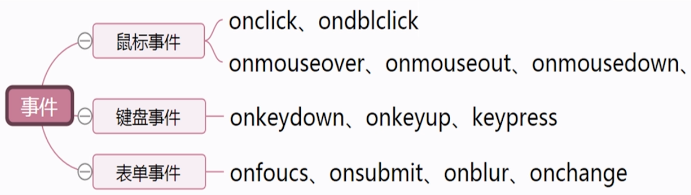
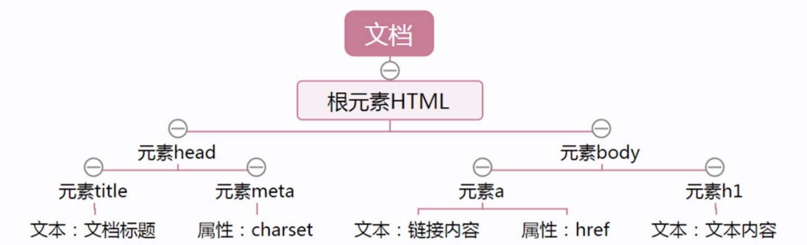

# js的常用功能

## 1.事件
在js中,事件表示什么时候发生,产生什么作用 

### 1.2.事件分类
 

## 2.文档对象模型DOM
**使每一个页面元素都是可操控的** 
 

### 2.1.常用的DOM操作

|方法|描述|
|---|----|
|getElementById|返回带有指定ID的元素|
|getElementsByTagName|返回包含带有指定标签名称的所有元素的节点列表|
|getElementsByClassName|返回包含带有指定类名的所有元素的节点列表|
|getElementsByName|获取相同名称(name)的元素的节点列表|