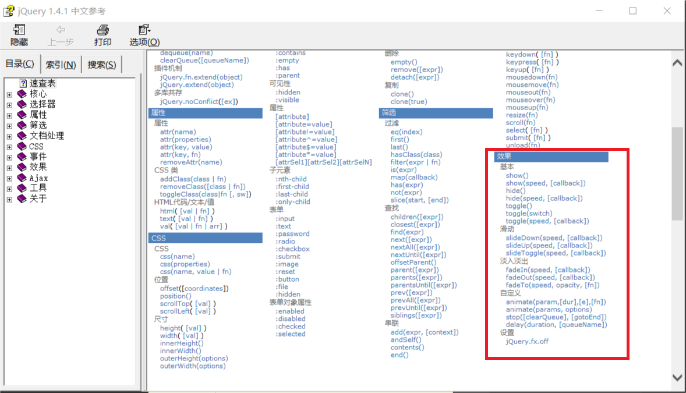
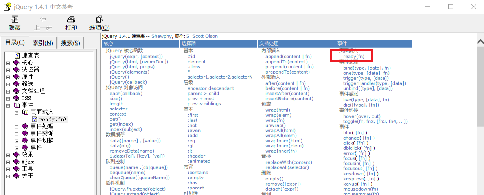

# jQuery效果
在帮助文档中我们可以找到相关信息:<br>
<br>

## 1.show和hide
显示或隐藏某个标签<br>
```html
<!DOCTYPE html>
<html>
	<head>
		<meta charset="utf-8" />
		<title></title>
		<script type="text/javascript" src="js/jquery-1.11.3.min.js"></script>
	</head>
	<body>
		<button id="btn1">隐藏</button>
		<button id="btn2">显示</button><br />
		
	</body>
	<script>
		//<!--
			//1.按钮绑定事件
			//2.执行相应的代码
		//-->
		$(function(){
			$("#btn1").click(function(){
				$("#img1").hide(1000);
			});
		});
		
		$(function(){
			$("#btn2").click(function(){
				$("#img1").show();
			});
		})
	</script>
</html>
```

## 2.slideDown和slideUp
这两个属性要特别注意一点: 目标对象必须要有足够的宽度(通常会使用width属性设置)
否则不能展现出slideDown和slideUp的效果<br>
```html
<!DOCTYPE html>
<html>
	<head>
		<meta charset="utf-8" />
		<title></title>
		<script type="text/javascript" src="js/jquery-1.11.3.min.js"></script>
	</head>
	<body>
		<button id="btn1">隐藏</button>
		<button id="btn2">显示</button><br />
		
	</body>
	<script>
		//<!--
			//1.按钮绑定事件
			//2.执行相应的代码
		//-->
		$(function(){
			$("#btn1").click(function(){
				$("#img1").slideDown();
			});
		});
		
		$(function(){
			$("#btn2").click(function(){
				$("#img1").slideUp();
			});
		})
	</script>
</html>
```

## 3.fadeIn和fadeOut
```html
<!DOCTYPE html>
<html>
	<head>
		<meta charset="utf-8" />
		<title></title>
		<script type="text/javascript" src="js/jquery-1.11.3.min.js"></script>
	</head>
	<body>
		<button id="btn1">隐藏</button>
		<button id="btn2">显示</button><br />
		
	</body>
	<script>
		//<!--
			//1.按钮绑定事件
			//2.执行相应的代码
		//-->
		$(function(){
			$("#btn1").click(function(){
				$("#img1").fadeOut(500);
			});
		});
		
		$(function(){
			$("#btn2").click(function(){
				$("#img1").fadeIn(500);
			});
		})
	</script>
</html>
```

## 4.自定义效果animate
```html
<!DOCTYPE html>
<html>
	<head>
		<meta charset="utf-8" />
		<title></title>
		<script type="text/javascript" src="js/jquery-1.11.3.min.js"></script>
	</head>
	<body>
		<button id="btn1">隐藏</button>
		<button id="btn2">显示</button><br />
		
	</body>
	<script>
		//<!--
			//1.按钮绑定事件
			//2.执行相应的代码
		//-->
		$(function(){
			$("#btn1").click(function(){
				$("#img1").animate({width:"200%",opacity:"0.2"},500);
			});
		});
		
		$(function(){
			$("#btn2").click(function(){
				$("#img1").animate({width:"100%",opacity:"1"});
			});
		})
	</script>
</html>
```