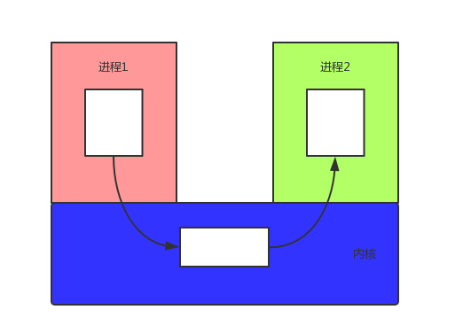
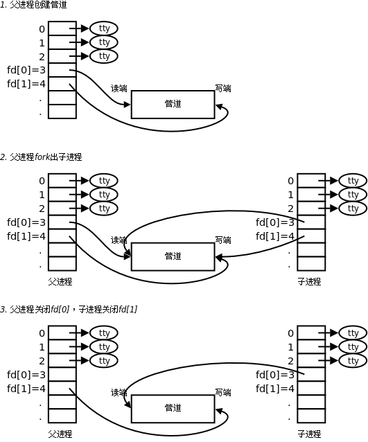

# 1.进程通信
## 1.IPC
Linux环境下，进程地址空间相互独立，每个进程各自有不同的用户地址空间。任何一个进程的全局变量在另一个进程中都看不到，所以进程和进程之间不能相互访问，要交换数据必须通过内核，在内核中开辟一块缓冲区，进程1把数据从用户空间拷到内核缓冲区，进程2再从内核缓冲区把数据读走，内核提供的这种机制称为进程间通信（IPC，InterProcess Communication）。<br>
<br>


在进程间完成数据传递需要借助操作系统提供特殊的方法，如：文件、管道、信号、共享内存、消息队列、套接字、命名管道等。随着计算机的蓬勃发展，一些方法由于自身设计缺陷被淘汰或者弃用。现今常用的进程间通信方式有：
- ① 管道 (使用最简单)
- ② 信号 (开销最小)
- ③ 共享映射区 (无血缘关系)
- ④ 本地套接字 (最稳定)

## 2.管道
### 1.基本概念

管道是一种最基本的IPC机制，作用于有血缘关系的进程之间，完成数据传递。调用pipe系统函数即可创建一个管道。有如下特质：<br>
- 1. 其本质是一个伪文件(实为内核缓冲区)
- 2. 由两个文件描述符引用，一个表示读端，一个表示写端。
- 3. 规定数据从管道的写端流入管道，从读端流出。


管道的原理: 管道实为内核使用环形队列机制，借助内核缓冲区(4k)实现。<br>

管道的局限性：<br>
- ① 数据自己读不能自己写。
- ② 数据一旦被读走，便不在管道中存在，不可反复读取。
- ③ 由于管道采用半双工通信方式。因此，数据只能在一个方向上流动。
- ④ 只能在有公共祖先的进程间使用管道。


__注：__<br>常见的通信方式有，单工通信、半双工通信、全双工通信。<br>

### 2.pipe函数
``int pipe(int pipefd[2]);``		成功：0；失败：-1，设置errno<br>
函数调用成功返回``r/w``两个文件描述符。无需``open``，但需手动``close``。规定：``fd[0] → r``； ``fd[1] → w``，就像0对应标准输入，1对应标准输出一样。向管道文件读写数据其实是在读写内核缓冲区。<br>
管道创建成功以后，创建该管道的进程（父进程）同时掌握着管道的读端和写端。如何实现父子进程间通信呢？通常可以采用如下步骤：<br>

<br>

- 1. 父进程调用pipe函数创建管道，得到两个文件描述符fd[0]、fd[1]指向管道的读端和写端。
- 2. 父进程调用fork创建子进程，那么子进程也有两个文件描述符指向同一管道。
- 3. 父进程关闭管道读端，子进程关闭管道写端。父进程可以向管道中写入数据，子进程将管道中的数据读出。由于管道是利用环形队列实现的，数据从写端流入管道，从读端流出，这样就实现了进程间通信。

### 3.管道的读写行为

- 1.读管道：<br>
  - 1.管道中有数据，read返回实际读到的数据
  - 2.管道中没数据，read阻塞等待，直到有数据为止
- 2.写管道：<br>
  - 1.管道读端全部被关闭，进程异常终止(也可以使用捕捉SIGPIPE信号，使进程不终止)
  - 2.管道读端没有完全关闭：
    - 1)管道已满，write阻塞(内核维护的默认管道大小是4096，根据现实需求可能会弹性扩容，所以想要写满，不容易)
    - 2)管道未满，write将数据写入，并返回实际写入的数据字节数

__注意：__ 只有当管道不同时有多个读端和写端时，才可以正常通行。<br>
- 1.一个读端一个写端
- 2.一个读端多个写端
- 3.多个读端一个写端

满足以上三条任意一种pipe就可以工作。<br>


下面这个程序因为父进程的读写端没有关闭，导致pipe不能实现单向通信。<br>
```c
#include <stdio.h>
#include <unistd.h>
#include <sys/wait.h>

int main(void)
{
	pid_t pid;
	int fd[2], i;

	pipe(fd);

	for (i = 0; i < 2; i++) {
		if((pid = fork()) == 0) {
			break;
        }
    }

	if (i == 0) {			//fist subprocess
		close(fd[0]);				//close read
		dup2(fd[1], STDOUT_FILENO);
		execlp("ls", "ls", NULL);
	} else if (i == 1) {	//second subprocess
		close(fd[1]);				//close write
		dup2(fd[0], STDIN_FILENO);
		execlp("wc", "wc", "-l", NULL);
	} else {
        //close(fd[0]);
        //close(fd[1]);
		for(i = 0; i < 2; i++)		//wait twice
			wait(NULL);
	}

	return 0;
}
```

### 4.管道的优劣
- 优点：简单，相比信号，套接字实现进程间通信，简单很多。
- 缺点：
  - 1.只能单向通信，双向通信需建立两个管道。
  - 2.只能用于父子、兄弟进程(有共同祖先)间通信。该问题后来使用fifo有名管道解决。
