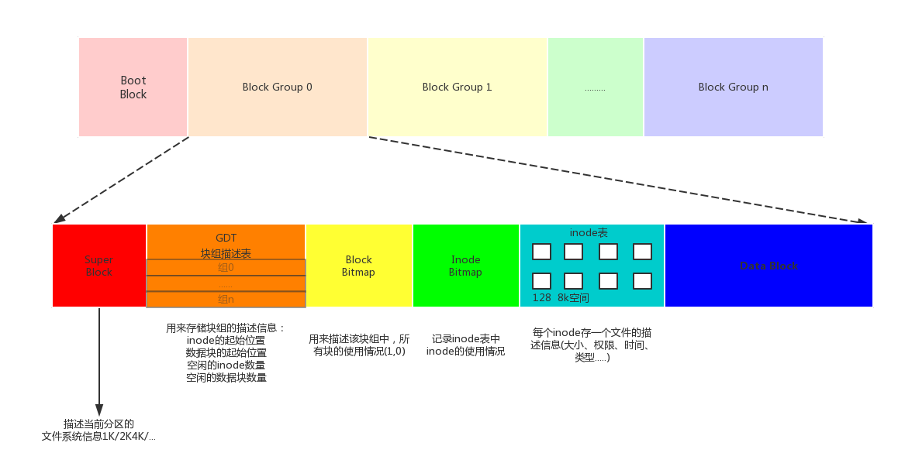

# 文件系统
## 1.文件存储原理
在Linux系统中通过dentry、inode管理文件。 
__inode__ 
本质是结构体，存储文件的属性信息。如：权限、类型、大小、时间、用户组、盘块位置等。 
大多数的inode都存放在磁盘上，少量常用、近期使用的inode会被缓存到内存中。 

__dentry__ 
目录项，本质依然是结构体，重要的成员变量有两个{文件名，inode......}，而文件内容保存在磁盘盘块上。 

## 2.文件系统
文件系统，是一组规则，规定对文件的存储和读取的一般方法。文件系统在磁盘格式化时被确定。 
常见的文件系统有：fat32 ntfs exfat ext2 ext3 ext4 

我们知道，一个磁盘可以划分成多个分区，每个分区必须先用格式化工具,格式化成某种格式的文件系统，然后才能存储文件，格式化的过程会在磁盘上写一些管理存储布局的信息。下图是一个磁盘分区格式化成ext2文件系统后的存储布局。 

 
文件所有的描述信息：存储在inode表中(借助超级快、快组描述符表、块位图、inode位图来找到它)。 
文件的数据：存储在，数据块中(data block)。 

文件系统中存储的最小单位是块（Block），一个块究竟多大是在格式化时确定的，例如mke2fs的-b选项可以设定块大小为1024、2048或4096字节。而上图中启动块（BootBlock）的大小是确定的，就是1KB，启动块是由PC标准规定的，用来存储磁盘分区信息和启动信息，任何文件系统都不能使用启动块。启动块之后才是ext2文件系统的开始，ext2文件系统将整个分区划成若干个同样大小的块组（Block Group），每个块组都由以下部分组成。 

__超级块（Super Block）__  描述整个分区的文件系统信息，例如块大小、文件系统版本号、上次mount的时间等等。超级块在每个块组的开头都有一份拷贝。 

__块组描述符表（GDT，Group Descriptor Table）__  由很多块组描述符组成，整个分区分成多少个块组就对应有多少个块组描述符。每个块组描述符（Group Descriptor）存储一个块组的描述信息，例如在这个块组中从哪里开始是inode表，从哪里开始是数据块，空闲的inode和数据块还有多少个等等。和超级块类似，块组描述符表在每个块组的开头也都有一份拷贝，这些信息是非常重要的，一旦超级块意外损坏就会丢失整个分区的数据，一旦块组描述符意外损坏就会丢失整个块组的数据，因此它们都有多份拷贝。通常内核只用到第0个块组中的拷贝，当执行e2fsck检查文件系统一致性时，第0个块组中的超级块和块组描述符表就会拷贝到其它块组，这样当第0个块组的开头意外损坏时就可以用其它拷贝来恢复，从而减少损失。 

__块位图（Block Bitmap）__  一个块组中的块是这样利用的：数据块存储所有文件的数据，比如某个分区的块大小是1024字节，某个文件是2049字节，那么就需要三个数据块来存，即使第三个块只存了一个字节也需要占用一个整块；超级块、块组描述符表、块位图、inode位图、inode表这几部分存储该块组的描述信息。那么如何知道哪些块已经用来存储文件数据或其它描述信息，哪些块仍然空闲可用呢？块位图就是用来描述整个块组中哪些块已用哪些块空闲的，它本身占一个块，其中的每个bit代表本块组中的一个块，这个bit为1表示该块已用，这个bit为0表示该块空闲可用。 

__inode位图（inode Bitmap）__  和块位图类似，本身占一个块，其中每个bit表示一个inode是否空闲可用。 

__inode表（inode Table）__  我们知道，一个文件除了数据需要存储之外，一些描述信息也需要存储，例如文件类型（常规、目录、符号链接等），权限，文件大小，创建/修改/访问时间等，也就是ls -l命令看到的那些信息，这些信息存在inode中而不是数据块中。每个文件都有一个inode，一个块组中的所有inode组成了inode表。inode表占多少个块在格式化时就要决定并写入块组描述符中，mke2fs格式化工具的默认策略是一个块组有多少个8KB就分配多少个inode。由于数据块占了整个块组的绝大部分，也可以近似认为数据块有多少个8KB就分配多少个inode，换句话说，如果平均每个文件的大小是8KB，当分区存满的时候inode表会得到比较充分的利用，数据块也不浪费。如果这个分区存的都是很大的文件（比如电影），则数据块用完的时候inode会有一些浪费，如果这个分区存的都是很小的文件（比如源代码），则有可能数据块还没用完inode就已经用完了，数据块可能有很大的浪费。如果用户在格式化时能够对这个分区以后要存储的文件大小做一个预测，也可以用mke2fs的-i参数手动指定每多少个字节分配一个inode。 

__inode表中每个inode的大小：ext2、ext3中128字节，ext4中256字节。__ 

__数据块（Data Block）__  根据不同的文件类型有以下几种情况： 
对于常规文件，文件的数据存储在数据块中。 
对于目录，该目录下的所有文件名和目录名存储在数据块中，注意文件名保存在它所在目录的数据块中，除文件名之外，ls -l命令看到的其它信息都保存在该文件的inode中。注意这个概念：目录也是一种文件，是一种特殊类型的文件。 
对于符号链接，如果目标路径名较短则直接保存在inode中以便更快地查找，如果目标路径名较长则分配一个数据块来保存。 
设备文件、FIFO和socket等特殊文件没有数据块，设备文件的主设备号和次设备号保存在inode中。 
