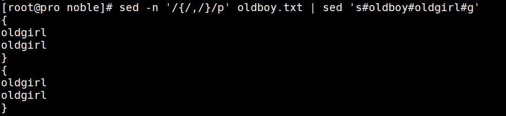
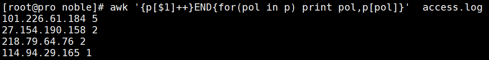
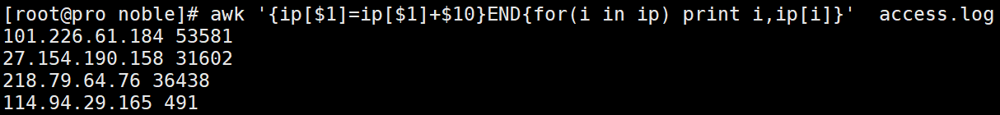
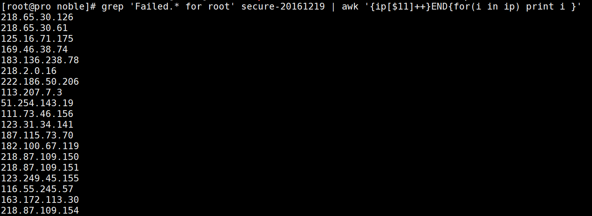

# 基础要求：
__1.说出常见raid级别的特点与使用场景__<br>
- 1)raid0
    - 特点：
	    - 读写性能高
	    - 磁盘空间利用率最高
	    - 安全度最低
    - 使用场景：
	    - 对数据的安全要求不高(如数据库的备份)，只追求性能

- 2)raid1
    - 特点：
	- 安全度很高
	- 必须使用两块硬盘
	- 写速度慢
	- 使用空间损失一半
- 使用场景：
	- 对数据安全要求很高，只有两块硬盘的时候，可能作为系统盘使用

- 3)raid5
- 特点：
	- 兼顾安全存储容量
	- 容量损失一个硬盘
	- 硬盘数量一般在3个以上
	- 读速快，写速度一般
- 使用场景：
	- 一般场景都可以使用

- 4)raid10
    - 特点：
	- 安全度最高
	- 读写性能高
	- 磁盘容量损失一半
	- 磁盘数量在4个以上，并且是偶数
- 使用场景：
	- 对安全要求极高(如主数据库)，并发量高的场景

__2.添加一块100M的硬盘并把它永久挂载到/data01上，写出详细的操作步骤__<br>
- 第一步：创建/data01目录，并且把硬盘和服务器接好
- 第二步：重启服务器，查看/dev/目录下有没有加入的磁盘(sdb或sdc等)
- 第三步：创建分区：

```
	1.fdisk -cu /dev/sdc
	Command (m for help): n
	Command action
		e   extended
		p   primary partition (1-4)
	p
	Partition number (1-4): 1
	First sector (2048-208895, default 2048):
	Using default value 2048
	Last sector, +sectors or +size{K,M,G} (2048-208895, default 208895):
	Using default value 208895

	Command (m for help): p

	Disk /dev/sdc: 106 MB, 106954752 bytes
	64 heads, 32 sectors/track, 102 cylinders, total 208896 sectors
	Units = sectors of 1 * 512 = 512 bytes
	Sector size (logical/physical): 512 bytes / 512 bytes
	I/O size (minimum/optimal): 512 bytes / 512 bytes
	Disk identifier: 0x2d14d180

	Device Boot      Start         End      Blocks   Id  System
	/dev/sdc1            2048      208895      103424   83  Linux
	Command (m for help): w
	The partition table has been altered!
```

- 第四步：通知系统磁盘分区改变了
	- partprobe /dev/sdc
- 第五步：格式化文件系统
```
	[root@pro ~]# mkfs.ext4 /dev/sdc1
	mke2fs 1.41.12 (17-May-2010)
	Filesystem label=
	OS type: Linux
	Block size=1024 (log=0)
	Fragment size=1024 (log=0)
	Stride=0 blocks, Stripe width=0 blocks
	25896 inodes, 103424 blocks
	5171 blocks (5.00%) reserved for the super user
	First data block=1
	Maximum filesystem blocks=67371008
	13 block groups
	8192 blocks per group, 8192 fragments per group
	1992 inodes per group
	Superblock backups stored on blocks:
		8193, 24577, 40961, 57345, 73729

	Writing inode tables: done
	Creating journal (4096 blocks): done
	Writing superblocks and filesystem accounting information: done

	This filesystem will be automatically checked every 30 mounts or
	180 days, whichever comes first.  Use tune2fs -c or -i to override.
```

- 第六步：关闭磁盘自动检测
```
	[root@pro ~]# tune2fs -c 0 -i 0 /dev/sdc1
	tune2fs 1.41.12 (17-May-2010)
	Setting maximal mount count to -1
	Setting interval between checks to 0 seconds
```

- 第八步：磁盘挂载：
	- 1)df -h 查看是否有人使用data01目录
	- 2)mount /dev/sdc1 /data01
- 第九步：永久挂载：
	- 1)/etc/rc.local /bin/mount /dev/sdc1 /data01
	- 2)/etc/fstab中加入设备的名称，挂载点，文件系统，默认参数，是否备份，是否磁盘检查
	- /dev/sdc1 /data01 ext4 default 0 0

__3.创建一块500M的文件并把它永久增加到swap中，写出配置的详细步骤？__<br>
- 第一步：创建文件块
```
	[root@pro tmp]# dd if=/dev/zero of=/tmp/500M bs=1M count=500
	500+0 records in
	500+0 records out
	524288000 bytes (524 MB) copied, 12.6662 s, 41.4 MB/s
```

- 第二步：将文件块转换成swap
```
	[root@pro tmp]# mkswap /tmp/500M
	mkswap: /tmp/500M: warning: don't erase bootbits sectors
			on whole disk. Use -f to force.
	Setting up swapspace version 1, size = 511996 KiB
	no label, UUID=ba20764d-fce5-49f0-834f-9f3ea9c84488
```

- 第三步：把文件块加入swap
	- swapon /tmp/500M(可通过free -h查看)
- 第四步：永久加入
	- 把命令加入/etc/rc.local
	- 编辑/etc/fstab文件
	- /tmp/500M               swap                    swap    defaults        0 0


__4.把{}内的oldboy替换为oldgirl__<br>
文件oldboy.txt<br>
```
oldboy
{
oldboy
oldgirl
}
oldboy
oldgirl
{
oldgirl
oldboy
}
```

- 执行sed -n '/{/,/}/p' oldboy.txt | sed 's#oldboy#oldgirl#g'



__5.统计access.log文件中每个ip地址出现的次数__<br>
- 执行awk '{p[$1]++}END{for(pol in p) print pol,p[pol]}'  access.log



__6.统计access.log中每个ip地址使用的流量总数__<br>
- 执行awk '{ip[$1]=ip[$1]+$10}END{for(i in ip) print i,ip[i]}'  access.log



__7.通过awk分析secure这个日志哪个ip地址在破解你的密码？__<br>
- 执行grep 'Failed.* for root' secure-20161219 | awk '{ip[$11]++}END{for(i in ip) print i }'



# 升级需求
__1.如何进入单用户和救援模式请写出步骤__<br>


__2.通过awk同时分析access.log文件每个ip的重复数和每个ip使用的流量__<br>