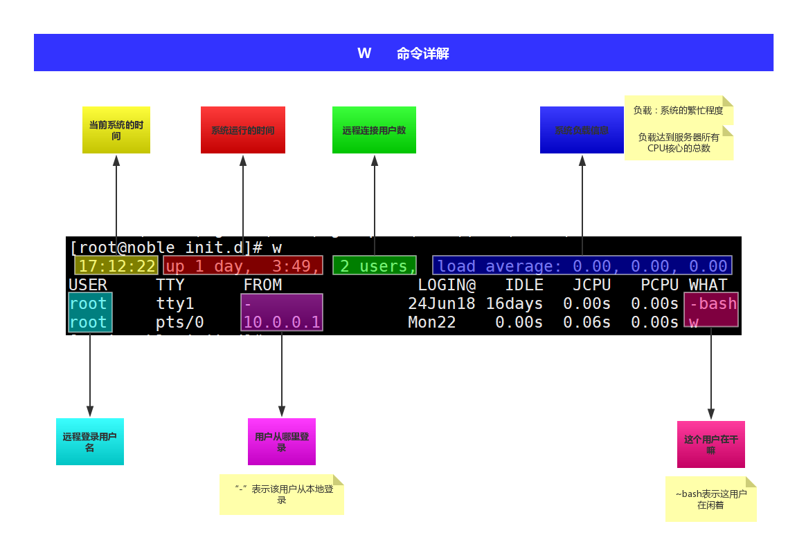

# 用户管理
## 1.脚本开机运行
方法一：放到``/etc/rc.local``<br>
方法二：通过chkconfig管理<br>
- 第一个里程碑
  - 把脚本放到``/etc/init.d/``中并有执行权限
- 第二个里程碑
  - 在脚本中的前几行加入``# chkconfig: 2345 99 99``
    - ``2345``表示什么运行级别运行此脚本
    - 第一个``99`` 表示第几个运行
    - 第二个``99`` 表示关机的顺序
- 第三个里程碑
  - 加入到``chkconfig``管理
    - 执行命令``chkconfig --add <脚本名称>``
### 1.chkconfig运行原理
考虑两个命令：<br>
```
chkconfig iptables on
chkconfig iptables off
```

这两个命令会改变文件信息。<br>
在``/etc/``目录下有``rc0.d~rc6.d``7个目录里面有相关自启动进程的软连接。有S开头和K开头。如果相关文件是以``S``开头则``chkconfig``会在开机时运行，如果是``K``开头则不会运行。<br>
例如：``chkconfig iptables on``相当于在rc3.d等目录中创建``S08iptables``软连接。而``chkconfig iptables off``相当于在rc3.d等目录中创建``K92iptables``软连接。<br>
在``/etc/init.d/iptables``文件中有``# chkconfig: 2345 08 92``<br>

## 2.基本概念
UID：类似身份证号，每个用户的UID唯一<br>
GID:组的类别<br>
### 1.UID类别
- UID是0，就是root用户
- UID是1~499，虚拟用户(为了满足所有程序都能拥有执行用户，最大的特点是不能登录,sbin/nologin)
- UID是500+,普通用户。

### 2.用户的相关文件
``/etc/passwd``用户的信息<br>
``/etc/shadow``用户的密码信息<br>
``/etc/group``用户的用户组信息<br>
``/etc/gshadow``用户组密码信息<br>
``/etc/skel``用户家目录模板<br>

#### 1.passwd文件
里面的内容：<br>
```
bin   :x:1:1:bin   :/bin :/sbin/nologin
daemon:x:2:2:daemon:/sbin:/sbin/nologin
......
```
第一列是用户名，第二列是密码信息，现在存放在shadow里，第三列是UID，第四列是GID，第五列是用户的说明信息，第六列是用户的家目录，第七列是可以使用的shell。<br>

#### 2.skel文件
每当创建新用户是，系统会把``/etc/skel``的文件复制一份给新用户的家目录
```
[root@noble init.d]# ll -a /etc/skel/
-rw-r--r--.  1 root root   18 Mar 23  2017 .bash_logout    #用户退出会运行里面的命令
-rw-r--r--.  1 root root  176 Mar 23  2017 .bash_profile
-rw-r--r--.  1 root root  124 Mar 23  2017 .bashrc
```
## 3.用户操作
### 1.添加用户
``useradd``命令：<br>
```
useradd -u 999 -M -s /sbin/nologin noble2
```
- -u 指定用户的UID
- -s 指定用户的shell
  - ``/bin/bash``
  - ``/sbin/nologin``创建一个虚拟用户
- -M 表示不创建家目录，一般虚拟用户不添加家目录
- -g 指定用户属于的组(组的名字)添加用户时会默认添加一个和用户同名的组
- -c 指定说明信息

### 2.删除用户
方法一：在``/etc/passwd``文件中，把对应要删除的用户前面加一个注释``#``<br>
这是最常用的。<br>
方法二：<br>
``userdel``命令+用户名


### 3.修改用户
``usermod``命令<br>
- -s 修改用户的shell
- -g 修改用户的主要组
- -G 修改用户属于多个组

```
usermod noble -c "vitrue user"
usermod noble -g root
usermod noble2 -G root,noble
```

### 4.修改用户密码
``passwd``命令<br>

``echo '123456' | passwd --stdin <用户名>``


### 5.查询用户信息
``id``命令+用户名<br>
可以查看用户基本信息

``w``命令<br>
<br>


``last``命令<br>
显示所有用户的登录情况。<br>
