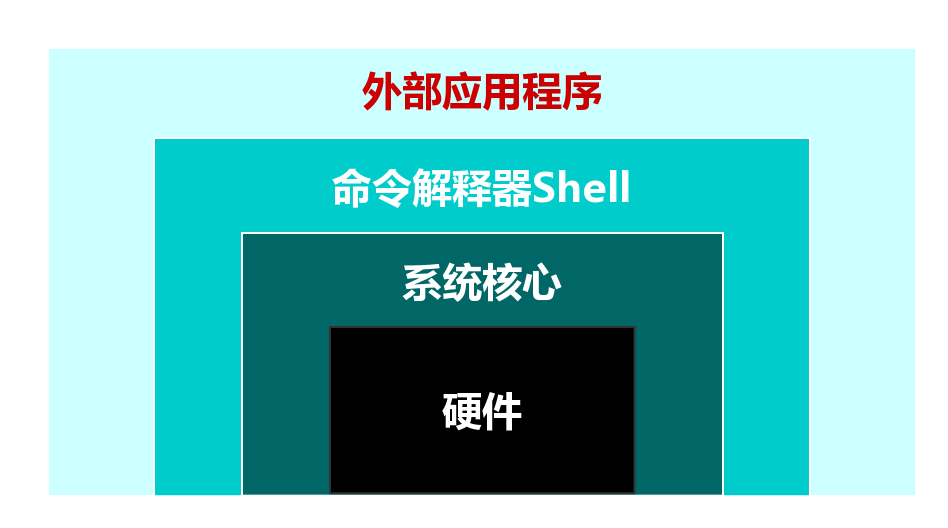

# Shell

## 1.shell基本概念
Shell是一个命令解释器，每当用户输入一条命令就会执行一条，这种操作模式被称为交互式。<br>
<br>

Shell存在于操作系统的最外层，负责直接与用户对话，把用户的输入命令解释给操作系统，并处理各种操作系统的输出结果，输出到屏幕返回给用户，当我们输入系统用户名和密码，登录到Linux后的所有操作都是有shell解释并执行的。<br>

## 2.shell脚本实例
当程序或命令不在命令行执行时，而是通过把命令、控制语句等放在一个文件中一键执行，这种方式是非交互式的。这种文件就可以称为shell脚本。<br>

以一个shell脚本为例：<br>
```shell
cd /var/log

cat /dev/null>messages

echo "Logs cleaned up."
```
脚本的作用是清除messages日志。非常简单只有三行，但是这个脚本有很多问题，如果执行这个脚本的用户不是root那么根本就没有权限情况日志等等。<br>
所以我们给这个脚本添加一些控制语句，升级版脚本如下：<br>
```shell
#!/bin/bash
LOG_DIR=/var/log
ROOT_UID=0

#Fist step only root can run script
if ["$UID" -ne "$ROOT_UID"]
then
  echo "Must be root to run this script."
  exit 1
fi

#Second step: change directoty success? if not exit
cd $LOG_DIR || {
  echo "Cannot change to necessary directoty."
  exit 1
}

#Third step: clean logs(cat /dev/null>messages)
cat /dev/null>messages && {
  echo "Logs cleaned up."
  exit 0
}

#Forth step:if script excuted this step means failed
echo "Logs clearned up fail."
exit 1
```

## 3.Shell脚本的优势
Shell脚本语言的优势在于处理偏操作系统底层的业务，例如：Linux系统内部的很多应用(有的是应用的一部分)都是使用Shell脚本语言开发的，因为有1000多个Linux系统命令为它支持，特别是Linux正则表达式及三剑客grep、awk、sed等命令。<br>
对于一些常见的脚本，使用shell脚本开发更方便快速。例如：让软件一键自动化安装、优化、监控报警脚本、软件启动脚本，日志分析脚本等。<br>

## 4.环境变量
以后如果要设置环境变量，都放在``/etc/bashrc``文件下，因为当我们使用ssh等非用户名密码登录时，可能不加载``/etc/profile``文件。<br>
