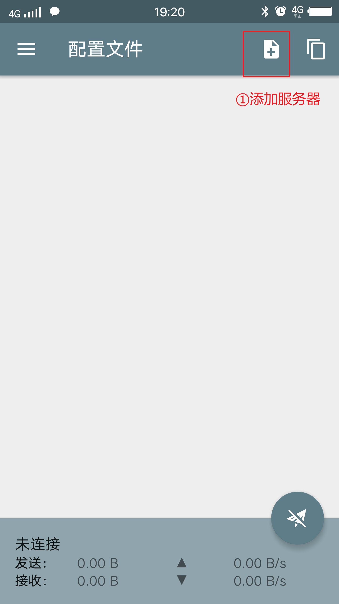

# 搭建ss客户端

## 1.Windows客户端
[下载ss客户端](https://github.com/pitifulnoble/computer_net/blob/master/Linux%E5%AD%A6%E4%B9%A0/%E7%9B%B8%E5%85%B3%E8%AE%BE%E7%BD%AE%E5%92%8C%E5%91%BD%E4%BB%A4/ss%E6%90%AD%E5%BB%BA/Shadowsocks-4.1.3.1.zip) 
 

### 1.1.里程碑一 准备环境
将下载好的压缩包放到本地合适的目录并解压~ 
然后单击运行 

### 1.2.里程碑二 配置服务器
我们在系统桌面的右下角可以看到一个小飞机的图标(如下)~ 
 

右键图标,并按照下图中的步骤操作 
 

我们会看到一个弹窗,如下图,并按照自己的服务器(可能是别人发给你的),填写信息~ 
 

接下来我们做最后一步设置~ 
看下面这张图(右键小飞机) 
 

**对上面的信息做简单介绍:** 
- 1.启动代理服务器
  - 启动这个软件的意思,建议永远勾选
- 2.开机自启动
  - 建议永久勾选
- 3.PAC模式和全局模式
  - PAC表示限制性访问,表示当你访问特定网站(比如google),才会"科学上网",访问其他网站的流量则不经过该服务器
  - 全局模式就是,你访问的所有网站的流量都经由该服务器
  - 一般情况下勾选PAC模式(如果使用全局模式,国内的很多网站可能访问不了~)

## 2.安卓手机
## 1.客户端下载apk包
可以去[官网下载](https://github.com/shadowsocks/shadowsocks-android/releases) 

也可以在我的[github上下载](https://github.com/pitifulnoble/computer_net/blob/master/Linux%E5%AD%A6%E4%B9%A0/%E7%9B%B8%E5%85%B3%E8%AE%BE%E7%BD%AE%E5%92%8C%E5%91%BD%E4%BB%A4/ss%E6%90%AD%E5%BB%BA/shadowsocks--universal-4.7.2.apk) 

把apk包发送到手机上,然后安装~ 
通常来说不同的手机厂商会有不同的验证方式,这些自行解决~ 

安装好后做相关配置~ 
 
 
 

## 3.Mac版本
[看这篇教程](https://crifan.github.io/scientific_network_summary/website/server_client_mode/ss_client/client_mac.html) 

## 4.IOS版本
[看这篇教程](https://crifan.github.io/scientific_network_summary/website/server_client_mode/ss_client/client_ios.html) 
