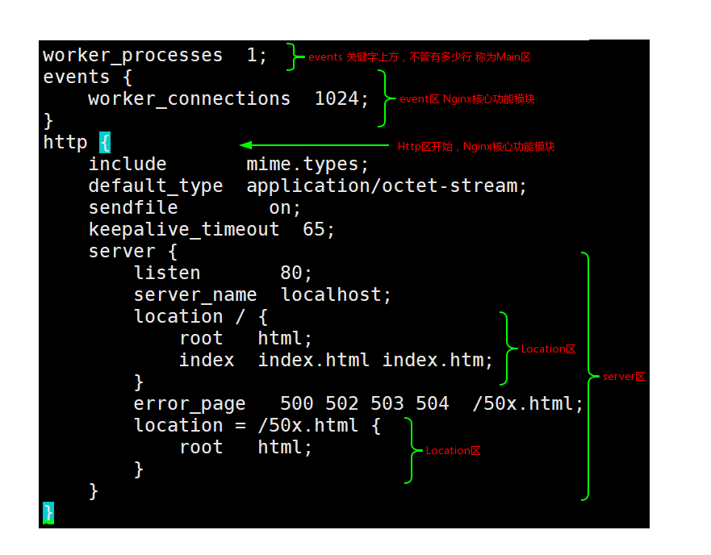

# 期中集群架构-第八章-期中架构nginx章节


## 1. web服务软件种类介绍<br>
#### 常用来提供静态Web服务的软件有如下三种：<br>

	Apache：<br>
  - 这是中小型Web服务的主流，Web服务器中的老大哥。<br>


	Nginx：<br>
  - 大型网站Web服务的主流，曾经Web服务器中的初生牛犊，现已长大。<br>
  - Nginx的分支Tengine（http://tengine.taobao.org/)目前也在飞速发展。<br>


	Lighttpd：<br>
  - 这是一个不温不火的优秀Web软件，社区不活跃，静态解析效率很高。<br>
  - 在Nginx流行前，它是大并发静态业务的首选，国内百度贴吧、豆瓣等众多网站都有Lighttpd奋斗的身影。<br>

#### 常用来提供动态服务的软件<br>
	PHP（FastCGI）：<br>
  - 大中小型网站都会使用，动态网页语言PHP程序的解析容器。<br>
  - 它可配合Apache解析动态程序，不过，这里的PHP不是FastCGI守护进程模式，而是mod_php5.so（module）。<br>
  - 也可配合Nginx解析动态程序，此时的PHP常用FastCGI守护进程模式提供服务。<br>


	Tomcat：<br>
  - 中小企业动态Web服务主流，互联网Java容器主流（如jsp、do）。<br>


	Resin：<br>
  - 大型动态Web服务主流，互联网Java容器主流（如jsp、do）。<br>


## 2. nginx软件服务介绍<br>
如果你听说或使用过Apache软件，那么很快就会熟悉Nginx软件，与Apache软件类似，Nginx（“engine x”）是一个开源的，支持高性能、高并发的WWW服务器和代理服务软件。它是由俄罗斯人lgor Sysoev开发的，最初被应用在俄罗斯的大型网站www.rambler.ru上。<br>

后来作者将源代码以类BSD许可证的形式开源出来供全球使用。<br>

Nginx可以运行在UNIX、Linux、BSD、Mac OS X、Solaris，以及Microsoft Windows等操作系统中<br>


## 03. nginx软件特征介绍<br>
- 支持高并发：能支持几万并发连接（特别是静态小文件业务环境）
- 资源消耗少：在3万并发连接下，开启10个Nginx线程消耗的内存不到200MB
- 支持异步网络I/O事件模型epoll（Linux 2.6+）以前的 apache（select）

## 4. nginx软件功能介绍<br>
- 1）作为Web服务软件（处理用户访问静态请求）
- 2）反向代理或负载均衡服务
- 3）前端业务数据缓存服务

## 5. nginx软件模型特点说明<br>
### 问题一：apache与nginx软件对比说明？？？

apache使用select模型<br>
nginx使用epoll模型<br>
举例说明：宿舍管理员<br>
select模型版管理员　会一个一个房间查询人员<br>
epoll模型版管理员　　会进行检索后，直接找到需要找的人<br>
举例说明：幼儿园阿姨<br>
select模型版阿姨　　会一个一个小朋友进行询问，确认哪个小朋友需要上厕所<br>
epoll模型版阿姨　　　会告知想上厕所小朋友自觉站到响应位置<br>　　

## 6. nginx软件编译安装<br>
### 第一个里程：软件依赖包安装<br>
pcre-devel：   perl语言正则表达式兼容软件包<br>
openssl-devel：使系统支持https方式访问<br>
``yum install -y pcre-devel openssl-devel``<br>

### 第二个里程：创建一个管理nginx进程的虚拟用户<br>
``useradd www -s /sbin/nologin/ -M``<br>

### 第三个里程：下载并解压nginx软件<br>
cd /server/tools<br>
wget http://nginx.org/download/nginx-1.12.2.tar.gz<br>
tar xf nginx-1.12.2.tar.gz <br>　　

### 第四个里程：进行软件编译安装<br>
软件编译安装两部曲：<br>
#### 1.编译配置<br>
```
./configure --prefix=/application/nginx-12.2 --user=www --group=www --with-http_ssl_module --with-http_stub_status_module
--prefix=PATH     指定软件安装在什么目录下
--user=USER       指定软件worker进程管理用户，利用www虚拟用户管理worker进程
--group=USER
--with-http_ssl_module           使nginx程序可以支持HTTPsF访问功能
--with-http_stub_status_module	 用于监控用户访问nginx服务情况
```

#### 2.编译安装
```
make && make install
```


### 第五个里程：为nginx程序软件创建链接目录<br>
``ln -s /application/nginx-12.2 /application/nginx``	<br>

### 第六个里程：启动nginx程序服务<br>
``/application/nginx/sbin/nginx``<br>

nginx命令参数说明：<br>
```
-V       --- 查看nginx软件编译配置参数
-t       --- 检查nginx配置文件语法格式是否正确
-s       --- 用于管理nginx服务运行状态
stop     --- 停止nginx服务
reload   --- 平滑重启nginx服务器
```

## 7. nginx软件程序目录结构
### 1.以下是Nginx服务的目录树<br>
```
nginx
├── client_body_temp
├── conf
│   ├── fastcgi.conf
│   ├── fastcgi.conf.default
│   ├── fastcgi_params
│   ├── fastcgi_params.default
│   ├── koi-utf
│   ├── koi-win
│   ├── mime.types
│   ├── mime.types.default
│   ├── nginx.conf
│   ├── nginx.conf.default
│   ├── scgi_params
│   ├── scgi_params.default
│   ├── uwsgi_params
│   ├── uwsgi_params.default
│   └── win-utf
├── fastcgi_temp
├── html
│   ├── 50x.html
│   └── index.html
├── logs
│   ├── access.log
│   ├── error.log
│   └── nginx.pid
├── proxy_temp
├── sbin
│   └── nginx
├── scgi_temp
└── uwsgi_temp

9 directories, 21 files
```

```
conf --- nginx程序所有配置文件保存目录
conf/nginx.conf   nginx程序主配置文件
```

### 2.Nginx服务目录说明和Nginx参数说明
```
html	   --- nginx程序站点目录
logs     --- nginx程序日志文件保存目录
sbin     --- nginx程序命令所在目录
```


## 8.nginx.conf文件讲解

精简nginx.conf配置文件内容：
``grep -Ev "#|^$" nginx.conf.default >nginx.conf``<br>


nginx配置文件组成：<br>
```
①. main       nginx 主区块
②. event      nginx 事件区块
③. http       nginx http功能区块
④. server     nginx 网站主机区块
⑤. location   nginx 匹配或者定位区块
```
<br>

### 1.Nginx配置文件参数说明：<br>
- 1.worker_processes: 在配置文件的第一行，它的意思是Nginx服务启动时创建worker进程的数量，默认是1，一个worker进程可以处理一个访问。管理worker进程的是master监视进程。详细参考：<br>[https://www.cnblogs.com/liushaodong/archive/2013/02/26/2933511.html](https://www.cnblogs.com/liushaodong/archive/2013/02/26/2933511.html)<br>
- 2.worker_connections: 在events区块。意思是一个worker进程的最大连接数。关于worker工作原理理解不是很深刻。<br>
- 3.include: 表示调用其他配置信息。我们可以把Nginx配置文件信息拆分成多个，然后通过include参数调用。
- 4.mime.types: 上例中mime.types被include关键字引用，mime.types是媒体资源类型，里面定义了可以被Nginx服务正常处理的资源类型，比如HTML，CSS等，但对于php等动态请求是不包含在内的
- 5.default_type: 是指默认媒体资源处理类型，可能是mime.types中的一种
- 6.keepalive_timeout: 当HTTPS使用TCP方式连接浏览器时，也就是非无状态模式，这时候我们需要设置一个定时器，当定时器结束计时后，TCP连接就会被服务器中断。
- 7.server: server区块，我们可以理解为一个网站，比如百度网站等等，一个``www``是一个server区块，而``bbs``是另一个区块。所以如果配置文件中有多个server区块，那么这台Nginx服务器就支持多个页面可以被访问。
- 8.listen: 表示服务器监听的端口
- 9.server_name: 是指网站的域名
- 10.root: root关键字在Location下面，表示站点目录，也叫根目录
- 11.index: 表示网站的首页，当客户端访问web服务器时，没有指定要什么文件时，会默认给客户端一个首页地址，就是index关键字指定的文件


## 9. 编写nginx服务配置<br>
#### 三个语法格式说明：<br>
- ①. 大括号要成对出现<br>
- ②. 每一行指令后面要用分号结尾<br>
- ③. 每一个指令要放置在指定的区块中<br>


### 1.实现编写一个网站页面<br>
```
worker_processes  1;
events {
    worker_connections  1024;
}
http {
    include       mime.types;
    default_type  application/octet-stream;
    sendfile        on;
    keepalive_timeout  65;
    server {
        listen       80;
        server_name  www.etiantian.org;
        location / {
            root   html/www;
            index  index.html index.htm;
        }
    }
}
```

### 2.每条指令位置相关说明：<br>
每一个指令都是有固定的放置位置，不能随意堆砌。我们以keepalive_timout说明。<br>
- 第一步：到Nginx官方网站：[http://nginx.org/en/](http://nginx.org/en/)<br>
- 第二步：网页右边[documentation](http://nginx.org/en/docs/)->Modules reference->[Alphabetical index of directives](http://nginx.org/en/docs/dirindex.html)<br>
- 第三步：按``Ctrl+f``搜索找到keepalive_timout.

我们可以看到如下页面：<br>
<br>
在``Context``字段中详细写了keepalived_timeout应该存放的位置可以是http，server，Location。<br>
我们使用``/application/nginx/sbin/nginx -t``命令检查语法规范。<br>
每次更改配置文件后，我们使用``/application/nginx/sbin/nginx -s reload``平滑重启Nginx服务。<br>

还要特别强调的一点是，我们在配置文件中配置了Nginx服务的站点目录时``html/www``那么我们就要创建这个目录。并在这个站点目录的根处存在index指定的默认文件。<br>

### 2.实现编写多个网站页面==编写多个虚拟主机（等于一个网站）
#### 1.第一个里程编写配置文件：
```
server {
listen       80;
server_name  www.etiantian.org;
location / {
    root   html/www;
    index  index.html index.htm;
}
}
server {
    listen       80;
    server_name  bbs.etiantian.org;
    location / {
        root   html/bbs;
        index  index.html index.htm;
    }
}
server {
    listen       80;
    server_name  blog.etiantian.org;
    location / {
        root   html/blog;
        index  index.html index.htm;
    }
}
```

#### 2.第二个里程创建站点目录：<br>
``mkdir -p /application/nginx/html/{www,bbs,blog}``<br>

#### 3.第三个里程创建站点目录下首页文件：
```
for name in www bbs blog;do echo "10.0.0.7 $name.etiantian.org" >/application/nginx/html/$name/index.html;done
for name in www bbs blog;do cat /application/nginx/html/$name/index.html;done
```
可以直接运行上面的命令。<br>

```
10.0.0.7 www.etiantian.org
10.0.0.7 bbs.etiantian.org
10.0.0.7 blog.etiantian.org
```

#### 4.第四个里程：进行访问测试<br>
浏览器访问测试：<br>
注意：需要编写windows主机hosts(``C:\Windows\System32\drivers\etc``)文件，进行解析<br>
命令行访问测试：<br>
利用curl命令在linux系统中访问测试<br>
注意：需要编写linux主机hosts文件，进行解析<br>

### 3.规范化管理配置文件：<br>
当我们的网站页面多的时候，可以想象到我们的``Nginx.conf``文件会非常冗长。我们可以考虑一种更清洁的配置文件管理方式。<br>
我们在``application/nginx/conf``目录下面创建``extra``目录，把所有的在``nginx.conf``文件中的server区块单独放置在``extra``目录中的一个文件中。然后用``include``关键字，在``nginx.conf``目录中引用。<br>
如下：<br>
```
/application/nginx/conf/nginx.conf

worker_processes     1;
events {
  worker_connections  1024;
}
http {
  include          mime.types;
  default_type     application/octet-stream;
  sendfile         on;
  keepalive_timeout 65;
  include           extra/www.conf;
  include           extra/bbs.conf;
}
```
```
/application/nginx/conf/extra/www.conf

server {
  listen                  80;
  server_name             www.etiantian.org;
  location / {
    root            html/www;
    index           index.html index.htm;
  }
}
```

```
/application/nginx/conf/extra/bbs.conf

server {
  listen                  80;
  server_name             bbs.etiantian.org;
  location / {
    root            html/bbs;
    index           index.html index.htm;
  }
}
```

### 4.虚拟主机配置文件编写方法(所谓虚拟主机其实就是不同的server区块)：<br>
- ①. 基于域名的虚拟主机配置方法（最常用）<br>
- ②. 基于端口的虚拟主机配置方法<br>
  说明：当你访问的网站域名在虚拟主机配置中不存在时，默认会将第一个虚拟主机的配置页面响应给用户<br>
- ③. 基于IP地址的虚拟主机配置方法<br>
  说明：nginx服务中只要涉及IP地址的修改，都需要重启nginx服务，而不能采用平滑重启<br>


## 9 Nginx服务日志信息<br>
Nginx服务``application/nginx/logs``目录下面有三个文件。<br>
<br>
最后一个文件记录着Nginx服务的pid。<br>

### 1.日志存放位置<br>
日志的相关配置同样存放在``nginx.conf``文件的中。<br>
```
error_log  logs/error.log  notice;
access_log  logs/access.log  main;
```
通过这些信息，我们可以找到日志的位置。日志的默认位置在``/application/nginx/logs/``下面。<br>

### 2.错误日志配置方法<br>
日志的相关配置同样1存放在``nginx.conf``中<br>
#### 配置过程如下：<br>
- 1.在``nginx.conf.default``文件中查看 备注释的默认配置参数和参数存放位置。
- 2.把``nginx.conf.default``中的配置参数拷贝到``nginx.conf``中就完成了配置。

我们在``nginx.conf.default``中可以看到如下信息：<br>
```
#error_log  logs/error.log;
#error_log  logs/error.log  notice;
#error_log  logs/error.log  info;
```
>>notic 和 info 是错误类别


我们把它粘贴到``nginx.conf``文件中的对应位置。<br>


__补充说明：__<br>
error_log 级别分为 debug, info, notice, warn, error, crit  默认为crit
该级别在日志名后边定义格式如下：<br>
error_log  /your/path/error.log crit;<br>

crit 记录的日志最少，而debug记录的日志最多。<br>
如果nginx遇到一些问题，比如502比较频繁出现，但是看默认的error_log并没有看到有意义的信息，我们可以调一下错误日志的级别，调成error级别时，就满足日常需要了<br>


### 2.访问日志(重点关注)<br>
我们在``nginx.conf.default``中可以看到如下信息：<br>
```
log_format  main  '$remote_addr - $remote_user [$time_local] "$request" '   --- 定义日志信息要记录的内容格式
                  '$status $body_bytes_sent "$http_referer" '
                  '"$http_user_agent" "$http_x_forwarded_for"';

```
上面的信息规定了访问日志记录的那些信息，下面对其进行一一描述：<br>


```
[变量名]            [变量值 举例]           [意义描述]
$remote_addr       10.0.0.1           --- 访问客户端的源地址信息
$remote_user          -               --- 访问客户端认证用户信息
[$time_local]                         --- 显示访问时间
$request        GET / HTTP/1.1        --- 请求行信息
$status              304              --- 状态码信息（304状态码利用缓存显示页面信息）
$body_bytes_sent                      --- 服务端响应客户端的数据大小信息
$http_referer                         --- 记录链接到网站的域名信息
$http_user_agent                      --- 用户访问网站客户端软件标识信息
                                             用户利用客户端浏览器测试访问时，win10默认浏览器会有异常问
$http_x_forwarded_for                 --- 反向代理
```
对于上述的所有变量，都可以在Nginx的官网查到 __官方链接：__<br> [http://nginx.org/en/docs/http/ngx_http_log_module.html#access_log](http://nginx.org/en/docs/http/ngx_http_log_module.html#access_log)<br>

在``nginx.conf.default``文件中，我们看到后面有这一调用的语句,表示调用我们自定义的输出格式。<br>
```
access_log  logs/access.log  main;  --- 调用定义格式信息，生成访问日志
```

记得每次编写完``nginx.conf``文件都要执行：<br>
```
/application/nginx/sbin/nginx -t
/application/nginx/sbin/nginx -s reload
```

### 3.日志要进行切割
#### 1.利用shell脚本实现日志切割<br>
```
#!/bin/bash
# file name cut_log.sh
data_info=$(date +%F-%H:%M)
mv /application/nginx/logs/www_access.log /application/nginx/logs/access.log.$data_info
/application/nginx/sbin/nginx -s reload
# cut nginx log cron
* */6 * * * /bin/sh /server/scripts/cut_log.sh &>/dev/null
```

## 10.Nginx服务location区块配置
### 1.访问配置
在location区块中有一个deny关键字可以配置访问控制，同样可以到官方网站上查找。<br>
[http://nginx.org/en/docs/http/ngx_http_access_module.html](http://nginx.org/en/docs/http/ngx_http_access_module.html)<br>
在官方网站上我们可以看到：<br>
```
location / {
    deny  192.168.1.1;
    allow 192.168.1.0/24;
    allow 10.1.1.0/16;
    allow 2001:0db8::/32;
    deny  all;
}
```

### 2.location站点资源匹配
参考以下文章:[https://segmentfault.com/a/1190000013267839](https://segmentfault.com/a/1190000013267839)<br>


__更多Nginx详细参考：__<br>
[http://tengine.taobao.org/book/index.html](http://tengine.taobao.org/book/index.html)<br>
