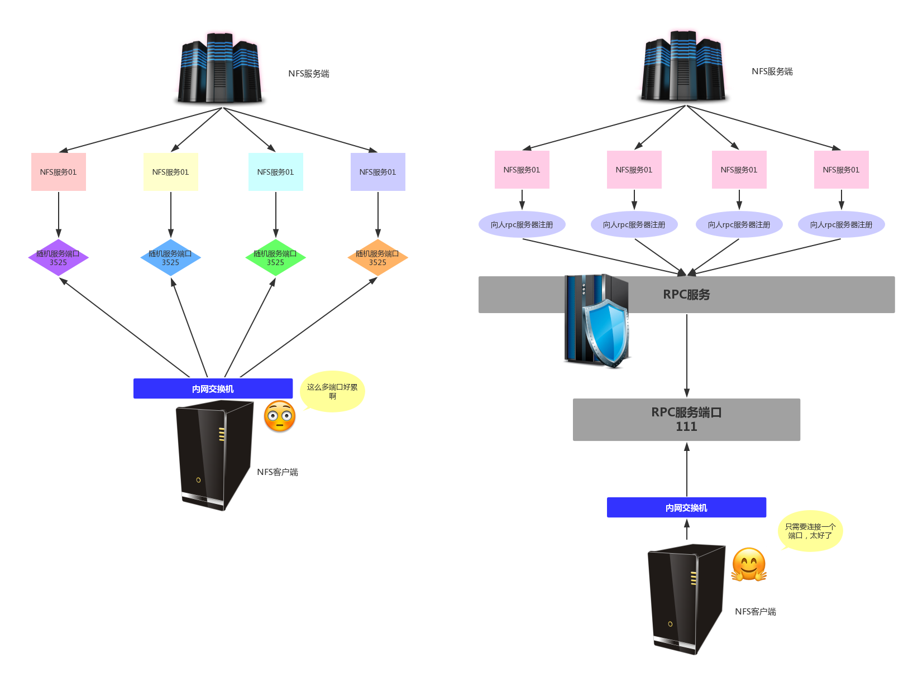
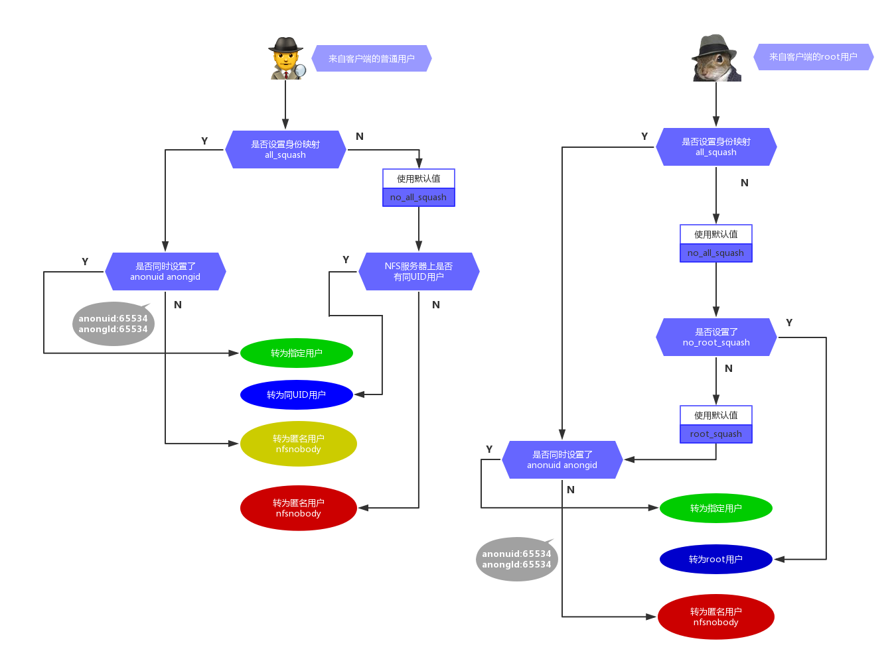
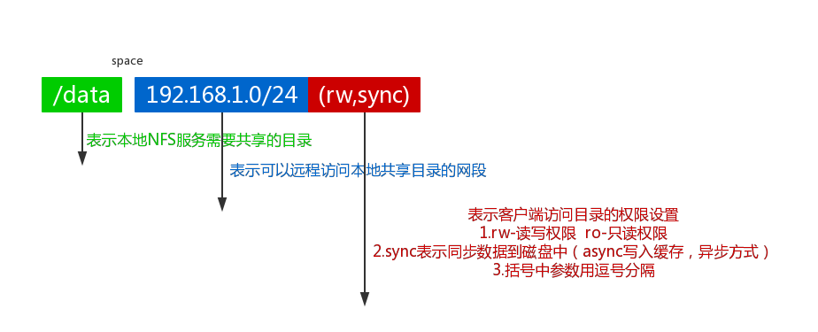

期中架构-第三章-存储服务笔记
======================================================================


__02. NFS共享存储服务开篇介绍__<br>
- 共享存储服务是什么
    - NFS是Network File System的缩写,中文意思是网络文件系统，
    - 它的主要功能是通过网络（一般是局域网）让不同的主机系统之间可以共享文件或目录。

- NFS共享存储服务的应用：<br>

    - 将数据存储到一台服务器上，实现数据统一一致，共享访问<br>
    - NFS存储服务器中主要存储哪些信息：用户上传的图片 音频 视频 附件等信息<br>
    - NFS服务是分为服务端和客户端<br>
    - 存储服务器：NFS服务端   网站web服务器：NFS客户端<br>

- 实现共享存储好处：<br>
    - 01. 实现数据统一一致
    - 02. 节省网站磁盘资源
    - 03. 节省网站访问带宽

- NFS共享存储服务的原理：
    - ①. nfs服务端创建共享存储目录
    - ②. nfs客户端创建远程挂载点目录
    - ③. nfs客户端进行远程挂载
    - ④. 实现客户端数据信息统一一致

- 共享文件系统的工作原理（服务端3步 客户端3步）
    - 服务端做了三件事：
    - 1. 启动rpcbind服务，创建中介
    - 2. 启动nfs服务，创建房源信息
    - 3. 将房源信息向中介进行注册，在nfs服务稳定运行过程中，房源信息只注册一次

- 客户端做了三件事：
    - 1. 启动rpcbind服务（可选）
    - 2. 确保客户端和服务端网络连接建立成功
    - 3. 执行mount命令进行网络存储挂载

__03. NFS服务重要概念说明__<br>
- NFS共享文件系统RPC服务介绍
- NFS共享文件系统RPC服务由来
<br>

__04. NFS服务部署实践过程__<br>
- NFS服务端部署流程：
    - 第一个里程：检查服务软件是否安装
        - rpm -qa|egrep “nfs-utils|rpcbind”

	- 第二个里程：进行软件服务安装
	    ``yum install -y nfs-utils rpcbind``

	    ```补充说明：nfs-utils 和 rpcbind两个软件大礼包
	    rpm -ql nfs-utils
	    /etc/rc.d/init.d/nfs     <-- nfs服务启动脚本文件
	    /usr/sbin/showmount      <-- 检查nfs服务共享目录信息

	    rpm -ql rpcbind
	    /etc/rc.d/init.d/rpcbind   <-- rpcbind服务启动脚本文件
	    /usr/sbin/rpcbind          <-- 检查nfs服务向rpc服务注册信息
	    ```
	- 第三个里程：编写nfs服务配置文件
	    ```
	    [root@nfs01 ~]# ll /etc/exports
        -rw-r--r-- 1 root root 30 2018-02-25 13:30 /etc/exports   <-- nfs服务配置文件，默认已经存在
	    [root@nfs01 ~]# vim /etc/exports
        /data  172.16.1.0/24(rw,sync)
        ```

	说明：配置文件信息 指定共享目录   指定共享目录访问控制网段或主机信息(共享目录参数信息)<br>

	- 第四个里程：创建nfs服务共享目录，并且进行授权
	    ```
	    mkdir /data
	    chown -R nfsnobody.nfsnobody /data
	    ```

	- 第五个里程：启动nfs和rpc服务
	    ```
	    /etc/init.d/rpcbind start       <- 首先启动rpcbind服务
	    /etc/init.d/nfs start           <- 其次启动nfs服务
	    ```

	- 第六个里程：进行服务配置检查
	    ```
	    先检查房源信息是否注册
	    rpcinfo -p 172.16.1.31
	    检查是否存在可用的共享目录
	    [root@nfs01 ~]# showmount -e 10.0.0.31
        Export list for 10.0.0.31:
        /data 172.16.1.0/24
        ```

- NFS客户端部署流程：
    - 第一个里程：检查服务软件是否安装<br>
	    ``rpm -qa|egrep “nfs-utils|rpcbind”``

	- 第二个里程：进行软件服务安装<br>
	    ``yum install -y nfs-utils rpcbind``

	- 第三个里程：进行共享目录挂载
	    ```
	    [root@web02 ~]# mount -t nfs 172.16.1.31:/data /mnt
        [root@web02 ~]# df -h
        Filesystem         Size  Used Avail Use% Mounted on
        172.16.1.31:/data  8.6G  1.9G  6.4G  23% /mnt
	    ```

	- 第四个里程：进行共享存储测试
	    ```
	    [root@web01 mnt]# touch test.txt
        [root@web01 mnt]# ls
        test.txt

	    [root@nfs01 ~]# cd /data/
        [root@nfs01 data]# ls
        test.txt

	    [root@web02 ~]# ls /mnt
        test.txt
	    说明：在web01的mnt目录中创建的数据，在nfs和web02服务器上都可以看到，即已经实现数据共享存储
        ```

__05. NFS服务部署进程信息详述__<br>
- 进程介绍

        ```
        [root@oldboy ~]# ps -ef|egrep "rpc|nfs"
        rpc        1564      1  0 09:32 ?        00:00:00 rpcbind
        rpc        1065      1  0 09:32 ?        00:00:00 rpc statd		<- 检查数据存储一致性
        root       4736      2  0 21:31 ?        00:00:00 [rpciod/0]
        root       5363      1  0 21:47 ?        00:00:00 rpc.rquotad	<- 磁盘配额进程（remote quote server）
        root       5368      1  0 21:47 ?        00:00:00 rpc.mountd	<- 权限管理验证等（NFS mount daemon）
        root       5375      2  0 21:47 ?        00:00:00 [nfsd4]
        root       5376      2  0 21:47 ?        00:00:00 [nfsd4_callbacks]
        root       5377      2  0 21:47 ?        00:00:00 [nfsd]		<- NFS主进程
        root       5378      2  0 21:47 ?        00:00:00 [nfsd] 		<- NFS主进程
        root       5379      2  0 21:47 ?        00:00:00 [nfsd] 		<- NFS主进程，管理登入，ID身份判别等。
        root       5380      2  0 21:47 ?        00:00:00 [nfsd]
        root       5381      2  0 21:47 ?        00:00:00 [nfsd]
        root       5382      2  0 21:47 ?        00:00:00 [nfsd]
        root       5383      2  0 21:47 ?        00:00:00 [nfsd]
        root       5384      2  0 21:47 ?        00:00:00 [nfsd]		<- NFS主进程
        root       5415      1  0 21:47 ?        00:00:00 rpc.idmapd	<- name mapping daemon
                                                                        用户压缩/用户映射（记录）
        root       5512   4670  0 22:02 pts/0    00:00:00 egrep rpc|nfs
        ```

__06. NFS共享文件系统用户映射过程说明__<br>
<br>

__07. NFS共享文件系统配置文件格式说明__<br>
<br>
- NFS共享目录：
    - 为NFS服务器端要共享的实际目录，要用绝对路径，如（/data）。
	- 注意共享目录的本地权限，如果需要读写共享，一定要让本地目录可以被NFS客户端的用户（nfsnobody）读写。
- NFS客户端地址：
    - 为NFS服务器端授权的可访问共享目录的NFS客户端地址，可以为单独的IP地址或主机名、域名等，也可以为整个网段地址。
	- 还可以用“*”来匹配所有客户端服务器，这里所谓的客户端一般来说是前端的业务的业务服务器，例如：web服务。具体说明见表
	 <br>
- 权限参数集
    - 对授权的NFS客户端的访问权限设置。参数具体说明见后文。
 	- nfs权限（共享目录【借给你手机】） nfs配置的/etc/exports /data 172.16.1.0/24(rw)
  	- 本地文件系统权限（【手机密码不告诉你】） 挂载目录的权限rwxr-xr-x root root /data

__08. NFS共享文件系统配置文件案例说明__<br>
- 配置例一``/data 10.0.0.0/24（rw,sync）``
    说明：允许客户端读写，并且数据同步写入到服务器端的磁盘里<br>
    注意：24和“（”之间不能有空格<br>

- 配置例二	/data 10.0.0.0/24（rw,sync,all_squash,anonuid=2000,anongid=2000）
    说明：允许客户端读写，并且数据同步写到服务器端的磁盘里，并且指定客户端的用户UID和GID。
	      早期生产环境的一种配置，适合多客户端共享一个NFS服务单目录，
		  如果所有服务器的nfsnobody账户UID都是65534，则本例没什么必要了。
		  早期centos5.5的系统默认情况下nfsnobody的UID不一定是65534，此时如果这些服务器共享一个NFS目录，
		  就会出现访问权限问题。<br>

- 配置例三	/home/oldboy 10.0.0.0/24（ro）   <-- 是为开发人员想查看线数据准备配置方式
    说明：只读共享<br>
    用途：例如在生产环境中，开发人员有查看生产服务器日志的需求，但又不希望给开发生产服务器的权限，
	      那么就可以给开发提供从某个测试服务器NFS客户端上查看某个生产服务器的日志目录（NFS共享）的权限，
		  当然这不是唯一的方法，
		  例如可以把程序记录的日志发送到测试服务器供开发查看或者通过收集日志等其它方式展现<br>

__09. NFS共享文件系统配置文件参数设置__<br>
    参见视频中表格说明

__10. NFS共享文件系统权限参数设置梳理__<br>
    - 1）NFS服务器/etc/exports设置需要开放可写入的权限，即服务器端的共享权限。
    - 2）NFS服务器实际要共享的NFS目录权限具有可写入w的权限，即服务器端本地目录的安全权限。
    - 3）每台机器对应存在和NFS默认配置UID的相同UID 65534的nfsnobody用户
     （确保所有客户端的访问权限统一，否则每个机器需要同时建立相同UID的用户，并覆盖NFS的默认用户配置）

__1. NFS共享文件系统相关重要文件说明__<br>

    ```
    /etc/exports            nfs服务主配置文件
	/usr/sbin/showmount     查看nfs服务共享目录信息
	/usr/sbin/rpcinfo       查看rpc服务中是否有房源注册信息
	/var/lib/nfs/etab       用于查看nfs服务默认配置信息
	/proc/mounts            nfs客户端mount挂载参数（可以查看默认挂载参数信息）
    ```
