# 期末架构与CentOS7
## 期末架构

### 1.搭建CentOS7服务器

#### 1.CentOS7修改网卡名称为eth0
我们在创建好的虚拟机加两块网卡。<br>

在安装系统的时候配置：修改内核选项，net.ifnames=0 biosdevname=0<br>

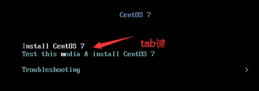<br>
按完tab键后多按几个空格，当光标出现在下一行时，输入``net.ifnames=0 biosdevname=0``<br>
如下图：<br>

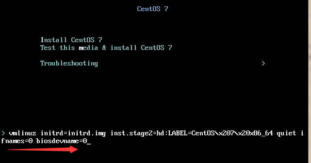<br>
已经安装完系统修改<br>
http://oldboy.blog.51cto.com/2561410/1722101<br>

#### 2.配置网络
首先找到网络配置接口 如下：<br>
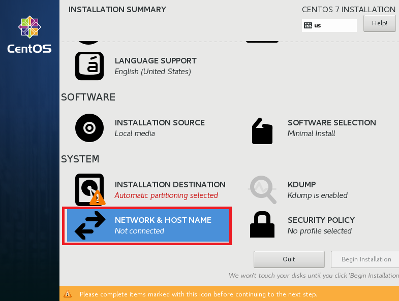<br>
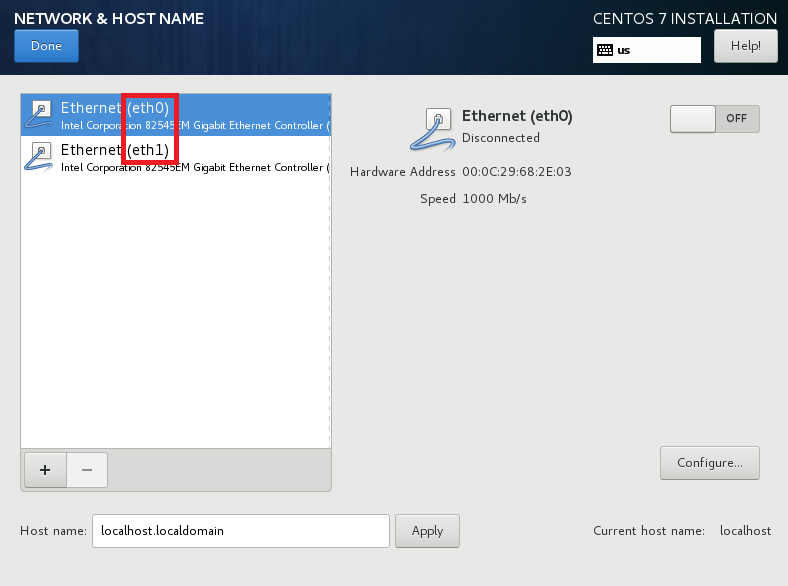<br>
当网卡的名字是eth0和eth1是说明我们网卡名配置成功，如上图。<br>

接下来我们配置ip地址和网关：<br>
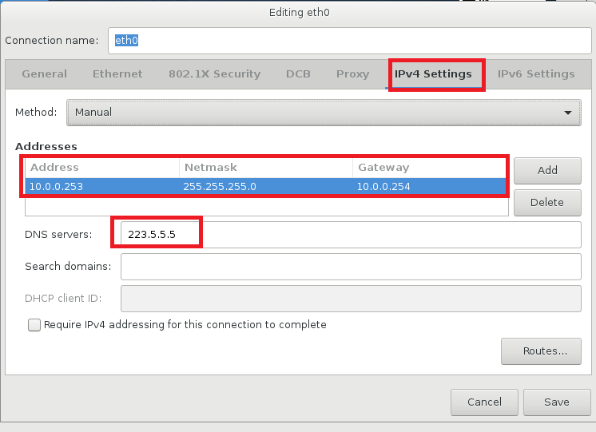<br>

下图中的Authomatically表示onboot的意思。<br>
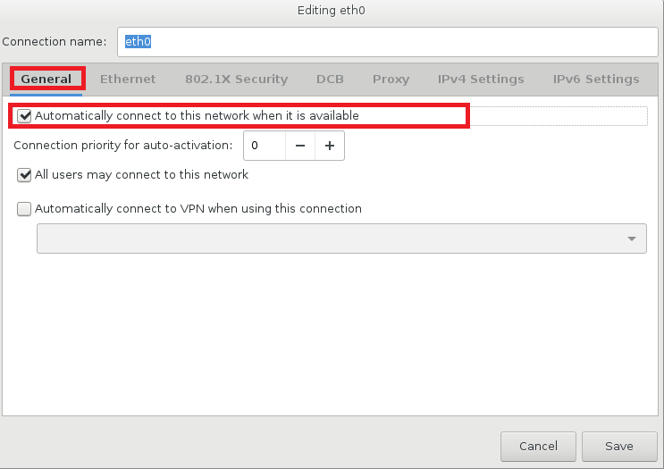<br>

#### 3.确定时间
<br>
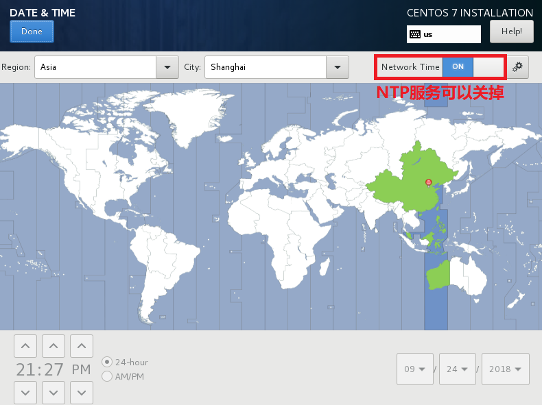<br>

#### 4.确定安装包
课程要求：<br>
- CentOS7使用镜像为CentOS7.4(CentOS-7-x86_64-DVD-1708)<br>
- IP:10.0.0.201和172.16.1.201<br>
- 关闭防火墙和selinux<br>
- 拍好快照<br>
- 安装包如下图<br>
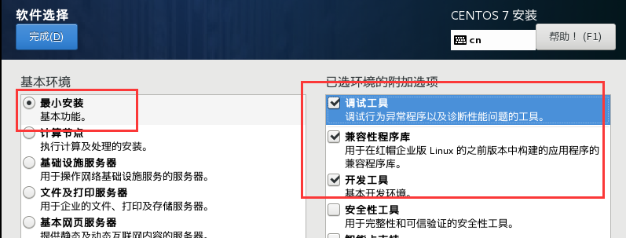<br>

#### 5.规划目录
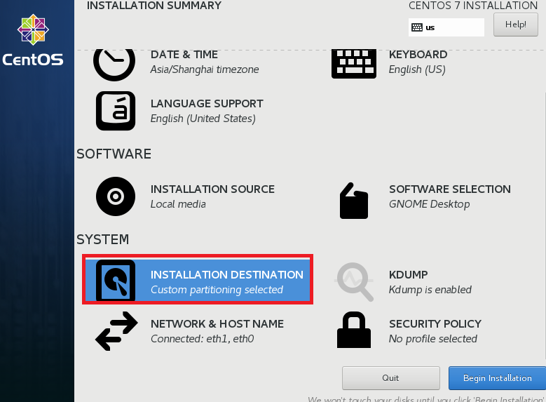<br>
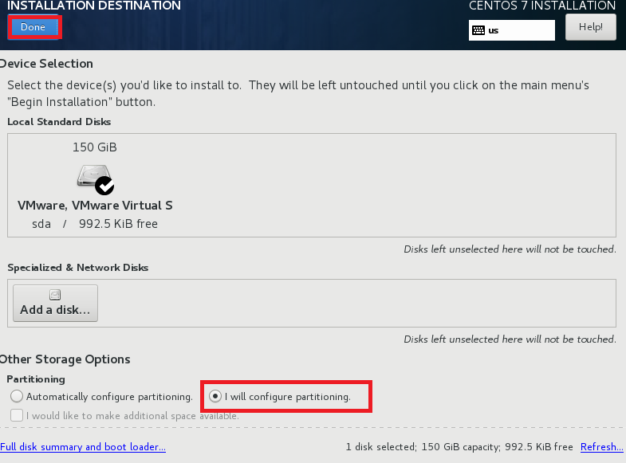<br>
<br>
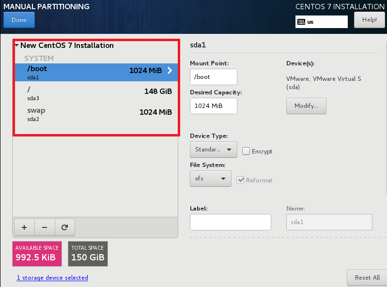<br>
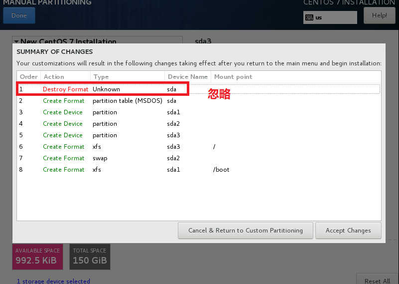<br>

#### 6.关闭kdump
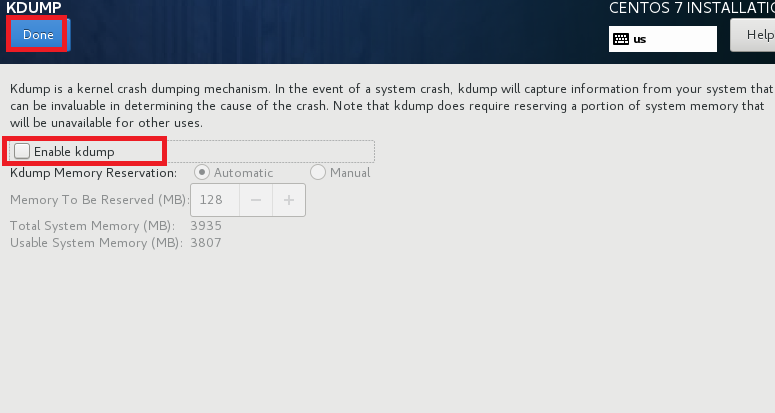<br>

#### 7.关闭安全相关组件
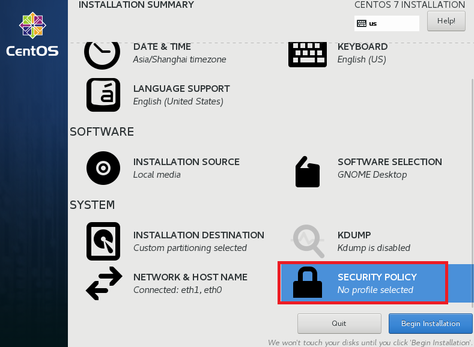<br>
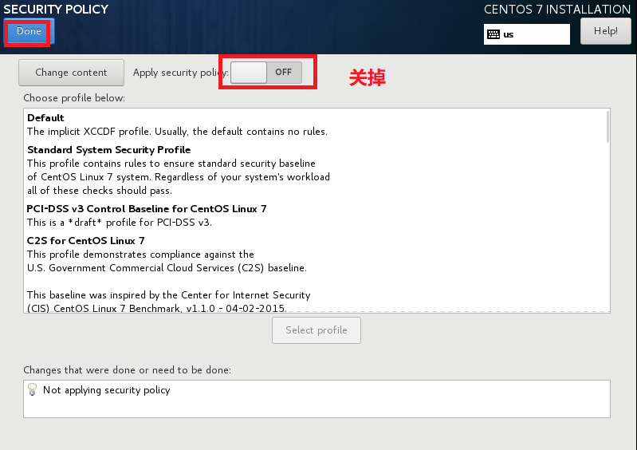<br>

#### 8.安装过程中的配置
完成上面的步骤我们就可以安装系统了。在安装系统的过程我们还要配置一下root的密码和另一个超级用户。<br>
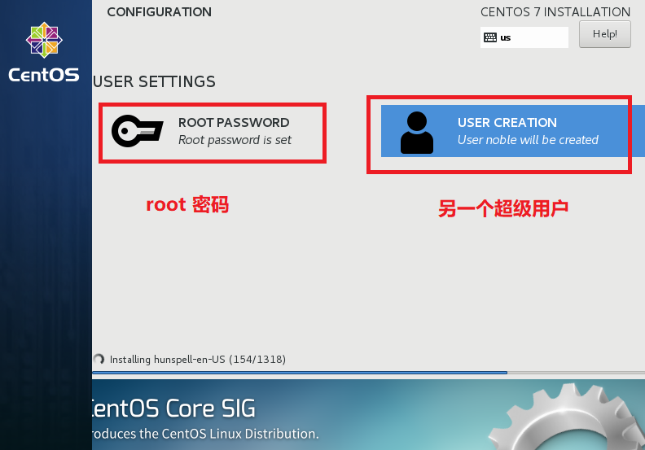<br>


### 2.自动部署安装CentOS7机器
- 课程要求：<br>
- 使用上节课安装的主机CentOS7(10.0.0.201)搭建KickStart服务端<br>
- 准备好CentOS7.4镜像<br>
- 上课会带领大家使用KickStart自动安装系统<br>
- (IP：10.0.0.202/172.16.1.202，主机名：cobbler)<br>
- 使用cobbler主机搭建cobbler服务，并再次使用cobbler服务自动安装系统<br>

### 3.缓存数据库memcached入门
- 本课程从最简单的缓存数据库memcached入门，更多数据库课程请期待数据库课程专场。 <br>
- 从CentOS7模板机全新克隆一台新主机<br>
- IP规划为10.0.0.21/172.16.1.21，主机名为cache01<br>
- 其次，准备一台能够打开wordpress的web01机器(CentOS6)，仿真企业真实环境，多系统混合使用<br>

### 4.搭建Tomcat
- 1.准备4台安装好CentOS7.4系统的虚拟机，内存512M。<br>
- 2.所有虚拟机的防火墙和Selinux关闭<br>
- 3.主机名及IP地址关系如下：<br>
    ```
    lb03    10.0.0.15
    lb04    10.0.0.16
    web03   10.0.0.17
    web04   10.0.0.18
    ```
- 4.web03和web04安装Tomcat软件，并满足下面条件：<br>
``curl http://10.0.0.17/页面底部得到结果为web03``<br>
``curl http://10.0.0.18/页面底部得到结果为web04``<br>
- 5.安装好wireshark 2.2.2版本  2.2.x版本以上即可<br>

### 5.发邮件
- 从CentOS7模板机全新克隆2台新主机<br>
- 第1台：IP规划为10.0.0.63/172.16.1.63，主机名为gitlab，内存2G+<br>
- 第2台：IP规划为10.0.0.64/172.16.1.64，主机名为Jenkins，内存1G+<br>
- 上课所需软件提前下发<br>
- Linux中能发邮件的账号<br>

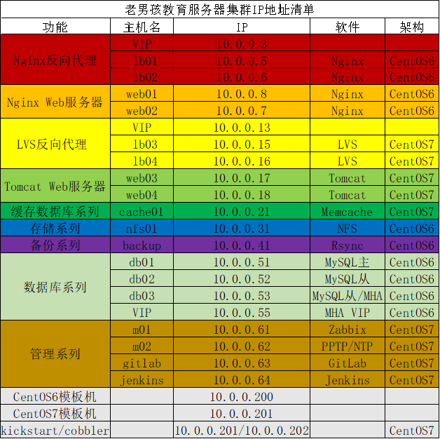<br>

<hr>

<br>

## CentOS7

### 1.CentOS7镜像介绍

- 下载地址： http://mirrors.aliyun.com/centos/7/isos/x86_64/CentOS-7-x86_64-DVD-1708.iso<br>
- 镜像名字解释：CentOS-7-x86_64-DVD-1708.iso<br>
- 从 CentOS 7 之后，版本命名就跟发行的日期有关了。<br>
- CentOS-7 系统是7.x版本<br>
- x86_6464 位操作系统，并且从7以后不再提供32位镜像。<br>
- 1708 2017年08月发表的版本<br>

### 2.登录系统 & 简单优化
- 补充安装软件包<br>
- yum -y install wget vim lrzsz bash-completion telnet nmap tree<br>
- 关闭selinux：/etc/selinux/config<br>
  getenforce
- 关闭防火墙：systemctl disable firewalld.service<br>
- 关机做快照<br>


### 4.管理服务
systemctl:融合service和chkconfig的功能于一体,兼容SysV和LSB的启动
脚本，而且够在进程启动过程中更有效地引导加载服务。。<br>
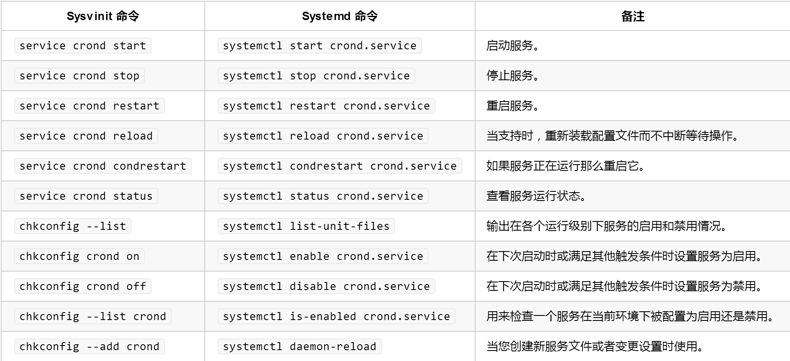<br>

<hr>

<br>
