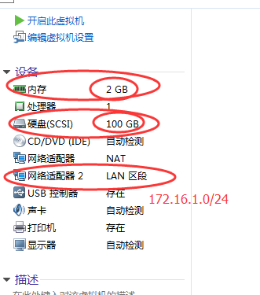
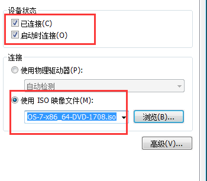

# Linux系统批量自动安装
- 实现原理：将手动安装的所有的详细步骤记录到一个文件中，然后有一种软件通过读取这个文件就可以实现自动化安装系统。<br>

- 这个工具叫做KickStart，kickstart是RedHat公司开源的工具，所以对CentOS兼容性最好。注意kickstart是一个项目的名称，没有这个软件。<br>

- cobbler是对kickstart的所有组件的封装。本质上就是网页版本的kickstart<br>

## 1.kickstart的原理及组件

__什么是PXE__<br>
- PXE，全名Pre-boot Execution Environment，预启动执行环境；
- 通过网络接口启动计算机，不依赖本地存储设备（如硬盘）或本地已安装的操作系统；
- PXE客户端会调用网际协议(IP)、用户数据报协议(UDP)、动态主机设定协议(DHCP)、小型文件传输协议(TFTP)等网络协议；

## 2.环境准备
```
[root@kickstart ~]# cat /etc/redhat-release
CentOS Linux release 7.4.1708 (Core)
[root@kickstart ~]# uname -r
3.10.0-693.el7.x86_64
[root@kickstart ~]# getenforce
Disabled
[root@kickstart ~]# systemctl status firewalld.service
● firewalld.service - firewalld - dynamic firewall daemon
   Loaded: loaded (/usr/lib/systemd/system/firewalld.service; disabled; vendor preset: enabled)
   Active: inactive (dead)
     Docs: man:firewalld(1)
[root@kickstart ~]# hostname -I
10.0.0.201 172.16.1.201
```

## 3.安装DHCP服务
1.安装DHCP<br>
``yum -y install dhcp``
 
2.配置DHCP<br>
```
cat >>/etc/dhcp/dhcpd.conf<<EOF
subnet 172.16.1.0 netmask 255.255.255.0 {
range 172.16.1.100 172.16.1.199;
option subnet-mask 255.255.255.0;
default-lease-time 21600;
max-lease-time 43200;
next-server 172.16.1.201;
filename "/pxelinux.0";
}
EOF
```

## 4.运行DHCP服务与检查日志
3.启动dhcp查看日志<br>
```
[root@kickstart ~]# systemctl start dhcpd
[root@kickstart ~]# systemctl status dhcpd
tailf /var/log/messages
```
4.通过抓包查看DHCP过程<br>
```
yum install wireshark -y
tshark -ni eth1
```

## 5.那些年我们踩过的坑（1）
新建空白虚拟机，建完后做快照。<br>
 <br>

__安装TFTP服务__<br>
安装<br>
``yum -y install tftp-server``<br>
启动<br>
 ``systemctl start tftp.socket``<br>

## 6.那些年我们踩过的坑（2）
<br>

上面报错是在TFTP服务的根目录找不到启动文件pxelinux.0<br>

    ```
    [root@kickstart ~]# cd /var/lib/tftpboot/ # TFTP服务的根目录
    [root@kickstart tftpboot]# ls
    [root@kickstart tftpboot]#
    yum -y install syslinux
    cp /usr/share/syslinux/pxelinux.0 /var/lib/tftpboot/
    ```

## 那些年我们踩过的坑（3）
<br>
首先排除最简单故障原因：selinux是否关闭，防火墙是否关闭<br>
上面的错误是因为pxelinux.0这个小系统的配置文件（default）不存在，或者文件名不对<br>


如何找到这个配置文件<br>
- 第一步：挂载镜像<br>
    <br>
- 第二步<br>
    ```
    mkdir -p /var/www/html/CentOS7
    mount /dev/cdrom /var/www/html/CentOS7
    ```

- 第三步：从镜像中找到相关的配置文件<br>
    ```
    cp -a /var/www/html/CentOS7/isolinux/* /var/lib/tftpboot/
    mkdir -p /var/lib/tftpboot/pxelinux.cfg
    cp /var/www/html/CentOS7/isolinux/isolinux.cfg /var/lib/tftpboot/pxelinux.cfg/default
    ```

__配置完成TFTP服务__<br>
```
#systemctl is-active tftp.service
active
tree -F  /var/lib/tftpboot/
/var/lib/tftpboot/
├── boot.cat
├── boot.msg
├── grub.conf
├── initrd.img
├── isolinux.bin
├── isolinux.cfg
├── memtest
├── pxelinux.0
├── pxelinux.cfg/
│   └── default
├── splash.png
├── TRANS.TBL
├── vesamenu.c32
└── vmlinuz*
```

## 安装HTTP服务
作用1：提供自动应答文件下载<br>
作用2：提供安装系统所需的所有rpm包下载<br>
```
yum -y install httpd
systemctl start httpd.service
```
检查步骤<br>
```
http://10.0.0.201/CentOS7/
curl http://172.16.1.201/CentOS7/
```

## 手动网络安装
编辑default文件

<br>

## 自动安装操作系统
- 1.1 ks文件组成
    命令段<br>
    包组段  以%packages开头，以%end结束<br>
    脚本段  以%post开头，以%end结束，在安装完系统之后执行的相关Linux命令、脚本<br>
      　　　  以%pre开头，以%end结束，在安装完系统之前执行的相关Linux命令、脚本<br>

- 1.2 kickstart文件语法检查
    ```
    yum install pykickstart
    ksvalidator /var/www/html/ks_config/CentOS-7-ks.cfg
    ```
请记住这个验证工具有其局限性。Kickstart 文件可能会很复杂；ksvalidator 可保证其语法正确，且该文件不包含淘汰的选项，但它无法保证安装会成功。它也不会尝试验证 Kickstart 文件的 %pre、%post 和 %packages 部分。<br>

- 1.3 root加密密码生成<br>
    ``python -c 'import crypt; print(crypt.crypt("密码"))'``<br>


__开始自动安装系统，enjoy！__<br>
