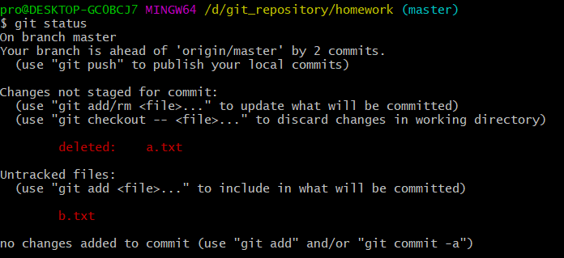

# 版本控制Git

## 1.安装
### 1.yum安装
默认在CentOS下，我们可以通过yum的方式来安装Git<br>
```
[root@noble ~]# yum install git –y
[root@noble ~]# git version
git version 1.8.3.1
```

使用yum安装的Git的版本是1.8，版本较低，我们还可以通过源码编译的方式来安装Git的最新版本。<br>

### 2.源码安装
首先需要安装依赖的库：<br>
``[root@node1 ~]# yum install curl-devel expat-devel gettext-devel openssl-devel zlib-devel gcc perl-ExtUtils-MakeMaker -y``<br>

下载最新的源码包<br>
``https://www.kernel.org/pub/software/scm/git/git-2.9.5.tar.gz``<br>

解压安装:<br>
```
[root@noble src]# tar xf git-2.9.5.tar.gz
[root@noble src]# cd git-2.9.5
[root@noble git-2.9.5]# make prefix=/usr/local/git all
[root@noble git-2.9.5]# make prefix=/usr/local/git install
[root@noble git-2.9.5]# rm -rf /usr/bin/git
[root@noble git-2.9.5]# ln -s /usr/local/git/bin/git /usr/bin/git
[root@noble git-2.9.5]# git --version
git version 2.9.5
```
至此，我们已经完成了Git的编译安装<br>

## 2.Git配置

### 1.系统环境配置
关闭selinux和防火墙。<br>

### 2.Git全局配置
```
git config --global user.name "pitifulnoble"
git config --global user.email "pitifulnoble@outlook.com"
git config --global color.ui true #语法高亮
git config --list #查看git的全局配置
```

## 3.Git基本使用

### 1.初始化Git仓库
我们先创建一个目录，把它选定为Git的仓库，使用命令``git init``初始化这个目录。<br>
在执行完``git init``命令后，该目录会出现一个``.git``的隐藏目录。<br>
```
[root@node1 git]# tree .git/
.git/
├── branches
├── config
├── description
├── HEAD
├── hooks
│   ├── applypatch-msg.sample
│   ├── commit-msg.sample
│   ├── post-update.sample
│   ├── pre-applypatch.sample
│   ├── pre-commit.sample
│   ├── prepare-commit-msg.sample
│   ├── pre-push.sample
│   ├── pre-rebase.sample
│   └── update.sample
├── info
│   └── exclude
├── objects
│   ├── info
│   └── pack
└── refs
    ├── heads
    └── tags
```


我们可以使用``git status``查看当前git仓库的状态。<br>

### 2.git版本控制的四周工作区域

<br>

__工作目录：__<br>
就是``git init``初始化的工作目录。<br>
特别的在工作目录中的文件，可能被git跟踪，也可能没有被git跟踪。<br>

__缓冲区域：__<br>
在使用了``git add .``后被加入缓冲区。此时被加入缓冲区的文件，被git跟踪，可以继续使用命令``git commit``提交到本地仓库，也可以使用``git rm``解除跟踪，使用该命令并没有真正删除该文件，仅仅取消git跟踪这个文件，该文件还存在在工作目录中。<br>
缓冲区域的文件相关信息记录在``.git``目录下的``index``文件中<br>

__本地仓库：__<br>
使用``git commit``将缓冲区的文件提交到本地仓库。<br>
本地仓库的相关信息记录在``.git``目录下面的``objects``目录中，类似或可能就是通过md5检查更新。<br>

__远程仓库：__<br>
使用``git push``命令将本地目录推送到远程仓库。<br>


### 3.常用命令
```
git status                     查看当前仓库状态
git lfs status                 类似 `git status`，查看当前 Git LFS 对象的状态
git add .                      把所有的更新加入到“临时保存地”
git lfs track                  查看当前使用 Git LFS 管理的匹配列表
git lfs track "*.tar.gz"       使用 Git LFS 管理指定的文件
git lfs untrack "*.tar.gz"     不再使用 Git LFS 管理指定的文件
git commit -m ''               把保存的更新加入到版本控制中，准备推送到远程仓库
git push origin master         推送到远程仓库
```

### 4.git删除命令
``git rm --cached <文件名>``<br>
上述命令是将文件从缓冲区删除。<br>
如果上述命令不加``--cached`` 该命令会把文件从缓冲区和工作目录同时删除。<br>

上述命令可以用``git add``替代，也就是说我们完全可以用``add``命令代替``rm``命令。<br>

使用``git commit``提交到本地目录<br>


### 5.git文件重命名
``git mv <file_name_src> <file_name_desc>``<br>
这条命令存在的价值是什么？<br>
我们完全可以使用这样的方法达到同样的目的：<br>
在工作目录把一个目标文件重命名然后用``git add``,``git commit``把文件推送到仓库。<br>

使用上述方法会有一个问题，就是无端的浪费流量和时间。当我们在把一个文件在工作目录改名后，``git``的跟踪程序会做出什么识别？(此时还没有使用``git add/rm``)<br>
我们看这张图：<br>
<br>
在上面这张图是我们在工作目录把一个已经被git跟踪的``a.txt``文件跟名为``b.txt``。此时``git``的跟踪程序识别为删除一个被跟踪文件``a.txt``，增加了一个文件``b.txt``。<br>
如果我们继续使用上述方法实现同样的目的，如果是在本地仓库不会有什么问题，但如果我们要推送到远程仓库就会出现浪费流量的问题，远程仓库删除``a.txt``文件，又把本地的``b.txt``文件推过去。如果``a.txt``文件越大越浪费时间和流量。<br>

__更正：__<br>
``git`` 会使用类似或可能就是``md5``的方法检测文件内容，如果工作目录删除和增加的文件的``md5``值相等，git会默认修正为更名操作。<br>
