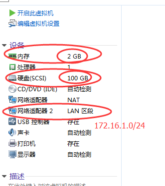
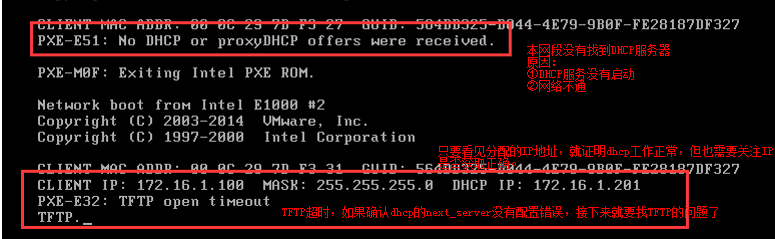

# Linux系统批量自动安装
- 实现原理：将手动安装的所有的详细步骤记录到一个文件中，然后有一种软件通过读取这个文件就可以实现自动化安装系统。<br>

- 这个工具叫做KickStart，kickstart是RedHat公司开源的工具，所以对CentOS兼容性最好。注意kickstart是一个项目的名称，没有这个软件。<br>

- cobbler是对kickstart的所有组件的封装。本质上就是网页版本的kickstart<br>

## 1.kickstart的原理及组件

__什么是PXE__<br>
- PXE，全名Pre-boot Execution Environment，预启动执行环境；
- 通过网络接口启动计算机，不依赖本地存储设备（如硬盘）或本地已安装的操作系统；
- PXE客户端会调用网际协议(IP)、用户数据报协议(UDP)、动态主机设定协议(DHCP)、小型文件传输协议(TFTP)等网络协议；

## 2.环境准备
```
[root@kickstart ~]# cat /etc/redhat-release
CentOS Linux release 7.4.1708 (Core)
[root@kickstart ~]# uname -r
3.10.0-693.el7.x86_64
[root@kickstart ~]# getenforce
Disabled
[root@kickstart ~]# systemctl status firewalld.service
● firewalld.service - firewalld - dynamic firewall daemon
   Loaded: loaded (/usr/lib/systemd/system/firewalld.service; disabled; vendor preset: enabled)
   Active: inactive (dead)
     Docs: man:firewalld(1)
[root@kickstart ~]# hostname -I
10.0.0.201 172.16.1.201
```

## 3.安装DHCP服务
1.安装DHCP<br>
``yum -y install dhcp``
 
2.配置DHCP<br>
```
cat >>/etc/dhcp/dhcpd.conf<<EOF
subnet 172.16.1.0 netmask 255.255.255.0 {
range 172.16.1.100 172.16.1.199;
option subnet-mask 255.255.255.0;
default-lease-time 21600;
max-lease-time 43200;
next-server 172.16.1.201;
filename "/pxelinux.0";
}
EOF
```

## 4.运行DHCP服务与检查日志
3.启动dhcp查看日志<br>
```
[root@kickstart ~]# systemctl start dhcpd
[root@kickstart ~]# systemctl status dhcpd
tailf /var/log/messages
```
4.通过抓包查看DHCP过程<br>
```
yum install wireshark -y
tshark -ni eth1
```

## 5.那些年我们踩过的坑（1）
新建空白虚拟机，建完后做快照。<br>
 <br>
