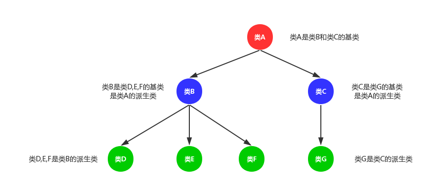
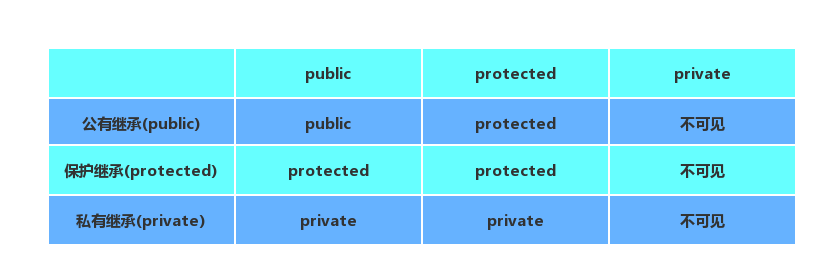

# 继承和派生
在C++中可重用性是通过继承这一机制来实现的。
## 1.概述
类的继承是新的类从已有类哪里得到已有属性。<br>
类的派生就是从已有的类产生新的类。<br>
原有的类称为基类或父类，新产生的类称为派生类或子类。<br>
继承和派生是对同一事实的不同描述方法，如类B继承类A，或类A派生了类B。<br>
<br>

- 1.全盘接收，除了构造函数和析构函数。
- 2.基类有可能会冗余，所以类是需要设计的
- 3.派生类有自己的特性，所以派生类是有意义的

## 2.继承的类型
public，private和protected继承类型说明。首先继承类型使用的关键字和和类的成员属性类型是一样的词语，但是他们是完全不同的东西，不要理解错误。<br>
<br>
(1)我们使用公有继承：子类继承基类的public成员属性和protected成员属性，其中基类的public成员属性在子类中也是public成员属性，类的内部和外部都可以访问，基类中protected成员属性在子类中是protected成员属性，只能在类的内部访问。而private成员属性不可在子类中访问，不管是类的内部，还是类的外部。<br>

(2)我们使用保护继承：子类继承基类的public成员属性和protected成员属性。其中基类成员属性不管是public还是protected成员属性，在子类中都变成protected成员属性，只能在子类的内部访问，不能在子类的外部访问。基类中的private成员属性不可在子类中访问。<br>

(3)我们使用私有继承：子类继承基类的public成员属性和protected成员属性。其中基类成员属性不管是public还是protected成员属性，在子类中都变成private成员属性，当该子类做基类时，新的派生类不可访问该子类继承过来的所有属性。<br>

__注意：__<br>
基类中的private属性虽然不能被派生类访问，但他占用派生类的空间，也就是说在派生类中，基类的private属性是存在的。<br>

```cpp
#include <iostream>
#include<string>
using namespace std;

class A
{
public:
    int pub_A;
protected:
    int pro_A;
private:
    int pri_A;
};

class B:public A//public模式继承
{
    void fun()
    {
        pub_A;//public成员
        pro_A;//protected成员
        //pri_A;不可访问
    }
};

class C:protected A//protected模式继承
{
    void fun()
    {
        pub_A;//protected成员
        pro_A;//protected成员
        //pri_A;不可访问
    }
};

class D:private A//private模式继承
{
    void fun()
    {
        pub_A;//private成员
        pro_A;//private成员
        //pri_A;不可访问
    }
};

int main()
{
    return 0;
}

```
