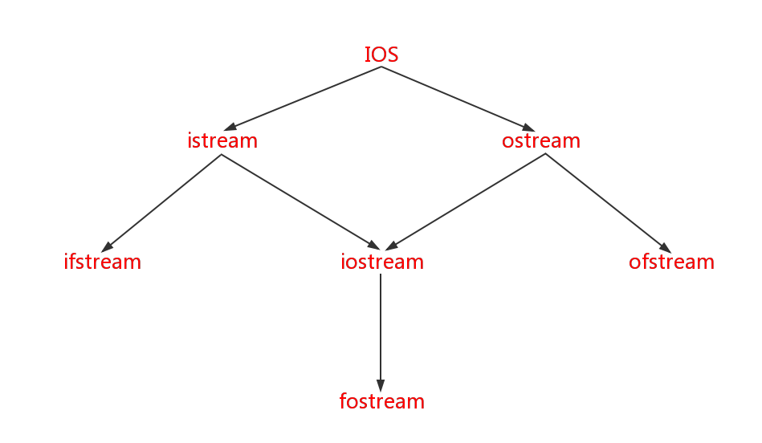

# I/O控制
在C++语言中字节流的概念和C语言中是一样的。但在C++中对输入的类型检查更加严格，这带来了安全稳定的好处，但同时也使得C++的io系统异常复杂，需要掌握更多的细节。<br>

我们知道在CPP中的输入输出对象是类实现的，下图展示了CPP中输入输出流的继承层次：<br>
<br>

上图``ios``是抽象基类，由它派生出``istream``类和``ostream``类，两个类名中第一个字母``i``和``o``分别代表输入(``input``)和输出(``output``)。``iostream``是从``istream``和``ostream``两个类继承过来的。参见上图。<br>
C++对文件的输入输出使用``ifstream``和``ofstream``。<br>

## 1.I/O控制流的头文件
iostream类库中不同的类的声明在不同的头文件中，常用的有：<br>
- 1.iostream 包含了对输入输出流进程操作所需的基本信息
- 2.fstream 用于管理文件的I/O操作
- 3.strstream 用于字符串流I/O
- 4.stdiostream 用于混合使用C和CPP的I/O机制，例如将C程序变成CPP程序

## 2.标准I/O流
标准的I/O对象：cin，cout，cerr，clog<br>
### 1.cout
cout是console output的缩写，意思是控制台输出。<br>
__注意：__<br>
- 1.每当我们在使用``cout<<``时，当我们加入``endl``后，程序会刷新缓冲区即不管缓冲区是否满，都会把数据流输出在终端上(如果插入的是``\n``则仅仅输出换行，是不会刷新缓冲区的)。<br>


一般情况下我们使用操作符``<<``来执行程序的输出，让编译器自己决定数据的输出格式。但有的时候我们希望自己来掌控。一般我们自定义数据输出格式的方法有两个，一个是通过标识符来操作，另一种是通过成员函数来实现。下面分别描述：<br>

#### 1.标识符控制输出格式
如果使用了标识符，那么要增加头文件：``iomanip``<br>

|标识符|作用|
|-----|----|
| dec  | 设置输出格式是10进制  |
| hex  | 设置输出格式是16进制  |
| oct  | 设置输出格式是8进制  |
| setfill(c)  | 设置填充字符c，c可以是字符常量或字符变量  |
| setprecision(n)  | 设置浮点数的精度为n位，在以一般十进制小数形式输出时，n代表有效数字。在以fixed(固定小数位数)形式和scientific(指数)形式输出时，n为小数位数  |
| setw(n)  | 设置字段宽度为n位  |
| setiosflags(ios::fixed)  | 设置浮点数以固定的小数显示  |
| setiosflags(ios::scientific)  | 设置浮点数以科学计数法显示  |
| setiosflags(ios::left)  | 输出左对齐  |
| setiosflags(ios::right)  | 输出右对齐  |
| setiosflags(ios::skipws)  | 忽略前面的空格  |
| setiosflags(ios::uppercase)  | 数据以十六进制输出，字母大写  |
| setiosflags(ios::lowercase)  | 数据以十六进制输出，字母小写  |
| setiosflags(ios::showpos)  | 输出正数时给出“+”号  |

实例(浮点数)：<br>
```cpp
double a=123.456789012345;

cout<<a;//输出123.457
cout<<setprecision(9)<<a;//输出123.456789
cout<<setprecision(6);//恢复默认格式(精度为6)
cout<<setiosflags(ios::fixed)<<a;//123.456789
cout<<setiosflags(ios::fixed)<<setprecision(8)<<a;//输出123.45678901
cout<<setiosflags(ios::scientific)<<a;//输出0xf.6e9e03fda6348p+3
cout<<setiosflags(ios::scientific)<<setprecision(4)<<a;//输出0xf.6e9e03fda6348p+3
```
实例(整数)：<br>
```cpp
int b=123456;

cout<<b<<endl;//输出123456
cout<<hex<<b<<endl;//输出1e240
cout<<setiosflags(ios::uppercase)<<b<<endl;//输出1E240
cout<<setw(10)<<b<<','<<b<<endl;//输出     1E240,1E240
cout<<setfill('*')<<setw(10)<<b<<endl;;//输出*****1E240
cout<<setiosflags(ios::showpos)<<b<<endl;//输出1E240
```

#### 1.使用成员函数

|流成员函数|与之相同作用的控制符|作用|
|---------|------------------|----|
| precision(n)  | setprecision(n)  | 设置实数精度为n位  |
| width(n)  | setw(n)  | 设置字段宽度为n位  |
| fill(c)  | setfill(c)  | 设置填充字符c  |
| setf()  | setiosflags()  | 设置输出格式状态，括号中应给出格式状态，内容与控制符setiosflags快活中的内容相同，如下图表所示  |
| unsetf()  | resetioflags()  | 终止已设置的输出格式状态，在括号中应指定内容  |


流成员函数setf和控制符setiosflags括号中的参数表示格式状态，它是通过格式标准来指定的。格式标志在类ios中被定义为枚举值。因此在引用这些格式标志时要在前面加上类名ios和域运算符``::``。格式标识符如下：<br>

|格式标志|作用|
|-------|----|
| ios::left  | 输出数据在本域宽范围内向左对齐  |
| ios::right  | 输出数据在本域宽范围内向右对齐  |
| ios::internal  | 数值的符号位在域宽内左对齐，数值右对齐，中间由填充字符填充  |
| ios::dec  | 设置整数的格式为10进制  |
| ios::oct  | 设置整数的格式为8进制  |
| ios::hex  | 设置整数的格式为16进制  |
| ios::showbase  | 强制输出整数的进制格式标识符(八进制以0开头，十六进制以0X开头)  |
| ios::showpoint  | 强制输出浮点数的点和尾数0  |
| ios::uppercase  | 用科学计数法格式E输出值，字母大写  |
| ios::showpos  | 对正数显示“+”号  |
| ios::scientific  | 浮点数以科学计数法输出  |
| ios::fixed  | 浮点数以定点格式(小数形式)输出  |
| ios::unitbuf  | 每次输出之后刷新所有的流  |
| ios::stdio  | 每次输出后清除stdout，stderr  |


### 2.cerr
cerr流对象是标准错误流，cerr流已被指定为与显示器关联。cerr的作用是向标准错误设备(standard error device)输出有关的错误信息。<br>
cerr的用法和cout差不多，不同的是，cout的输出我们可以重定向到文件，而cerr的信息只会显示在终端上，我们不希望错误信息也被重定向，而看不到错误提示。<br>

### 3.clog
clog流对象和cerr一样只显示在终端上，但是cerr不会有缓冲区，会直接把信息打印到显示器上，而clog会有缓冲区，当缓冲区满后，或遇到endl时向终端输出。<br>

### 4.标准输入流cin
我们对信息的读入通常会有一定的要求所以``>>``操作符可能有时候不能满足我们的需求，我们要重点掌握下面的函数：<br>
- cin.get()//一次只能读取缓冲区的一个字符
- cin.get(参数)//读取一个字符
- cin.get(三个参数)//可读取字符串
- cin.getline()//读取一行
- cin.ignore()//忽略一些字符
- cin.putback()//把读取的字符放回缓冲区

实例1：<br>
cin.get()没有参数时，返回接受到的字符。<br>
```cpp
#include <iostream>

using namespace std;

int main()
{
	char ch;
	while ((ch = cin.get() )!= EOF)
	{
		cout << ch << " ";
	}
	cout << endl;
	system("pause");
	return 0;
}
```

实例2：<br>
当cin.get(ch)有一个参数时，把接收到的值放置到参数变量中。<br>
```cpp
#include <iostream>

using namespace std;

int main()
{
	char ch;
	cin.get(ch);
	cout << ch << " ";
	cout << endl;
	system("pause");
	return 0;
}
```

实例3：<br>
当cin.get(bur,num,'a')有三个参数时,第一个参数传容器的首地址，第二个参数是容器的大小，第三个参数表示当遇到哪个字符后停止接受，并将当前接收到的字符串写入容器。<br>

```cpp
#include <iostream>

using namespace std;

int main()
{
	char ar[1024] = { 0 };
	cin.get(ar,1024,' ');
	cout << ar << endl;
	system("pause");
	return 0;
}
```

实例4：<br>
cin.getline()接受两个参数，第一个是容器的首地址，第二个是容器的大小。<br>
```cpp
#include <iostream>

using namespace std;

int main()
{
	char ar[1024] = { 0 };
	cin.getline(ar,1024);
	cout << ar << endl;
	system("pause");
	return 0;
}

```

实例5：<br>
cin.putback(c);将字符放回缓冲区。<br>
```cpp
#include<iostream>
#include<string>
using namespace std;

int main()
{
	cout << "Please,enter a number or a word:";
	char c = cin.get();

	if ((c >= '0') && (c <= '9'))
	{
		int n;//整数中间是不会有空格的
		cin.putback(c);//把c字符放回缓冲区
		cin >> n;
		cout << "You entered a number:" << n << endl;
	}
	else
	{
		string str;
		cin.putback(c);
		getline(cin, str);
		cout << "you entered a word:" << str << endl;
	}
	system("pause");
	return 0;
}
```


## 2.文件操作I/O
