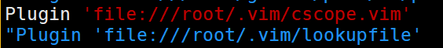

# C/C++ VIM编辑器的配置和使用
## 1.Vundle的使用和配置
官网说明：
[https://github.com/VundleVim/Vundle.vim](https://github.com/VundleVim/Vundle.vim)<br>
Vundle是一款VIM的插件管理器。<br>
编写方式在.vimrc中写的很清楚。类似如下：<br>
<br>

在vim编辑器中可以参考一下命令：<br>
<br>

命令详解：<br>
- 1.PluginList会列出当前安装和需要安装的插件列表
- 2.PluginInstall命令会安装在.vimrc中编写的插件
- 3.PluginClean会删除在.vimrc中没有包含的插件


__错误：__<br>
``E117: Unknown function: vundle#end``<br>
原因可能是两种：<br>
- 1.rtp路径出现错误
- 2.Windows编码不能在Linux下运行

对于第一种错误在这个网站上有很好的阐述：<br>
[overflow](https://stackoverflow.com/questions/25444680/unknown-function-vundlebegin)<br>

第二种错误我们可以使用``dos2unix``工具转换<br>
使用命令：``[root@noble ~]# dos2unix .vimrc``<br>
然后试试看说不准就解决了。<br>


## 2.tags使用
官方说明：
[https://packagecontrol.io/packages/CTags](https://packagecontrol.io/packages/CTags)<br>
### 第一个里程碑 安装
在Linux系统中：<br>
For Debian-based systems(Ubuntu,Mint,etc.):<br>
``sudo apt-get install exuberant-ctags``<br>
For Red Hat-based systems (Red Hat,Fedora,CentOS):<br>
``yum install ctags``<br>
### 第二个里程碑 使用
官方说明：
[https://courses.cs.washington.edu/courses/cse451/10au/tutorials/tutorial_ctags.html](https://courses.cs.washington.edu/courses/cse451/10au/tutorials/tutorial_ctags.html)<br>
在自己的项目根目录下使用命令``ctags -R *``<br>
这条命令会递归的扫描所有文件然后管理此项目。<br>

__两条重要的命令__<br>
- 1 ``Ctrl ]`` 在vim编辑器中当光标在一个函数上时，该命令跳转到该函数的定义上
- 2 ``Ctrl t`` 在上一命令结束后 使用该命令 光标跳回原来的地方

## 3.cscope的使用
### 1.创建cscope文件
有一个不错的博客：<br>
[https://blog.easwy.com/archives/advanced-vim-skills-cscope/](https://blog.easwy.com/archives/advanced-vim-skills-cscope/)<br>
在代码的更目录执行命令``cscope -Rbq``，就会生成cscope.out数据库文件<br>
生成的3个文件中cscope.out是最基本的文件。<br>
对参数的解释：<br>
- 1.-R 递归连接每个目录下面的子文件
- 2.-b 当前仅执行，不进入cscope的工作界面
- 3.-q 生成cscope.in.out和cscope.po.out文件，加快cscope的检索速度
- 4.-k 在生成索引数据库时，不搜索/usr/include目录
- 5.-i 当我们创建的cscope.files是用的其他名称，使用这个参数指定
- 6.-l 在-l参数的后面加目录路径，之后头文件的查找都在这个目录中
- 7.-u 扫描所有文件，重新生成索引文件
- 8.-P 加上绝对路径

__特别的：__<br>
- 1.cscope在生成数据库中，在你的项目目录中未找到的头文件，会自动到/usr/include目录中查找。如果你想阻止它这样做，使用"-k"选项。<br>
- 2.cscope在缺省情况下只检索C程序文件(.c和.h)，cscope也支持C++和JAVA但是必须要在项目的根目录下的cscope.files文件中包括这些C++或JAVA的路径。我们一般用find命令创建cscope.files文件。当cscope发现当前目录存在cscope.files文件时，就会建立cscope.files文件中包含文件名的数据库，所以不用加-R参数。<br>
```shell
find . -type f > cscope.files
cscope -bq
```


## 4.lookupfile插件使用
更多介绍：<br>[易水博客](https://blog.easwy.com/archives/advanced-vim-skills-lookupfile-plugin/)<br>
lookupfile是一个非常出色的文件查找插件，支持通配符，在大型项目和文件较多的环境中有非常大的用武之地。<br>
lookupfile源码下载链接：<br>
[https://www.vim.org/scripts/script.php?script_id=1581](https://www.vim.org/scripts/script.php?script_id=1581)<br>
