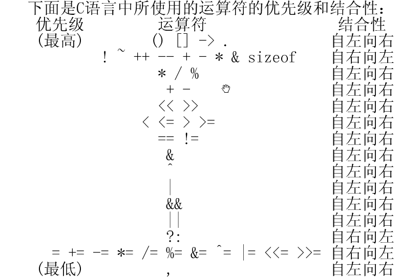

# 数据类型
- int整形
存储方式因不同的编辑器和环境不同<br>
    【例3.3】整型数据的溢出。<br>
    ```
    #include <stdio.h>
    void main()
    {
      short a,b;
      a=32767;
      b=a+1;
      printf("%d,%d\n",a,b);
     }
     ```
    32767:   0111111111111111<br>
    -32768:  1000000000000000<br>

<hr>

- float型
float型变量只能保存7位有效数字<br>
double型变量能保存13位有效数字<br>

    ```
    #include<stdio.h>
    void main()
    {
            float a,b;
            a = 123456.789e5;
            b = a + 20;
            printf("%f\n",a);
            printf("%f\n",b);
    }
    ```

    会发生误差，逻辑输出结果是12345678900，实际输出如下：<br>
    ```
    root@pro:/c/file# ./file2.o
    12345678848.000000
    12345678848.000000
    ```

- 字符型数据
    字符型数据包括字符常量和字符变量<br>
    字符常量是用 __单引号__ 括起来的一个字符<br>
    如：'a' , 'b' , '=' , '?'<br>

    __在Ｃ语言中，字符常量有以下特点：__<br>
    1)字符常量只能用单引号括起来，不能用双引号或其它括号。<br>
    2)字符常量只能是单个字符，不能是字符串。<br>
    3)字符可以是字符集中任意字符。但数字被定义为字符型之后就不能参与数值运算。如'5'和5 是不同的。'5'是字符常量，不能参与运算。<br>
    __字符变量__<br>
    字符变量用来存储字符常量，即单个字符。<br>

    字符变量的类型说明符是char。字符变量类型定义的格式和书写规则都与整型变量相同。例如：<br>

    char a,b;<br>
    ```
    #include<stdio.h>
    void main()
    {
            char a,b;
            a = 120;
            b = 121;
            printf("%c,%c\n",a,b);
            printf("%d,%d\n",a,b);
    }
    ```
    输出：<br>
    ```
    x,y
    120,121
    ```

- 字符串常量<br>
    1)字符常量由单引号括起来，字符串常量由双引号括起来。<br>
    2)字符常量只能是单个字符，字符串常量则可以含一个或多个字符。<br>
    3)可以把一个字符常量赋予一个字符变量，但不能把一个字符串常量赋予一个字符变量。<br>
    例如：可以char a = 'a' 不能 char a = "a";<br>
    4)字符常量占一个字节的内存空间。字符串常量占的内存字节数等于字符串中字节数加1。
    增加的一个字节中存放字符"\0" (ASCII码为0)。这是字符串结束的标志<br>

## 算术表达式和运算符的优先级和结合性
<br>
