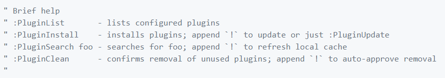

# C/C++ VIM编辑器的配置和使用
## 1.Vundle的使用和配置
官网说明：
[https://github.com/VundleVim/Vundle.vim](https://github.com/VundleVim/Vundle.vim) 
Vundle是一款VIM的插件管理器。 
在vim编辑器中可以参考一下命令： 
 

## 2.tags使用
官方说明：
[https://packagecontrol.io/packages/CTags](https://packagecontrol.io/packages/CTags) 
### 第一个里程碑 安装
在Linux系统中： 
For Debian-based systems(Ubuntu,Mint,etc.): 
``sudo apt-get install exuberant-ctags`` 
For Red Hat-based systems (Red Hat,Fedora,CentOS): 
``yum install ctags`` 
### 第二个里程碑 使用
官方说明：
[https://courses.cs.washington.edu/courses/cse451/10au/tutorials/tutorial_ctags.html](https://courses.cs.washington.edu/courses/cse451/10au/tutorials/tutorial_ctags.html) 
在自己的项目根目录下使用命令``ctags -R *`` 
这条命令会递归的扫描所有文件然后管理此项目。 
