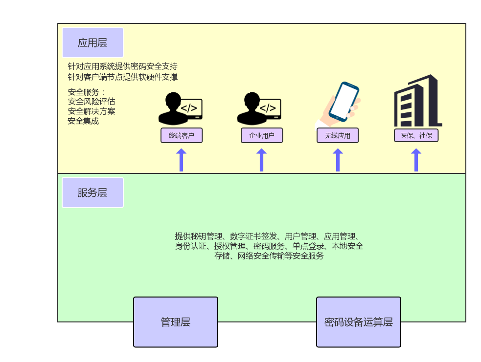

# 1.引言

## 1.编写的目的
详细记录数据传输平台项目的实现部署信息，为维护和次开发做好文档记录。 
## 2.术语和定义
应用，应用结点,网点,接入
## 3.参考资料

## 4.项目简介
数据安全传输基础设施平台(简称，数据传输平台)是一款 **基础设施类** 项目，为集团、企业信息系统 **提供统一、标准的信息安全服务** ；解决企业和企业之间，点与点之间传输安全、消息安全、身份鉴别和认证；能解决新增云服务节点安全数据传输；也能解决传统的安全产品部署分散、效率低下、系统脆弱等关键问题。是信息系统“逻辑大集中”、“业务大集中”下的数据安全传输解决方案。 
数据传输平台解决方案不仅可面向具有高安全性和高性能需求的电子商务、电子政务领域应用，提高整体系统的稳健性、高效性和成熟性；而且可应用于各种“云”中心、“云”节点，解决数据的本地存储、网络传输、身份认证、数据完整性等安全问题。 
 
# 2.总体设计方案

## 1.方案特点

## 2.方案架构

## 3.方案子系统

## 4.运行环境

## 5.软件环境

## 6.硬件环境

# 3.总体流程设计

# 4.子系统设计

## 1.SecMngServer子系统设计

### 1.子系统外延

### 2.系统子模块组成

### 3.系统业务流程

## 1.SecMngServerAdmin子系统设计

### 1.子系统外延

### 2.系统子模块组成

### 3.系统业务流程

## 1.SecMngClient子系统设计

### 1.子系统外延

### 2.系统子模块组成

### 3.系统业务流程

# 5.通用组件设计

## 1.报文编解码组件

### 1.设计原则

### 2.实现流程

### 3.接口形式

## 1.数据传输平台数据库组件

### 1.设计原则

### 2.实现流程

### 3.接口形式

## 1.统一数据接口组件

### 1.设计原则

### 2.实现流程

### 3.接口形式
