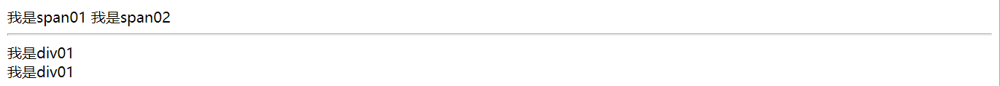
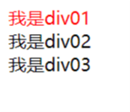
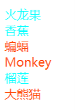
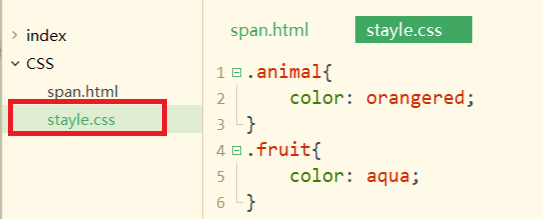
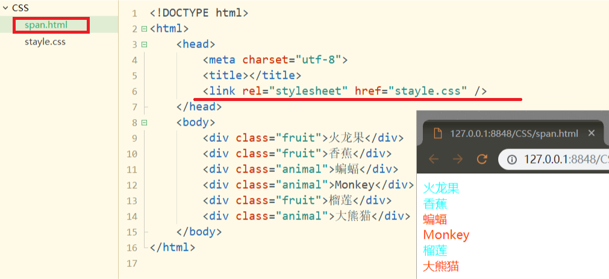
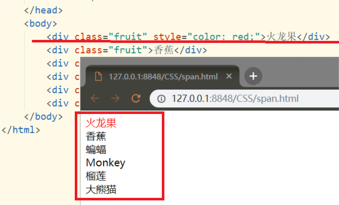

# CSS
## 1.简述
CSS其功能是对HTML页面美化,以及HTML页面元素杂乱而修改困难的情况.<br>
CSS其中最重要的工具之一:选择器,将目标元素(标签)选出,添加"样式"来达到美化页面和修改页面的目的<br>
实例:<br>
```html
<!DOCTYPE html>
<html>
	<head>
		<meta charset="utf-8">
		<title></title>
		<style>
			span{
				color: red;
			}
		</style>
	</head>
	<body>
		<span>Hello World!</span>
		<span>I'm noble!!!</span>
	</body>
</html>
```
运行结果:<br>
<!DOCTYPE html>
<html>
	<head>
		<meta charset="utf-8">
		<title></title>
		<style>
			span{
				color: red;
			}
		</style>
	</head>
	<body>
		<span>Hello World!</span>
		<span>I'm noble!!!</span>
	</body>
</html>

## 2.span标签和div标签
在继续讲解CSS之前,先来了解两个标签div和span<br>
```html
<!DOCTYPE html>
<html>
	<head>
		<meta charset="utf-8">
		<title></title>
	</head>
	<body>
		<span>我是span01</span>
		<span>我是span02</span>
		<br /><hr>
		<div>我是div01</div>
		<div>我是div01</div>
	</body>
</html>
```
运行结果:<br>
<br>
上图中我们看到span标签"没有什么作用",两个输出连在一起.而一个div标签默认占一行<br>
需要了解到的是,span标签和div标签基本没有属性,所以单独使用的价值不大,只有和CSS样式一起使用时才能发挥真正的作用.<br>

## 3.选择器
真如之前所述,选择器时CSS实现其价值的有力工具,下面介绍一些常用的CSS选择器.<br>

### 3.1.元素选择器
简述中使用的示例就是元素选择器,在``<style>``标签中写下目标元素的名称(如:span)在后面的大括号``{}``中写入加入的CSS样式.<br>
```
元素的名称{
    属性名称:属性值;
    属性名称:属性值;
}
```

```html
<!DOCTYPE html>
<html>
	<head>
		<meta charset="utf-8">
		<title></title>
		<style>
			span{
				color: red;
			}
		</style>
	</head>
	<body>
		<span>Hello World!</span>
		<span>I'm noble!!!</span>
	</body>
</html>
```

### 3.2.ID选择器
```
ID在整个页面中必须唯一
#ID的名称{
    属性名称:属性值;
    属性名称:属性值;
}
```
使用ID选择器可以避免影响全局的元素.<br>
示例:<br>
```html
<!DOCTYPE html>
<html>
	<head>
		<meta charset="utf-8">
		<title></title>
		<style type="text/css">
			#div01{
				color: red;
			}
		</style>
	</head>
	<body>
		<div id="div01">我是div01</div>
		<div id="div02">我是div02</div>
		<div id="div03">我是div03</div>
	</body>
</html>
```
<br>

## 3.类选择器
```
以.开头
.类的名称{
    属性名称: 属性值;
    属性名称: 属性值;
}
```

示例:<br>
```html
<!DOCTYPE html>
<html>
	<head>
		<meta charset="utf-8">
		<title></title>
		<style type="text/css">
			.animal{
				color: orangered;
			}
			.fruit{
				color: aqua;
			}
		</style>
	</head>
	<body>
		<div class="fruit">火龙果</div>
		<div class="fruit">香蕉</div>
		<div class="animal">蝙蝠</div>
		<div class="animal">Monkey</div>
		<div class="fruit">榴莲</div>
		<div class="animal">大熊猫</div>
	</body>
</html>
```
<br>

## 4.CSS的引入
CSS引入的方式主要有三种:<br>
- 1.外部引用
- 2.内部引用
- 3.行内引用

之前的案例中都采用内部引用的方式<br>

### 4.1.CSS外部引用
通过``link``标签引入一个外部文件<br>
**里程碑一**
新建一个``stayle.css``结尾的文件,将以下样式放入该文件<br>
```css
.animal{
	color: orangered;
}
.fruit{
	color: aqua;
}
```
如下图:<br>
<br>

**里程碑二**
在``span.html``文件中引用``stayle.css``的样式:<br>
```html
<!DOCTYPE html>
<html>
	<head>
		<meta charset="utf-8">
		<title></title>
		<link rel="stylesheet" href="stayle.css" />
	</head>
	<body>
		<div class="fruit">火龙果</div>
		<div class="fruit">香蕉</div>
		<div class="animal">蝙蝠</div>
		<div class="animal">Monkey</div>
		<div class="fruit">榴莲</div>
		<div class="animal">大熊猫</div>
	</body>
</html>
```
<br>

### 4.2.内部引用
见之前的案例<br>

### 4.3.行内应用
在``div``标签和``span``标签中引用``stayle``属性<br>
示例:<br>
```html
<!DOCTYPE html>
<html>
	<head>
		<meta charset="utf-8">
		<title></title>
	</head>
	<body>
		<div class="fruit" style="color: red;">火龙果</div>
		<div class="fruit">香蕉</div>
		<div class="animal">蝙蝠</div>
		<div class="animal">Monkey</div>
		<div class="fruit">榴莲</div>
		<div class="animal">大熊猫</div>
	</body>
</html>
```
<br>

## 5.CSS浮动
浮动让目标标签脱离原本标签流序<br>
示例:<br>
```html
<!DOCTYPE html>
<html>
	<head>
		<meta charset="utf-8">
		<title></title>
	</head>
	<body>
		<div style="float: left;width: 350px; height: 350px; background-color: red;"></div>
		<div style="float: left;width: 350px; height: 350px; background-color: yellow;"></div>
		<div style="float: left;width: 350px; height: 350px; background-color: green;"></div>
	</body>
</html>
```
这段代码解释为以下结果,通过不断缩小浏览器的边距,页面编排会发生变化,这就是流式布局的重要意义<br>

<!DOCTYPE html>
<html>
	<head>
		<meta charset="utf-8">
		<title></title>
	</head>
	<body>
		<div style="float: left;width: 350px; height: 350px; background-color: red;"></div>
		<div style="float: left;width: 350px; height: 350px; background-color: yellow;"></div>
		<div style="float: left;width: 350px; height: 350px; background-color: green;"></div>
	</body>
</html>

