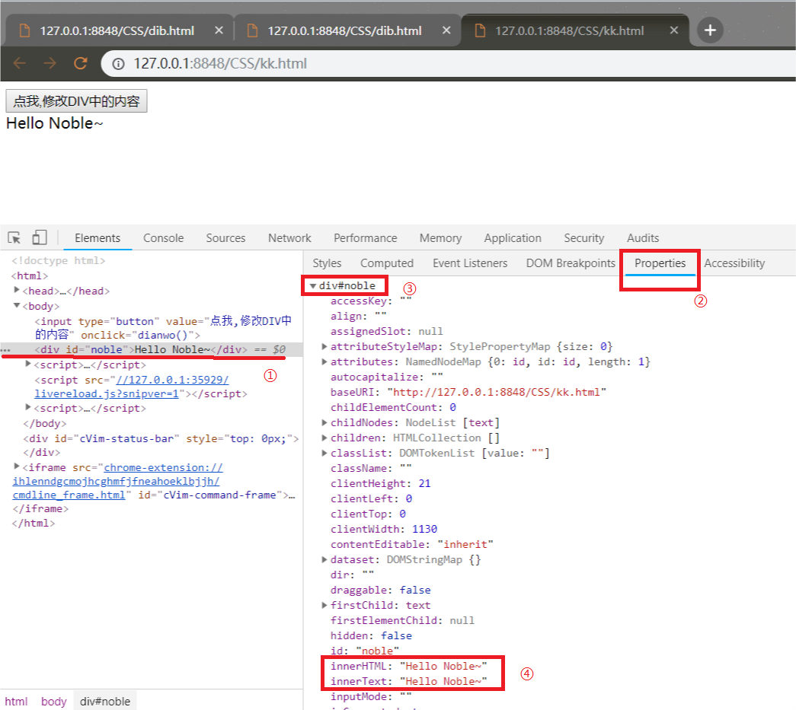

# 案例:点击替换选文
```html
<html>
	<head>
		<meta charset="UTF-8">
		<title></title>
		<script>
			function dianwo(){
				var div = document.getElementById("noble");
				div.innerHTML = "Hello World!";
			}
		</script>
	</head>
	<body>
		<input type="button" value="点我,修改DIV中的内容" onclick="dianwo()" />
		<div id="noble">Hello Noble~</div>
	</body>
</html>
```
在上述代码中``innerHTML``属性通过以下方法找到:<br>
<br>

## innerHTML和innerText的区别
innerHTML会解析字符串中的标签,但innerText不会解析.<br>

## JS开发过程

```html
<!--
	1.确定事件,点击按钮
	2.事件触发函数(dianwo)
	3.函数做一些事情
 -->
```