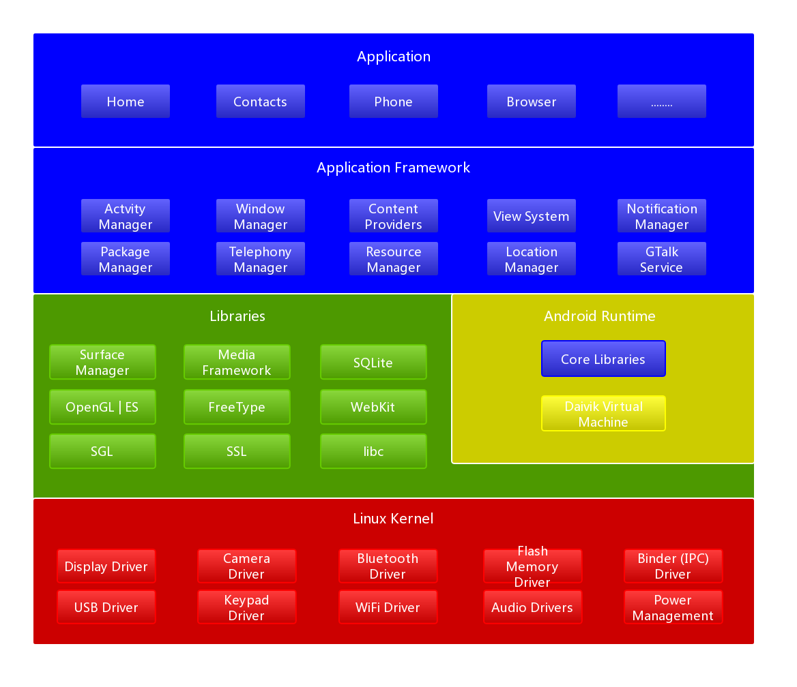
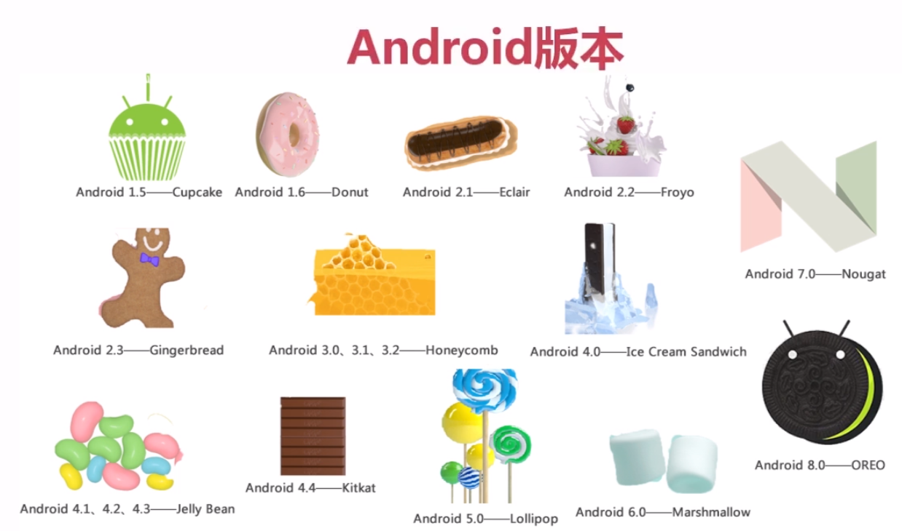

# 安卓入门了解

## 1.Android系统架构
 

## 2.Android版本
 
Android 2.3被誉为移动端的xp系统,是曾经装机量最大的系统 
在选择Android版本的时,要考虑兼容性,现在市场占有率最大的Android版本是4.x 

## 3.AndroidDevTools下载
[https://www.androiddevtools.cn/](https://www.androiddevtools.cn/) 