# Android-studio基本使用

## 1.project与module
在其他编辑器工程中,以eclipse为例,project代表一个独立的项目,所有的project放在workspace中. 
在android-studio中,project相当于eclipse中的workspace 

|工具|工作区间|工程|
|----|-------|----|
|eclipse|workspace|project|
|android studio|project|module|

## 2.创建工程
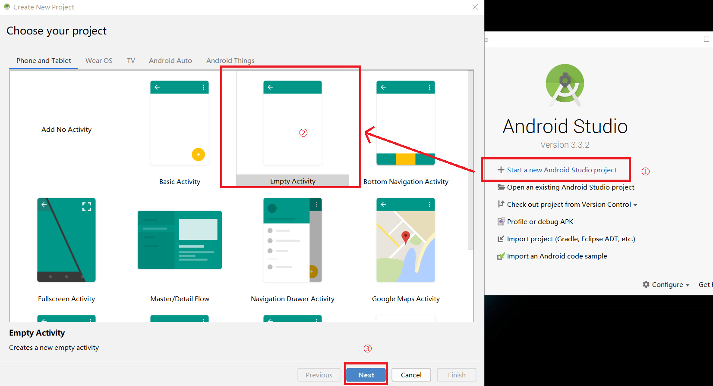 
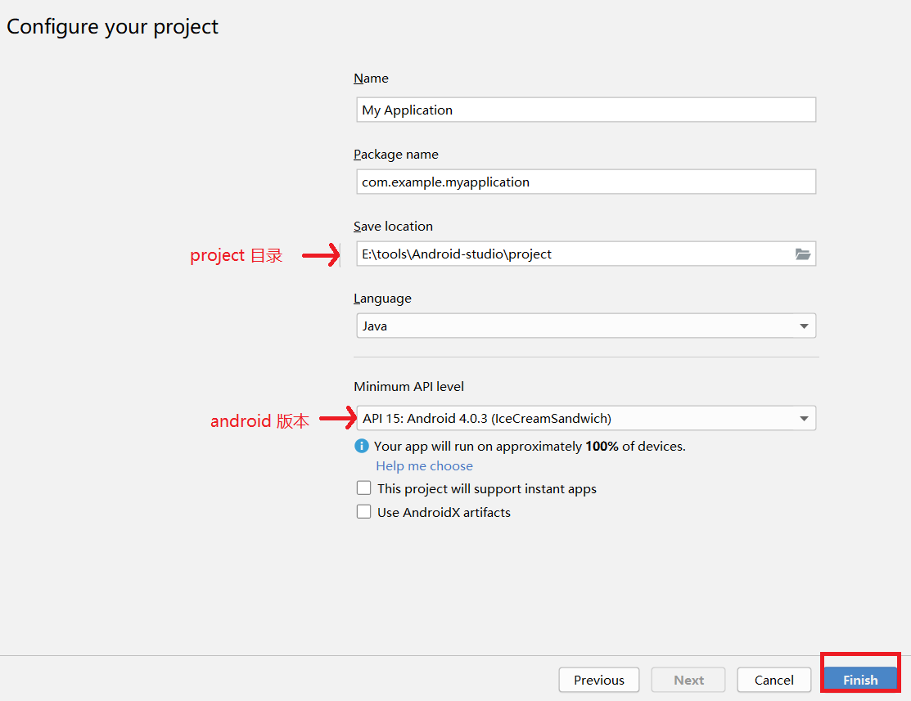 

## 3.修改字体大小
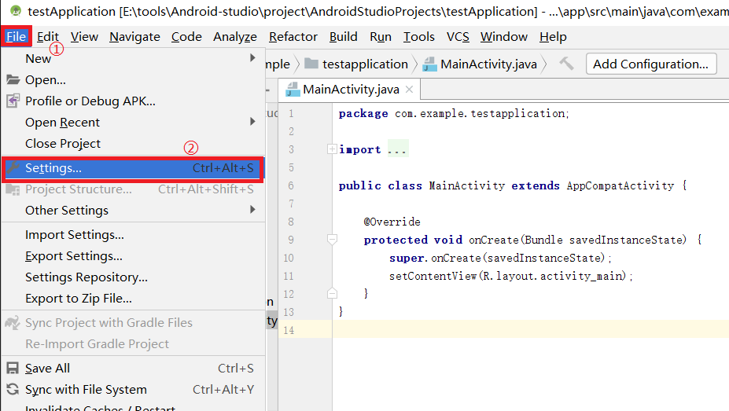 
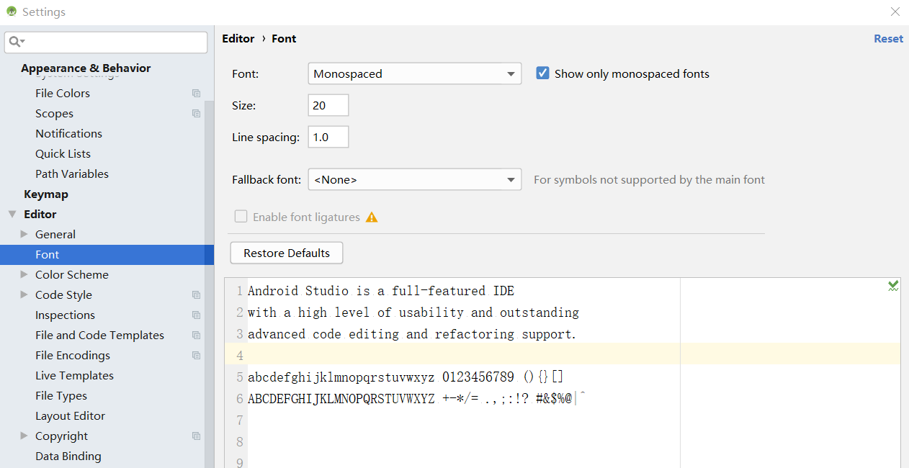 

## 4.创建一个module
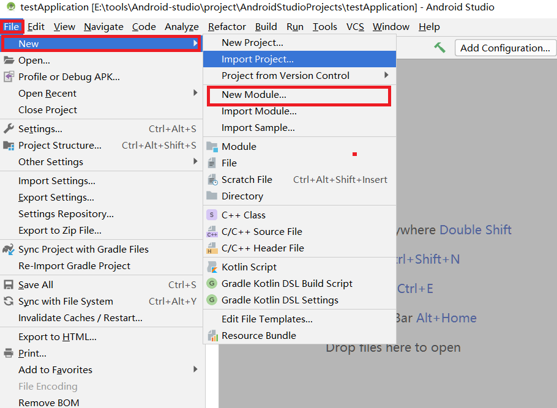 
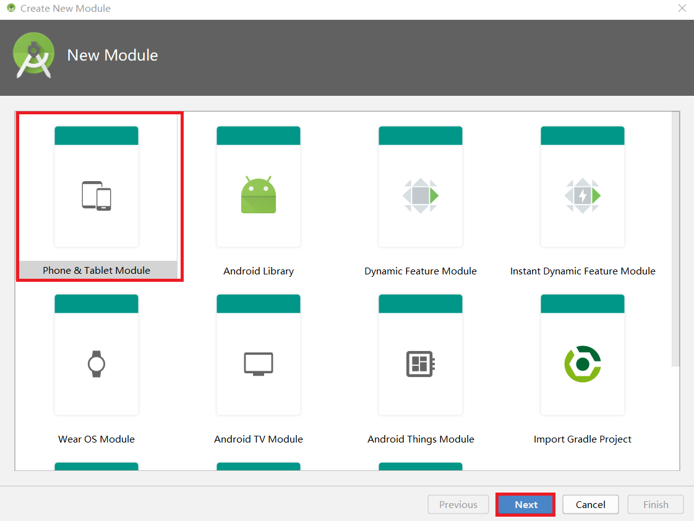 
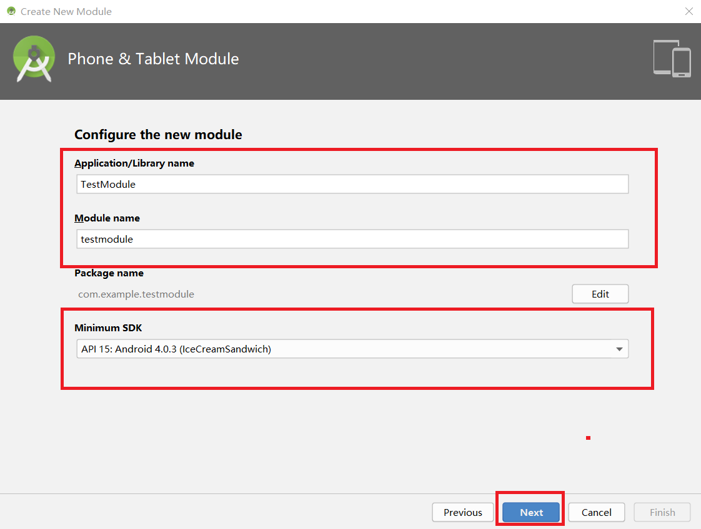 
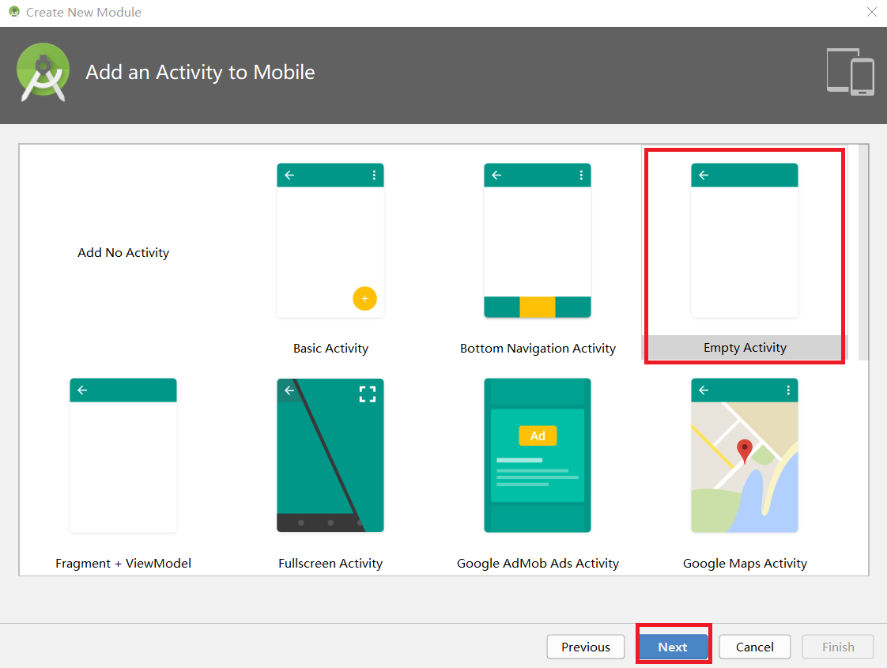 
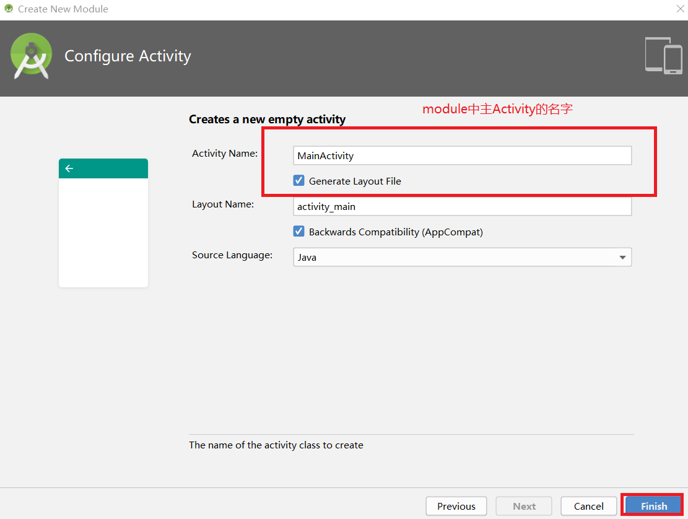 
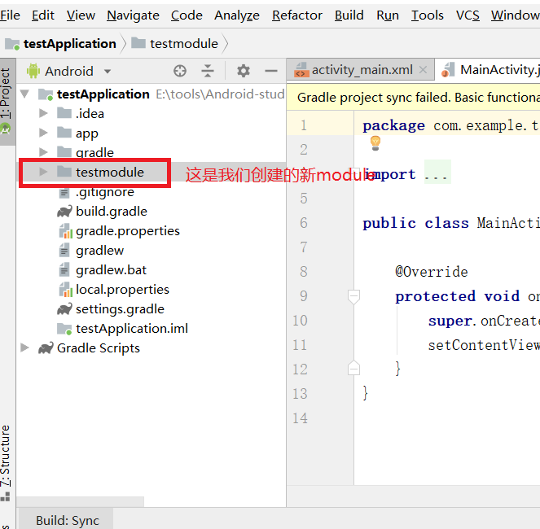 

## 5.视图模式
在Android Studio中,有多种视图模式供开发者掌握android开发的状态: 
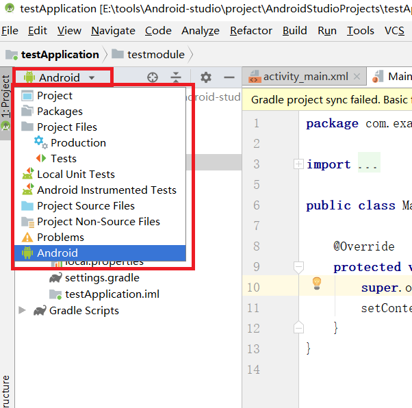 
其中最常用的是Android和project 

### 5.1.Android模式
在Android模式下,文件会按类型进行划分,(目录结构树和资源管理器上的目录结构不同~),目的是方便开发人员日常开发操作. 
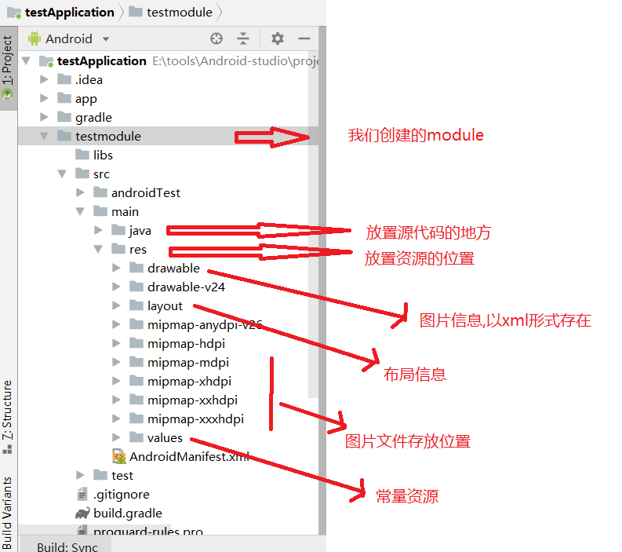 

### 5.2.Project模式
project模式是文件在硬盘上实际的存储方式 
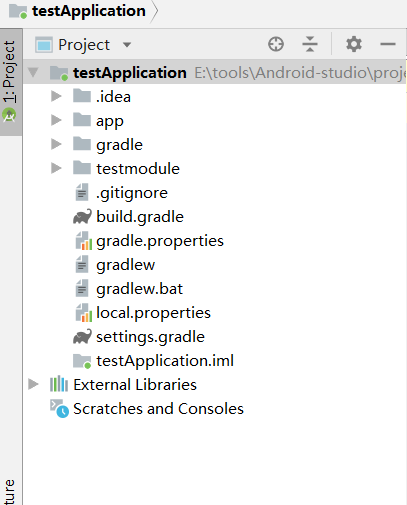 

## 6.运行module
在Android Studio中module就相当于一个project 
运行一个module的方法: 