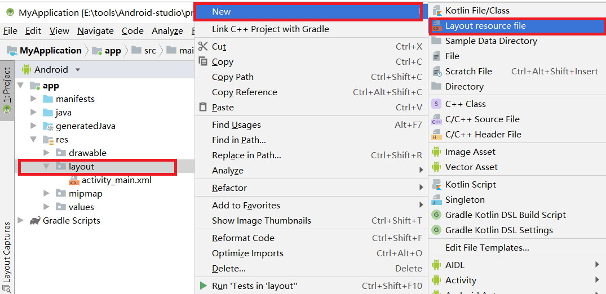
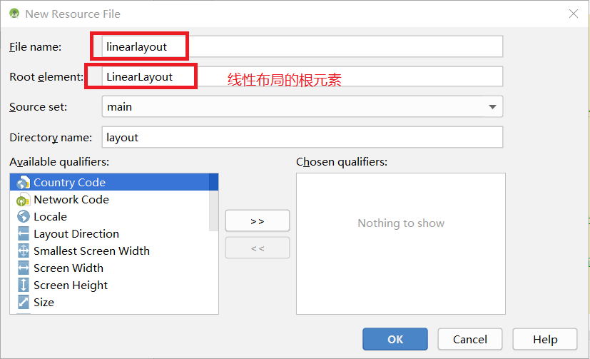
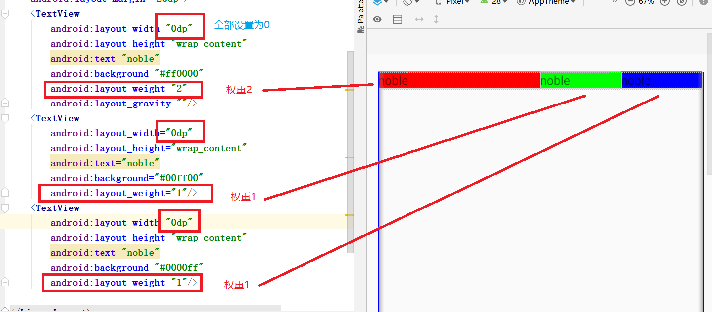

# 页面布局

## 1.常用布局
### 1.1.线性布局(LinearLayout)
### 1.2.相对布局(RelativeLayout)
### 1.3.帧布局(FrameLayout)
### 1.4.表格布局(TableLayout)
### 1.5.网络布局(GridLayout)
### 1.6.约束布局(ConstraintLayout)

## 2.添加布局的方式
### 2.1.利用xml文件设计
页面布局都使用该方法<br>

### 2.2.使用java代码添加
该方法不常用,主要是两个原因<br>
- 1.和xml同样的布局效果,需要的代码量很大
- 2.java代码,不直观 不能很好的和页面效果产生联想

## 3.线性布局
线性布局,上到下,做到右,凡是以这种方式布局的页面都可以使用线性布局来解决<br>
### 3.1.创建线性布局文件layout
<br>
<br>

### 3.2.布局的重要属性
```css
/* match_parent 和父容器一样大, wrap_content 随着内容的增大而增大 */
android:layout_width  [match_parent|wrap_content] 宽度 
android:layout_height [match_parent|wrap_content] 高度
android:layout_padding ndp 内边距 /* n是数字 */
android:layout_margin ndp 外边距
```
上面这四个属性是常用属性,width和height的值有两种类型,分别是match_parent和wrap_content<br>
layout_padding还有layout_margin和css的作用一致<br>

```
android:orientation    方向 [vertical(垂直)|horizontal(水平)]
android:layout_weight  权重
android:layout_gravity 重力
```
**上面三个属性是线性布局的特有属性**<br>
``orientation``,是指线性布局的方向,是线性布局的核心参数<br>
``layout_weight``,是权重,可以让多个控件按权重平分页面像素,如下:<br>
<br>

<br>

``layout_gravity``直译过来重力它对应不同的``orientation``有不同的参数<br>
```xml
<!-- 当orientation是horizontal时 -->
android:layout_gravity="top"
android:layout_gravity="bottom"
android:layout_gravity="center"
...
```
```xml
<!-- 当orientation是vertical时 -->
android:layout_gravity="left"
android:layout_gravity="right"
...
```