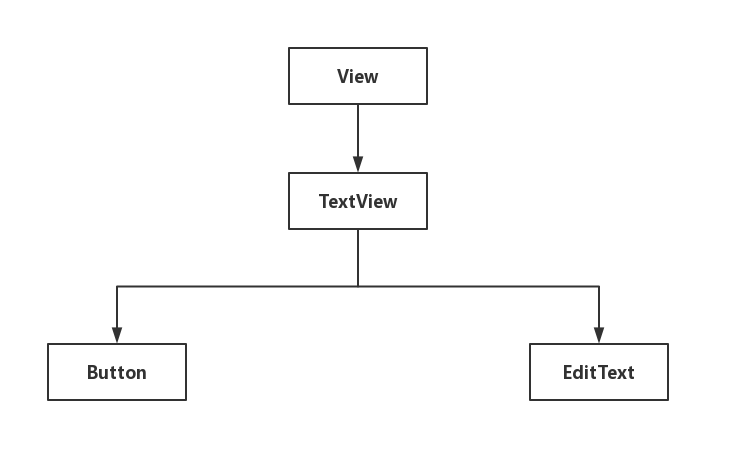
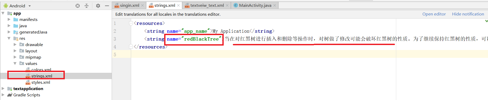
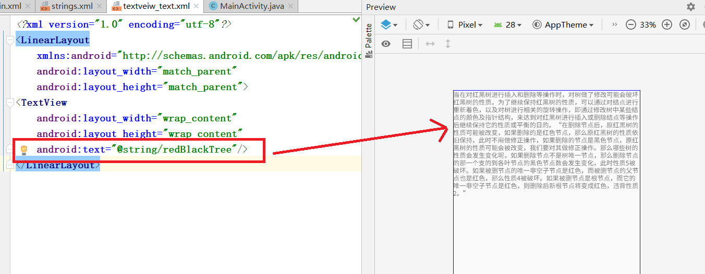
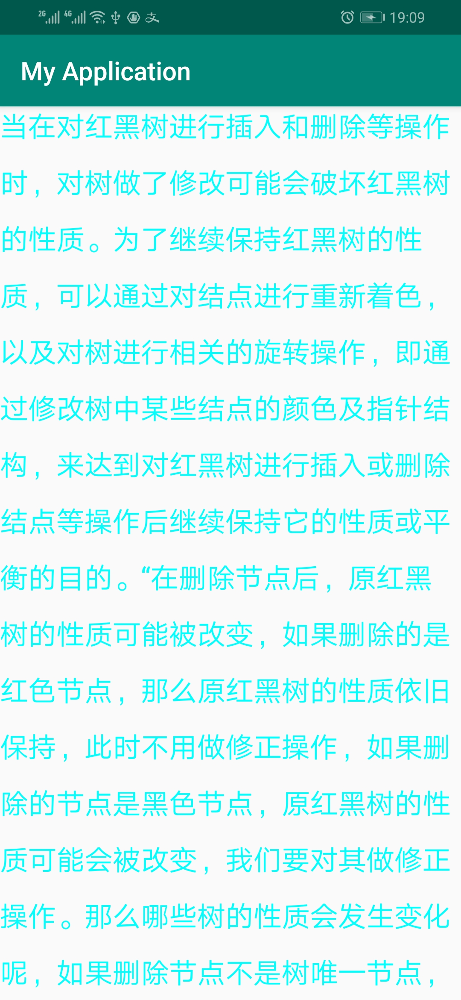
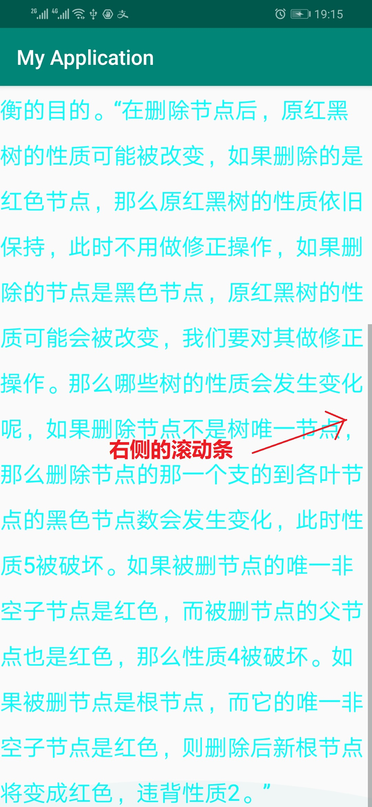
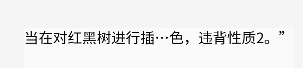
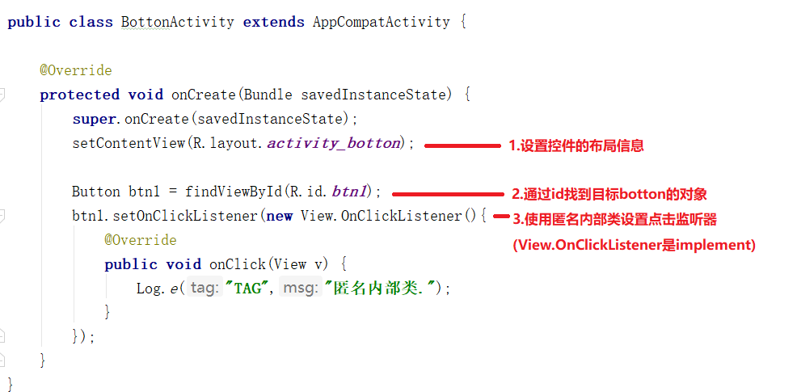
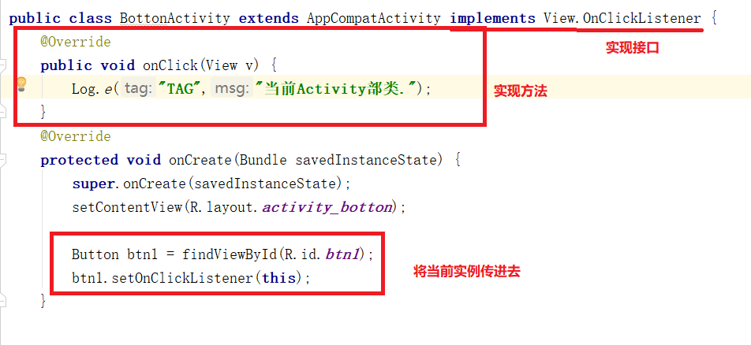
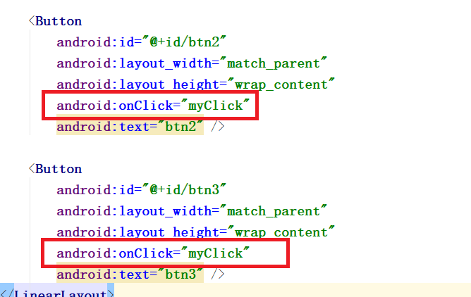
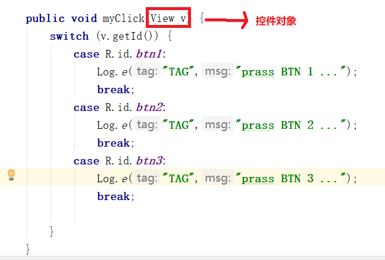

# UI基础控件

## 1.常见控件
```
处理文本内容的View(TextView)
被点击的View(Button)
处理图片的View(ImageView)
接收用户信息输入的View(EditText)
进度条类的VIew(ProgressBar)
```

## 2.通用属性

|属性|常用可选值|
|----|---------|
android:layout_width<br>nandroid:layoutheight|match_parent 填充整个父容器<br>wrap_content 由内容确定大小<br>正整数dp 精确大小|
|android:id|@id/valName 使用已存在的id<br>@+id/valName 添加新id|
|android:layout_margin|正整数单位dp 和相邻控件或边缘的距离|
|android:padding|正整数单位dp 控件内边距|
|android:background|十六进制rgb颜色值 颜色作为背景<br>@mipmap/resourceId 图片作为背景|
|android:layout_gravit<br>android:gravity|center_horizontal 水平居中<br>center_vertical 垂直居中<br>center 水平垂直居中<br>left 居左<br>right 居右<br>top 局顶<br>bottom 局底|
|android:visibility|visible 可见状态<br>invisible 不可见状态,但保留控件位置<br>gone 不可见状态,也不保留位置|

## 3.TextView
### 3.1.TextView的继承关系
<br>
从上图中我们看到,Button和EditText继承自TextView,这就和java类似,Button和EditText可以调用父类TextView的方法<br>

### 3.2.TextView的常用操作
- 1.对长文本进行显示处理
- 2.支持HTML代码
- 3.内容有样式,链接效果

### 3.3.对长文本处理
#### 3.3.1.String资源的引用
TextView操控的字符串资源可不必写到布局xml中,我们通常将它们放到``res/values/strings.xml``中.并通过``name``属性调用.<br>
<br>
<br>
<br>
在上图中我们看到,在布局文件中``android:text``属性使用``@``表示引用,后面是string资源的地址.<br>

#### 3.3.2.TextView元素常用属性
```css
android:textSize="22sp"           设置字体大小
android:textColor="#00ffff"       设置字体的颜色
android:lineSpacingMuktiplier="2" 设置行倍距
android:lineSpacingExtra="20sp"   设置行间距
```

#### 3.3.3.增加滚动条
对应非常长的文本,一个页面显示不下,就要考虑增加滚动条<br>
下图是国长文本在页面的效果图:<br>
<br>

没有滚轮边无法看下面的内容<br>
我们将最外面的``LinearLayout``改为``ScrollView``<br>
```xml
<?xml version="1.0" encoding="utf-8"?>
<ScrollView
    xmlns:android="http://schemas.android.com/apk/res/android"
    android:layout_width="match_parent"
    android:layout_height="match_parent">
<TextView
    android:layout_width="wrap_content"
    android:layout_height="wrap_content"
    android:text="@string/redBlackTree"
    android:textColor="#00ffff"
    android:textSize="22sp"
    android:lineSpacingExtra="15sp"/>
</ScrollView>
```
**特别要注意的是,在``ScrollView``标签下只能有一个控件**<br>
结果如下:<br>
<br>

#### 3.3.4.显示部分文字
一种方案:<br>
```css
android:lines="2"   /* 显示2行 */
```

第二种方案:<br>
```css
android:singleLine="true"    /* 设置单行 */
android:ellipsize="middle"   /* 省略号放置在中间 */
```
<br>

## 4.EditText
### 4.1.EditText常用类型
```css
android:inputType     控制输入类型
android:hint          提示性文字
android:textColorHint 提示性文字的颜色
android:maxLength     限制输入长度
android:background    通过图片设置输入框的形状
```
实例如下:<br>
```xml
<EditText
        android:layout_width="match_parent"
        android:layout_height="68dp"
        android:layout_marginHorizontal="50dp"
        android:layout_marginTop="10dp"
        android:background="@mipmap/border"
        android:gravity="center"
        android:hint="Password"
        android:inputType="textPassword"
        android:textColorHint="#cccccc" />
```

### 4.2.在Activity中获得EditText的输入
```java
EditText nameEdi = findViewById(R.id.name);
String name = nameEdi.getText().toString();
```

## 5.botton控件
botton点击触发事件的方法主要有以下:<br>
- 1.匿名内部类
- 2.当前Activity去实现事件接口
- 3.在布局文件中添加点击事件属性

### 5.1.匿名内部类的方法实现botton事件
<br>

### 5.2.当前Activity去实现事件接口
<br>

### 5.3.在布局文件中添加点击事件属性
这是最常用的方法,和前端添加js函数的习惯类似<br>

#### 5.3.1.在布局文件添加android:onClick="myClick"属性
<br>

#### 5.3.2.在Activity添加对应成员方法
<br>
注意以下几点:<br>
- 1.方法名必须和布局文件中的onClick属性值一致
- 2.属性值不带``()``如:``myClick``而不是``myClick()``

## 6.imageView
用来显示和控制图像的控件,可以对它进行放大,缩小,旋转等操作<br>
常用属性:<br>
```css
android:src        /* 前景:图片不会拉伸 */
android:background /* 背景:图片会被拉伸 */
```

## 7.ImageButton控件
常用做将图片当成按钮的场景<br>
```css
android:src
```

## 8.ProgressBar进度条控件
进度条,默认情况下是转圈,没有刻度,只是一个不断旋转的动画效果.通过设置style,可以显示传统的水平带刻度进度条<br>

### 8.1.常用属性
```css
style="?android:attr/progreesBarStyleHorizontal"  /* 设置水平进度条 */
android:progress=""          /* 设置进度 */
android:max=""               /* 设置最大值,默认100 */
```

### 8.2.案例
#### 8.2.1.里程碑一 
在布局文件中加入ProgressBar控件<br>
```xml
<ProgressBar
    android:id="@+id/progress"
    android:layout_width="match_parent"
    android:layout_height="wrap_content"
    style="?android:attr/progressBarStyleHorizontal"/>
```

#### 8.2.2.里程碑二
通过java代码操作<br>
```java
public class ProgressBarActivity extends AppCompatActivity {

    @Override
    protected void onCreate(Bundle savedInstanceState) {
        super.onCreate(savedInstanceState);
        setContentView(R.layout.activity_progress_bar);

        final ProgressBar pb = findViewById(R.id.progress);
        /**
        * 在Android中,4.0以后是不能直接在线程中操作控件的
        * 进度条是个特例
        */
        new Thread() {
            @Override
            public void run() {
                for (int i = 1; i < 100; i++) {
                    try {
                        Thread.sleep(50);
                    } catch (InterruptedException e) {
                        e.printStackTrace();
                    }
                    pb.setProgress(i);
                }
            }
        }.start();
    }
}
```