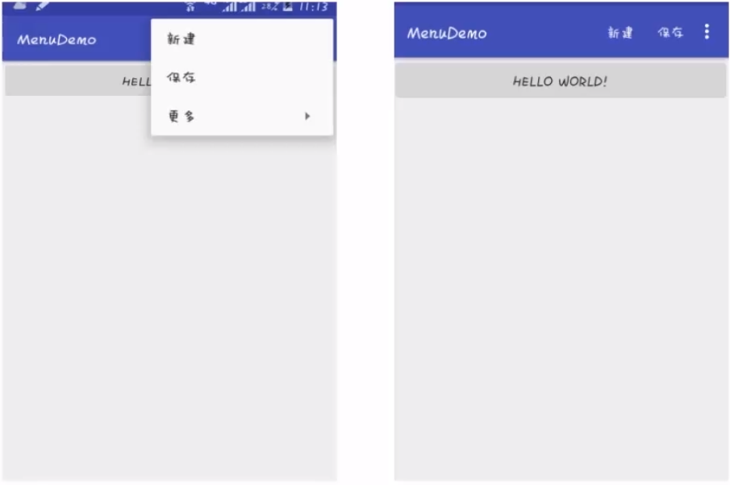
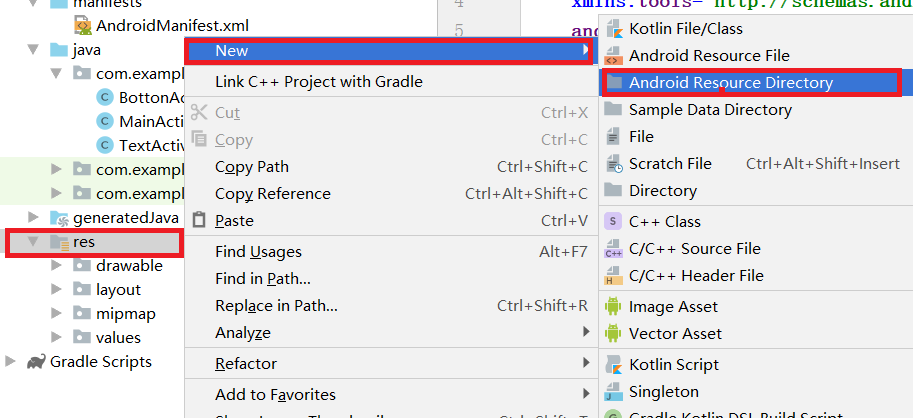
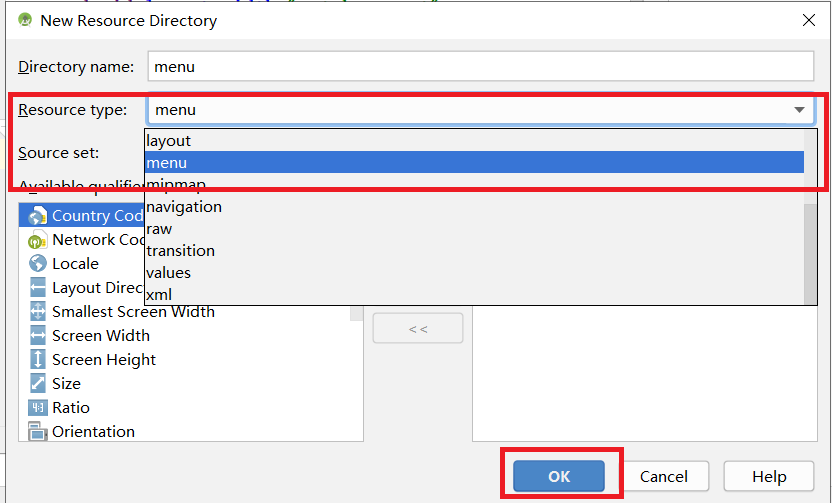
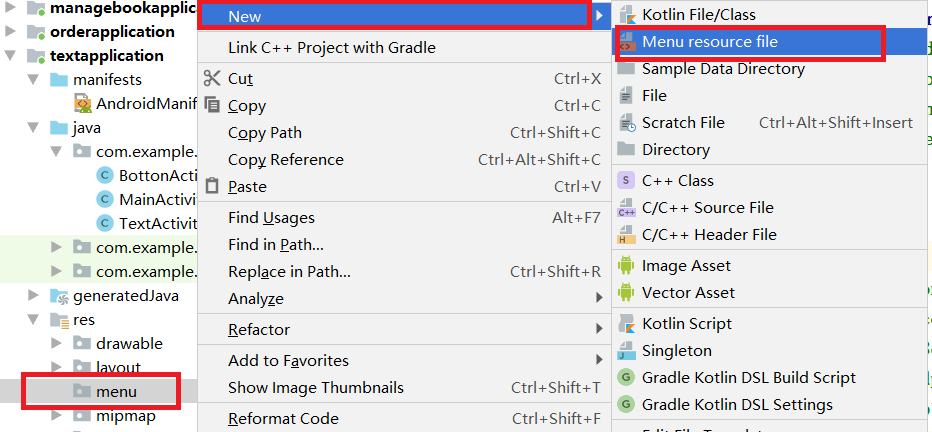
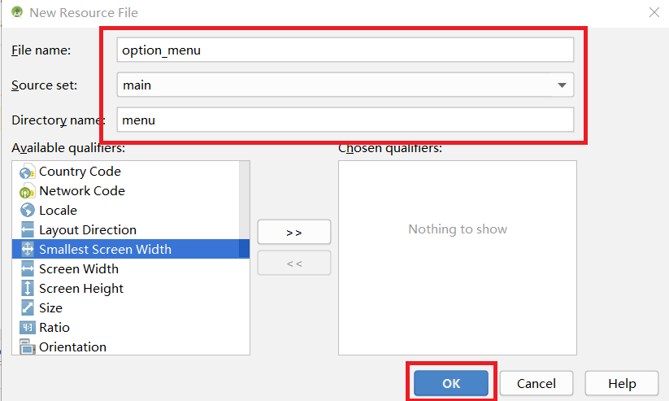
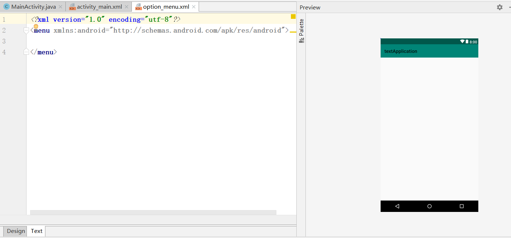
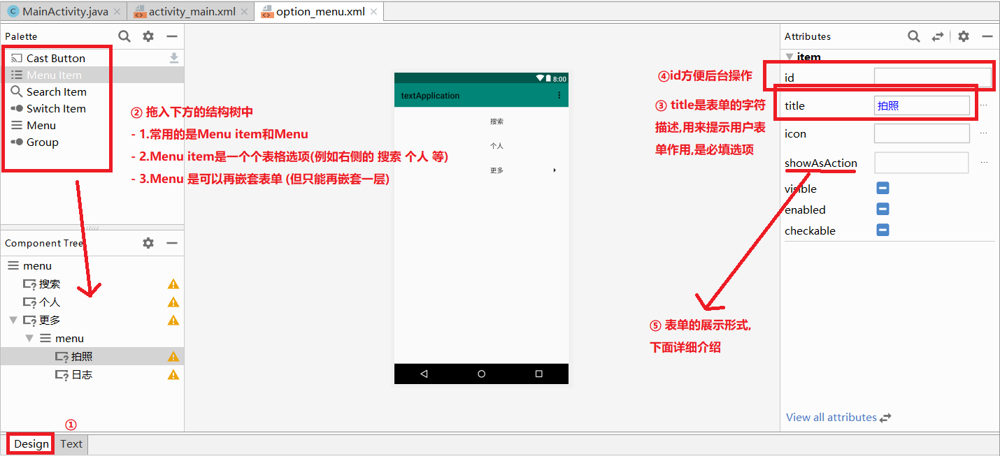
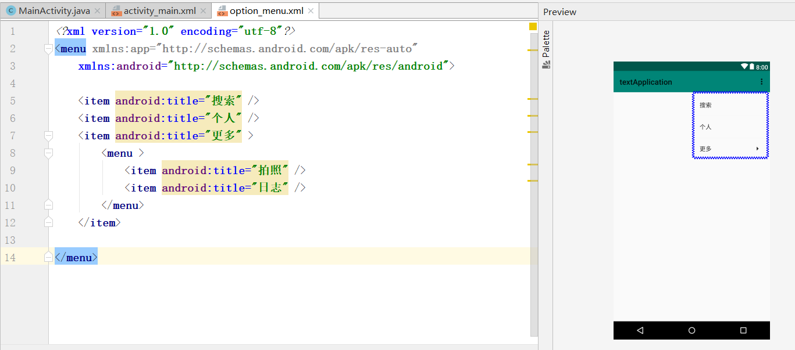
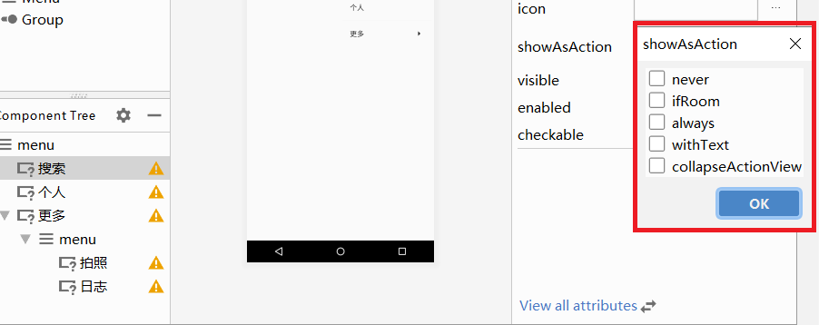

# 1.页面布局-menu
menu有三种主要类型:<br>
- 1.选项菜单(OptionMenu)
- 2.上下文菜单(ContextMenu)
- 3.弹出菜单(PopupMenu)

**选项菜单样式:**<br>
<br>

**上下文菜单:**<br>
<br>

**弹出菜单:**<br>
<br>

## 1.1.选项菜单
选项菜单是一个应用的主菜单项,用于放置对应用产生全局影响的操作.<br>
<br>

### 1.1.1.创建选项菜单
<br>
<br>
<br>
<br>
<br>

### 1.1.2.编辑选项菜单
可以使用Design模式编辑:<br>
<br>
上图对应的xml格式:<br>
<br>

### 1.1.3.showAsAction的选项
<br>

- 1.never      从不在导航栏显示
- 2.always     在导航栏显示(对于常用的控件执行该操作)
- 3.withText   如果选项表单既设置了文字又设置了图标,则文字和图标一并显示
- 4.ifRoom     如果导航栏还有空位,就在导航栏显示

关于图标问题:使用icon属性设置.<br>

### 1.1.4.实现选项菜单
在希望实现选项菜单的Activity后台Java代码中重写以下方法:<br>

```java
@Override
public boolean onCreateOptionsMenu(Menu menu) {
    getMenuInflater().inflate(R.menu.option_menu, menu);
    return true;
}
```

### 1.1.5.实现选项菜单的功能
重写Activity的以下方法实现菜单选项的功能:<br>
```java
@Override
public  boolean onOptionsItemSelected(MenuItem item){
    switch (item.getItemId()){
        case R.id.sort:
            Toast.makeText(this,"sort",Toast.LENGTH_SHORT).show();
            break;
        case R.id.photo:
            Toast.makeText(this,"photo",Toast.LENGTH_SHORT).show();
            break;
        case R.id.personal:
            Toast.makeText(this,"personal",Toast.LENGTH_SHORT).show();
            break;
        case R.id.journal:
            Toast.makeText(this,"journal",Toast.LENGTH_SHORT).show();
            break;
    }
    return true;
}
```