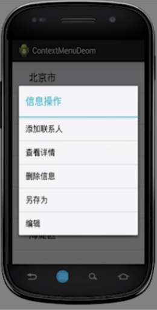
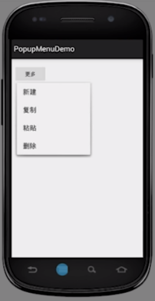
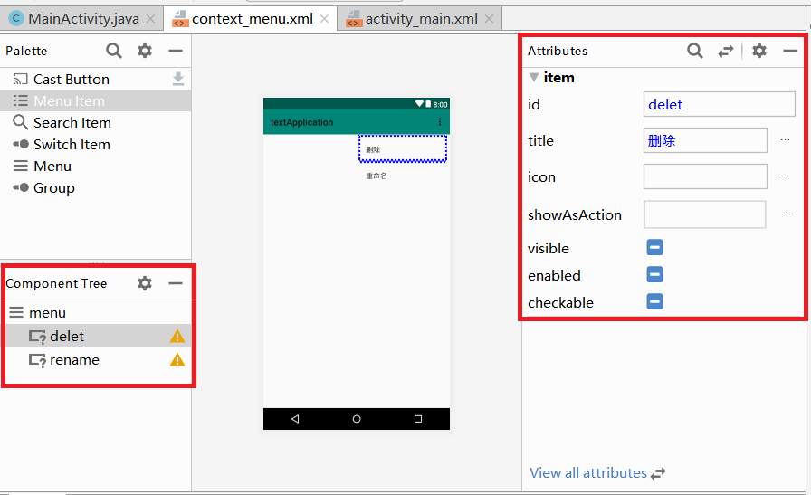

# 1.页面布局-menu
menu有三种主要类型:<br>
- 1.选项菜单(OptionMenu)
- 2.上下文菜单(ContextMenu)
- 3.弹出菜单(PopupMenu)

**选项菜单样式:**<br>
<br>

**上下文菜单:**<br>
<br>

**弹出菜单:**<br>
<br>

## 1.1.选项菜单
选项菜单是一个应用的主菜单项,用于放置对应用产生全局影响的操作.<br>
<br>

### 1.1.1.创建选项菜单
<br>
<br>
<br>
<br>
<br>

### 1.1.2.编辑选项菜单
可以使用Design模式编辑:<br>
<br>
上图对应的xml格式:<br>
<br>

### 1.1.3.showAsAction的选项
<br>

- 1.never      从不在导航栏显示
- 2.always     在导航栏显示(对于常用的控件执行该操作)
- 3.withText   如果选项表单既设置了文字又设置了图标(icon),则文字和图标一并显示
- 4.ifRoom     如果导航栏还有空位,就在导航栏显示

关于图标问题:使用icon属性设置.<br>

### 1.1.4.实现选项菜单
在希望实现选项菜单的Activity后台Java代码中重写以下方法:<br>

```java
@Override
public boolean onCreateOptionsMenu(Menu menu) {
    getMenuInflater().inflate(R.menu.option_menu, menu);
    return true;
}
```

### 1.1.5.实现选项菜单的功能
重写Activity的以下方法实现菜单选项的功能:<br>
```java
@Override
public  boolean onOptionsItemSelected(MenuItem item){
    switch (item.getItemId()){
        case R.id.sort:
            Toast.makeText(this,"sort",Toast.LENGTH_SHORT).show();
            break;
        case R.id.photo:
            Toast.makeText(this,"photo",Toast.LENGTH_SHORT).show();
            break;
        case R.id.personal:
            Toast.makeText(this,"personal",Toast.LENGTH_SHORT).show();
            break;
        case R.id.journal:
            Toast.makeText(this,"journal",Toast.LENGTH_SHORT).show();
            break;
    }
    return true;
}
```

## 1.2.上下文菜单
长按某个View不放,就会在屏幕中间弹出ContextMenu<br>
> 从用户体验上来看,没有选项菜单常用<br>

### 1.2.1.里程碑一 注册并创建ContextMenu
ContextMenu的工作方式是长按某一控件,所以先要对特定的控件做ContextMenu注册.<br>
```java
registerForContextMenu(findViewById(R.id.ContextButton));
```

接下来重写``public void onCreateContextMenu(ContextMenu menu, View v,ContextMenu.ContextMenuInfo menuInfo)``方法<br>
```java
@Override
public void onCreateContextMenu(ContextMenu menu, View v,ContextMenu.ContextMenuInfo menuInfo){
    getMenuInflater().inflate(R.menu.context_menu,menu);
}
```

### 1.2.2.里程碑二 编写ContextMenu布局文件
<br>

### 1.2.3.里程碑三 重写onContextItemSelected方法实现功能
```java
@Override
public boolean onContextItemSelected(MenuItem item) {
    switch (item.getItemId()){
        case R.id.delet:
            Toast.makeText(this,"delete",Toast.LENGTH_SHORT).show();
            break;

        case R.id.rename:
            Toast.makeText(this,"delete",Toast.LENGTH_SHORT).show();
            break;
    }
    return super.onContextItemSelected(item);
}
```

### 1.2.4.另一种实现ContextMenu的方法
```java
//创建长按点击事件,并调用回调实例cb
findViewById(R.id.ContextButton).setOnLongClickListener(new View.OnLongClickListener() {
    @Override
    public boolean onLongClick(View v) {
        startActionMode(cb);
        return true;
    }
});
```
```java
//创建一个回调成员实例 cb
ActionMode.Callback cb = new ActionMode.Callback() {
    @Override
    public boolean onCreateActionMode(ActionMode mode, Menu menu) {
        getMenuInflater().inflate(R.menu.context_menu,menu);
        Log.e("Tag","创建");
        return true;
    }

    @Override
    public boolean onPrepareActionMode(ActionMode mode, Menu menu) {
        Log.e("Tag","准备");
        return true;
    }

    @Override
    public boolean onActionItemClicked(ActionMode mode, MenuItem item) {
        Log.e("Tag","点击");
        switch (item.getItemId()){
            case R.id.delet:
                Toast.makeText(MainActivity.this,"delete",Toast.LENGTH_SHORT).show();
                break;

            case R.id.rename:
                Toast.makeText(MainActivity.this,"delete",Toast.LENGTH_SHORT).show();
                break;
        }
        return true;
    }
}
```

## 1.3.弹出式菜单PopupMenu
触发事件后在锚定View的下方(少量情况是上方)弹出PopuMenu<br>

### 1.3.1.后台java代码
```java
final Button popupBtn = findViewById(R.id.popButton);
popupBtn.setOnClickListener(new View.OnClickListener() {
    @Override
    public void onClick(View v) {
        //①实例化PopupMenu对象(参数2:被锚定的view)
        PopupMenu menu = new PopupMenu(MainActivity.this,popupBtn);
        //②加载菜单资源:利用MenuInflater将Menu资源加载到PopupMenu.getMenu()
        menu.getMenuInflater().inflate(R.menu.popup,menu.getMenu());
        //③为PopupMenu设置点击监听器
        menu.setOnMenuItemClickListener(new PopupMenu.OnMenuItemClickListener() {
            @Override
            public boolean onMenuItemClick(MenuItem item) {
                switch (item.getItemId()){
                    case R.id.delete:
                        Toast.makeText(MainActivity.this,"delete",Toast.LENGTH_SHORT).show();
                        break;
                    case R.id.add:
                        Toast.makeText(MainActivity.this,"add",Toast.LENGTH_SHORT).show();
                        break;
                }
                return true;
            }
        });
        //④千万不要忘记这一步,显示PopupMenu
        menu.show();
    }
});
```