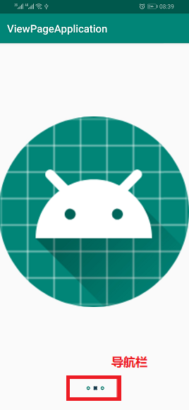
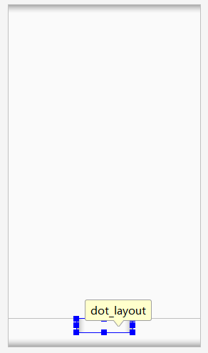

# ViewPager
ViewPager可以实现页面左右滑动,常见的应用场景如(应用启动时的功能介绍|相册的图片预览|App导航)<br>
<br>

## 1.实现ViewPager简单方法

### 1.1.里程碑三 添加PagerAdapter到布局文件ViewPager中
```xml
<!-- 创建ViewPager布局文件 -->
<?xml version="1.0" encoding="utf-8"?>
<LinearLayout
    xmlns:android="http://schemas.android.com/apk/res/android" android:layout_width="match_parent"
    android:layout_height="match_parent">

    <!--v4扩展包 提供的ViewPager -->
    <android.support.v4.view.ViewPager        
        android:id="@+id/view_pager"
        android:layout_width="match_parent"
        android:layout_height="match_parent">
    </android.support.v4.view.ViewPager>
</LinearLayout>
```

### 1.2.里程碑二 给ViewPager设置PagerAdapter
ViewPager控件的所有功能信息都存储在PagerAdapter中<br>
```java
/**
* 获得ViewPager控件
*/
ViewPager mviewPager = findViewById(R.id.view_pager);
/**
* 给ViewPager设置PagerAdapter
*/
mviewPager.setAdapter(mPagerAdapter);
```
下面是PagerAdapter的实现(回调):<br>
```java
/**
* PagerAdapter成员变量申明(回调函数)
*/
PagerAdapter mPagerAdapter = new PagerAdapter() {
    /**
    * 有多少个页面
    */
    @Override
    public int getCount() {
        return mLayoutIDs.length;
    }

    /**
    * instantiateItem方法(下面的方法)返回的Object和view是否是同一个实例
    */
    @Override
    public boolean isViewFromObject(@NonNull View view, @NonNull Object o) {
        return o == view;
    }

    /**
    * 将position下标的页面放入到容器中
    */
    @NonNull
    @Override
    public Object instantiateItem(@NonNull ViewGroup container, int position) {
        View child = mviews.get(position);//mviews是我们准备好的一个View容器,里面放的都是view
        container.addView(child);
        return child;
    }

    /**
    * 将position下标的页面从容器中剔除
    */
    @Override
    public void destroyItem(@NonNull ViewGroup container, int position, @NonNull Object object) {
        container.removeView(mviews.get(position));
    }
};
```

## 2.在原有ViewPager上实现下方导航
<br>
导航栏也是图标和布局组成的,但因为它们个数不确定,形状会变换(不能通过布局文件硬编码),我们使用Java代码生成图片<br>

### 2.1.里程碑一 在布局文件中规划导航栏的容器
<br>
```xml
<LinearLayout
    android:id="@+id/dot_layout"
    android:layout_width="120dp"
    android:layout_height="30dp"
    android:layout_gravity="center"
    android:layout_marginBottom="30dp"
    android:gravity="center"
    android:orientation="horizontal"></LinearLayout>
```

### 2.2.里程碑二 向导航栏容器添加dot
```java
ViewGroup mDotViewGroup = (ViewGroup) findViewById(R.id.dot_layout);
mDotViewGroup.addView(dot);//dot在下面的代码中实例化
```
使用for循环多次执行以下两个代码块,添加相对个数个导航下标(导航下标和View个数一般相同)<br>
```java
/**
* 实例化一个图标,并设置图像id(一个实例化dot不可重用)
*/
ImageView dot = new ImageView(this);
dot.setImageResource(R.mipmap.ic_launcher);
```
给dot设置样式<br>
```java
/**
* layoutParams是样式
*/
LinearLayout.LayoutParams layoutParams = new LinearLayout.LayoutParams(/*width*/20, /*height*/20);
layoutParams.leftMargin = 20;
dot.setLayoutParams(layoutParams);
dot.setEnabled(false);//和interaption有关
```

### 2.3.里程碑三 实现切换view是下标导航栏变换
下标导航栏也是图片,所以我们设置view切换监听器,实时更改导航栏图标就可以实现需求<br>
```java
/**
* mviewPager是ViewPager的实例
*/
mviewPager.addOnPageChangeListener(new ViewPager.OnPageChangeListener() {
    /**
    *This method will be invoked when the current page is scrolled, either as part of a programmatically initiated smooth scroll or a user initiated touch scroll.
    */
    @Override
    public void onPageScrolled(int i, float v, int i1) {

    }

    /**
    *This method will be invoked when a new page becomes selected. Animation is not necessarily complete.
    */
    @Override
    public void onPageSelected(int i) {
        for (int j = 0; j <mDotViews.size() ; j++) {
            mDotViews.get(j).setImageResource(i==j?R.mipmap.poweroff:R.mipmap.ic_launcher);//mDotViews是dotViews集合,里面的元素都曾被ViewGroup.addView进去过,同时下标也一一对应,我们通过重新设置ImageView对象的ImageResourse改变图像(ViewGroup中的对象没变)
        }
    }

    /**
    *Called when the scroll state changes. Useful for discovering when the user begins dragging, when the pager is automatically settling to the current page, or when it is fully stopped/idle.
    */
    @Override
    public void onPageScrollStateChanged(int i) {

    }
});
```

## 2.使用Fragment实现ViewPager
Fragment类和布局文件略<br>
```java
public class MainActivity extends AppCompatActivity {
    @Override
    protected void onCreate(Bundle savedInstanceState) {
        super.onCreate(savedInstanceState);
        setContentView(R.layout.activity_main);
        ViewPager viewPager = findViewById(R.id.viewPager);
        viewPager.setAdapter(new FragmentPagerAdapter(getSupportFragmentManager()) {//getSupportFragmentManager是AppCompatActivity中的方法
            @Override
            public Fragment getItem(int i) {
                return ListFragment.newInstance(i);//该方法会返回一个新的实例
            }

            @Override
            public int getCount() {
                return 4;
            }
        });
    }
}
```

## 3.实现底部导航栏(重难点)
<br>
我们要实现底部导航栏和ViewPager联动:<br>
> 改变ViewPager时,导航栏也改变<br>
> 选择不同的导航栏,ViewPager也改变<br>

