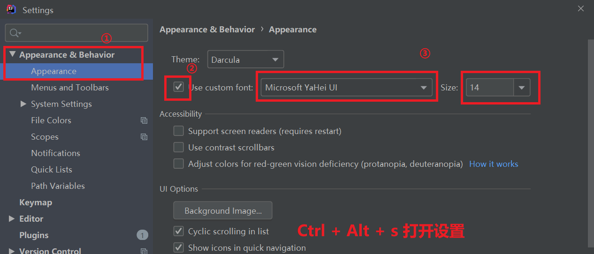
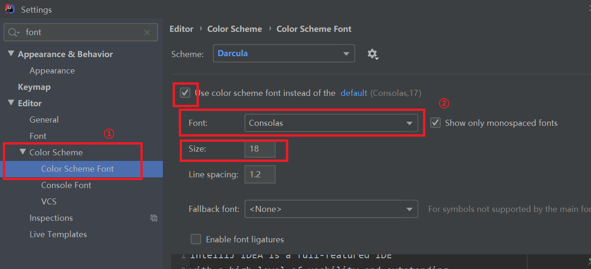
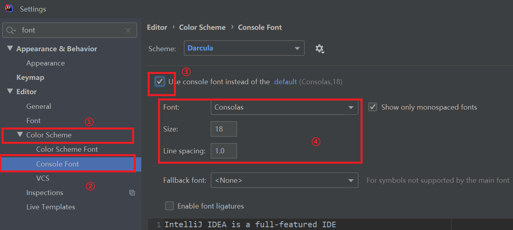
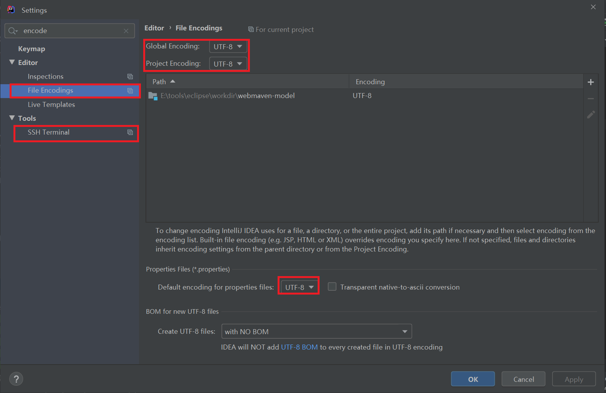
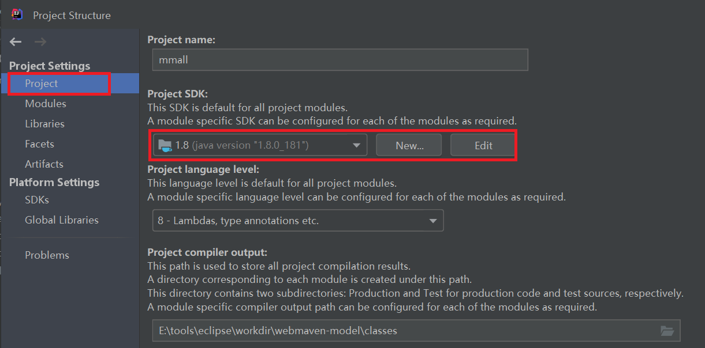

# idea新项目配置

## 1.基本配置

- [1.合适的字体大小](#1.1)
- [2.编码改为UTF-8](#1.2)
- 3.jdk设置

### 1.1.合适的字体大小

#### 1.1.1.菜单栏字体大小

使用``Ctrl+Alt+s``打开设置。

#### 1.1.2.代码编辑区字体大小

使用``Ctrl+Alt+s``打开设置。

#### 1.1.3.控制台区字体大小

使用``Ctrl+Alt+s``打开设置。

### 1.2.编码改为UTF-8

使用``Ctrl+Alt+s``打开设置。

将所有字体编码改为UTF-8

### 1.3.更改JDK设置

使用``Ctrl+Alt+Shift+s``打开项目设置。

