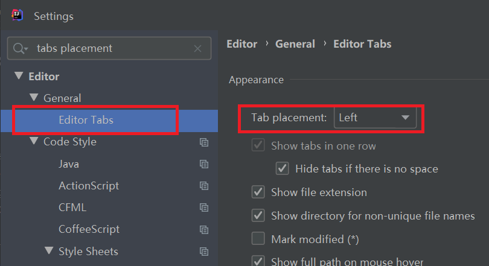

# idea新项目配置

## 1.基本配置

- [1.合适的字体大小](#1.1)
- [2.编码改为UTF-8](#1.2)
- 3.jdk设置
- 4.AutoScroll设置
- 5.Auto import设置

### 1.1.合适的字体大小

#### 1.1.1.菜单栏字体大小

使用``Ctrl+Alt+s``打开设置。

#### 1.1.2.代码编辑区字体大小

使用``Ctrl+Alt+s``打开设置。

#### 1.1.3.控制台区字体大小

使用``Ctrl+Alt+s``打开设置。

### 1.2.编码改为UTF-8

使用``Ctrl+Alt+s``打开设置。

将所有字体编码改为UTF-8

### 1.3.更改JDK设置

使用``Ctrl+Alt+Shift+s``打开项目设置。

### 1.4.AutoScroll设置

该设置可以让项目目录区和代码区左右一一对应。

### 1.5.Auto Import 设置

使用``Ctrl+Alt+s``打开设置。

帮助我们自动加入和删除import对象。

## 2.编辑区设置

- 1.显示行号
- 2.设置tabs位置
- 3.设置tabs排序
- 4.设置tabs数量限制

### 2.1.显示行号

使用``Ctrl+Alt+s``打开设置。

### 2.2.设置tabs位置

使用``Ctrl+Alt+s``打开设置。

设置完成后的效果如下：是不是能存放更多tabs了？

### 2.3.设置tabs排序

使用``Ctrl+Alt+s``打开设置。

该设置可以让tabs按字母顺序排序。方便我们查找文件。

### 2.4.设置tabs数量限制

使用``Ctrl+Alt+s``打开设置。

tab limit默认数量是10，可能不够用，我们可以调大一些。