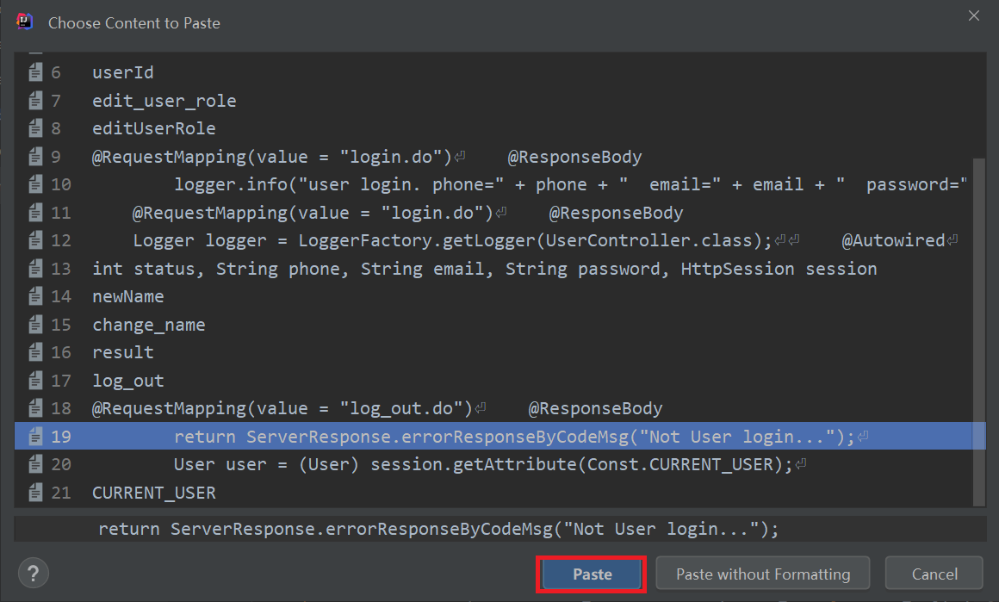
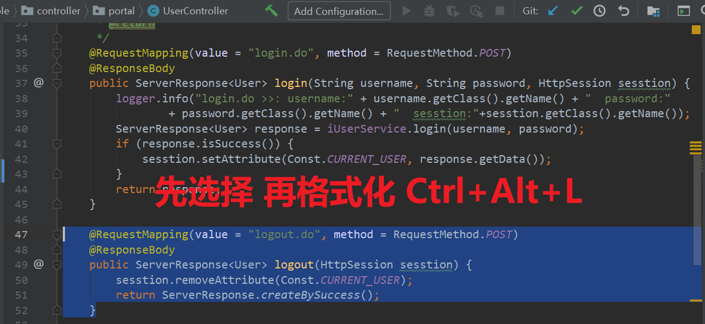
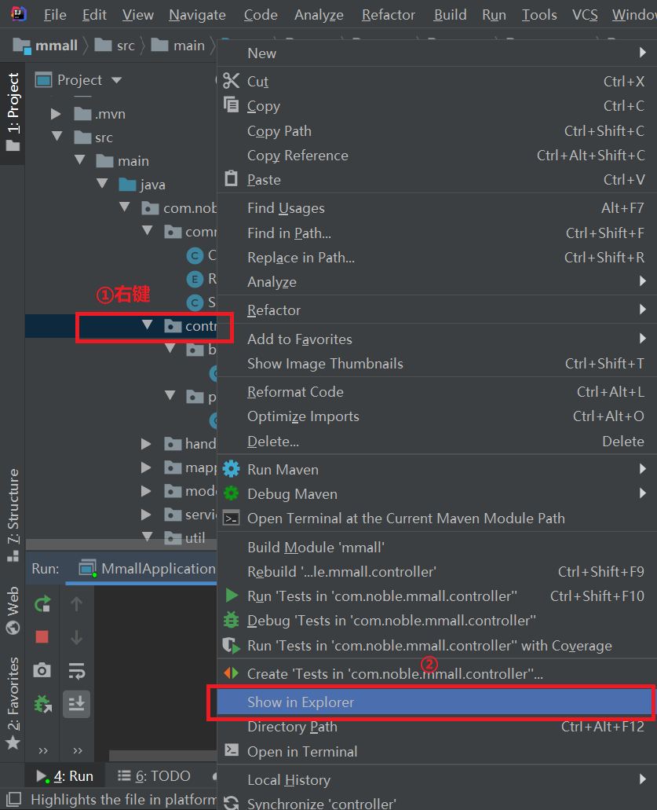
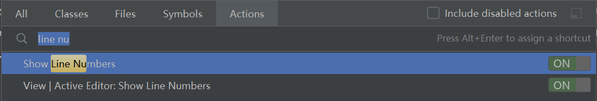
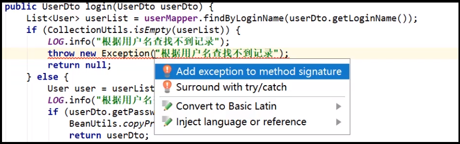
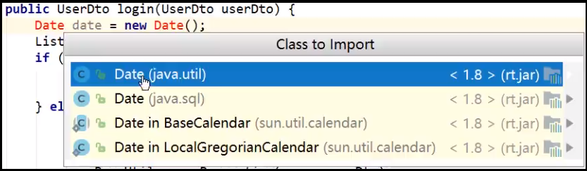

# idea开发技能

## 1.高效的代码开发技能

- 1.复制和复制历史
- 2.``Ctrl+Alt+L``格式化代码
- 3.``Ctrl+D``和``Ctrl+X``复制剪切光标所在行
- 4.``Alt+Shift+up/down``上下移动代码

### 1.1.复制和复制历史

使用``Ctrl+Shift+V``启动复制历史。

### 1.2.格式化代码

我们需要格式**局部代码**，不能将整个文件格式化。

先选择需要格式化的代码行，在按``Ctrl+Alt+L``格式化

### 1.3.``Ctrl+D``和``Ctrl+X``复制剪切光标所在行

实际操作一下就可以了。很好用

### 1.4.``Alt+Shift+up/down``上下移动代码

实际操作一下就可以了。很好用

## 2.快速跳转

- 1.``Home``和``end``快速跳到行首和行尾
- 2.``Ctrl+left/right``快速在一行移动光标(单位是词)
- 3.``Ctrl+G``跳到指定行
- 4.``Alt+left/right``tabs快速切换
- 5.``Ctrl+E``查看最近浏览过的文件
- 6.打开目标文件所在文件夹

### 2.1.``Home``和``end``快速跳到行首和行尾

实际操作一下就可以了。很好用

### 2.2.``Ctrl+left/right``快速在一行移动光标(单位是词)

实际操作一下就可以了。很好用

如果我们要选中则可以：

``Ctrl+Shift+left/right``

### 2.3.``Ctrl+G``跳到指定行

在生产环境中获得报错信息，需要我们跳转到指定行，可以使用该快捷键。

### 2.4.``Alt+left/right`` tabs快速切换

实际操作一下就可以了。很好用

### 2.5.``Ctrl+E``查看最近浏览过的文件

实际操作一下就可以了。很好用

### 2.6.打开目标文件所在文件夹

## 3.快速查找和替换

- 1.内容查找和替换
- 2.文件查找
- 3.idea功能查找
- 4.万能查找

### 3.1.内容查找和替换

#### 3.1.1.当前文件查找和替换

- 1.``Ctrl+F``当前文件查找
- 2.``Ctrl+R``当前文件替换

#### 3.1.2.项目全局查找和替换

- 1.``Ctrl+Shift+F``全局文件查找
- 2.``Ctrl+Shift+R``全局文件替换

### 3.2.文件查找

``Ctrl+Shift+N``按文件名查找。

### 3.3.Idea功能查找

``Ctrl+Shift+N``

### 3.4.万能查找

``Shift+Shift``可以同时查找文件名，菜单等等(不能查找文件内容)。

## 4.万能快捷键``Alt+Enter``

- 1.看到红色报错就按``Alt+Enter``
- 2.辅助import包

### 4.1.看到红色报错就按``Alt+Enter``

快捷错误修复键。

### 4.2.辅助import包

从其他地方粘贴过来的代码需要导入包，可以使用该快捷键``Alt+Enter``

## 5.键盘鼠标的组合

- 1.``Alt+鼠标拖动``纵向选择
- 2.类和方法之间的跳转

### 5.1.``Alt+鼠标拖动``纵向选择

### 5.2.类和方法之间的跳转

- 1.进入方法``Ctrl+鼠标左键``
- 2.返回上一步``Ctrl+Alt+left/right``