# 安卓开发环境搭建

使用``eclipse``，``ADK``，``SDK``搭建安卓开发环境。 

## 里程碑一 下载JAVA环境
我们在``Oracle``主页上下载适合当前操作系统的``JDK``包，要注意过于新版本的JDK可能发生不兼容的情况，本人使用的是JDK-8 
JDK下载链接：[https://www.oracle.com/technetwork/java/javase/downloads/index.html](https://www.oracle.com/technetwork/java/javase/downloads/index.html) 

下载到本地后双击安装。JDK安装成功后类似下面的目录： 
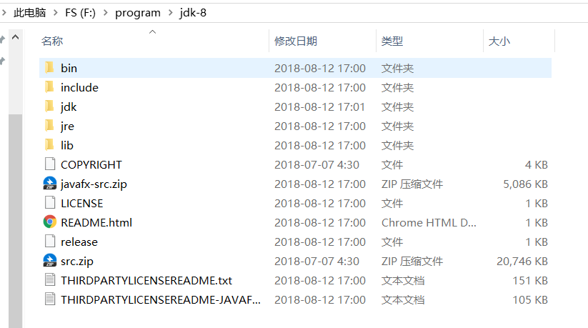 

## 里程碑二 配置JAVA环境变量
为了实现多个工具集的联合，需要告诉每个工具包其他工具的安装位置，而最好的解决方法就是配置环境变量。 

而``JAVA``的主要工具存放在bin/目录下： 
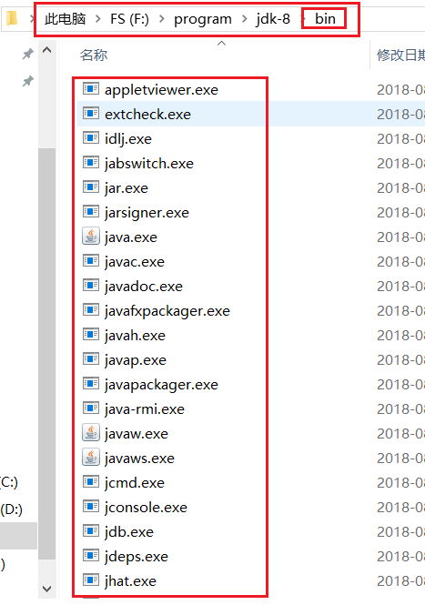 
所以我们把当前目录``F:\program\jdk-8\bin``加入环境变量。
方法如下： 
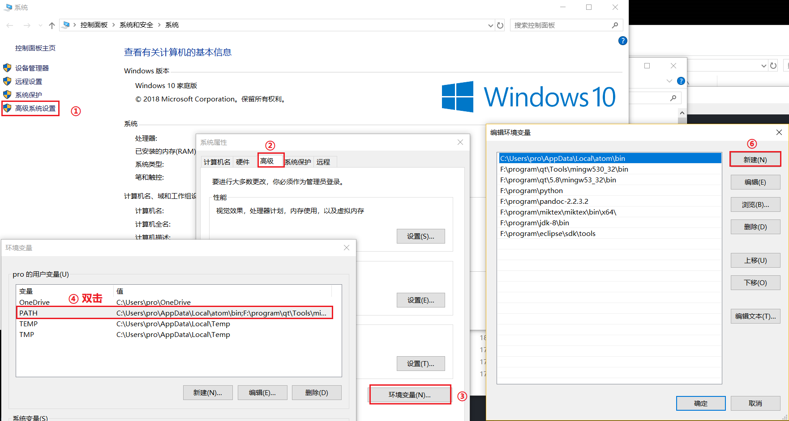 

最后一步，我们打开CMD中断 输入java命令，如果出现下面的输出就说明我们的环境变量配置好了。 
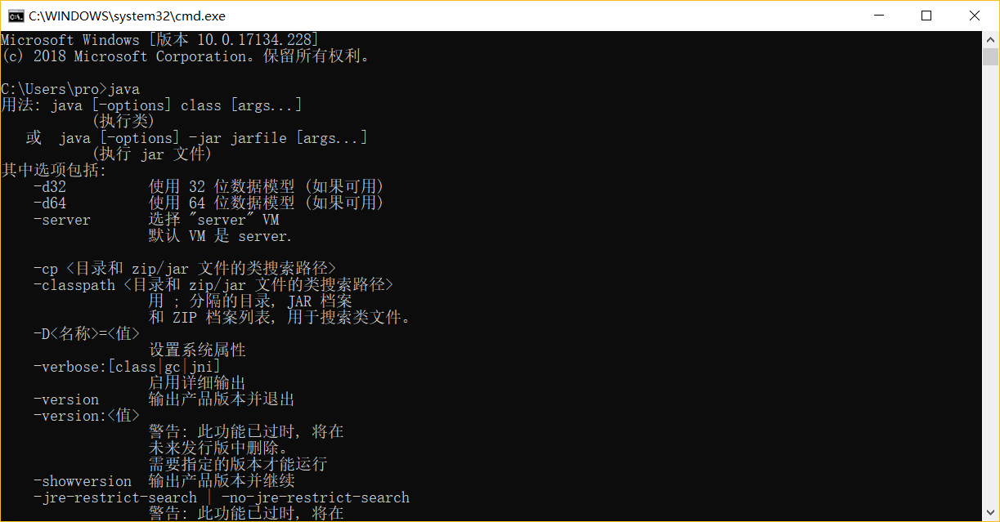 

## 里程碑三 下载Eclipse
Eclipse为Java应用程序及Android开发的IDE（集成开发环境）。Eclipse不需要安装，下载后把解压包解压后，剪切eclipse文件夹到你想安装的地方，打开时设置你的工作目录即可。 

Eclipse的版本有多个，这里选择下载Eclipse IDE for Java EE Developers这个版本。 
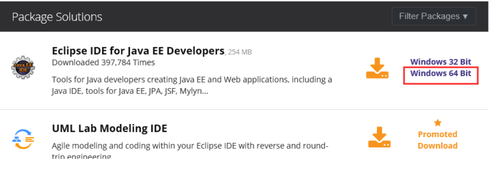 

## 里程碑四 下载SDK
此过程全程 科学上网。 
这一步非常关键，之前在这里踩了很多坑浪费了不少时间。
无论是从谷歌官网下载``SDK``命令行工具还是直接下载谷歌的``AndroidStudio``都没能处理好sdk安装配置过程。 

以下直接展示解决方案: 
我们要下载的``sdk``版本是``android-sdk_r24.4.1-windows.zip``。注意最新的版本``sdk-tools-windows-4333796.zip``中是没有``SDK manager``这个工具的，给我们配置``SDK``带来了非常大的不便。而谷歌的官方网站[https://developer.android.com/studio/](https://developer.android.com/studio/)上只有这个新版本的链接，所以我们要在其他资源上下载SDK工具包。 

**我们从以下网站下载我们需要的SDK包** 
[https://android-sdk.en.uptodown.com/windows](https://android-sdk.en.uptodown.com/windows) 

下载后双击安装，指定``Android SDK``的安装目录，为了方便使用``Android SDK``包含的开发工具，我们在系统环境变量中的``Path``设置``Android SDK``的安装目录下的tools目录。 

在``Android SDK``的安装目录下，双击``SDK Manager.exe``，打开``Android SDK Manager``，``Android SDK Manage``负责下载或更新不同版本的SDK包，我们看到默认安装的``Android SDK Manager``只安装了一个版本的``sdk tools``。 
正常情况下就可以下载Android的各个版本的sdk了。你只需要选择想要安装或更新的安装包安装即可。这里是比较耗时的过程，还会出现下载失败的情况，失败的安装包只需要重新选择后再安装就可以了。 
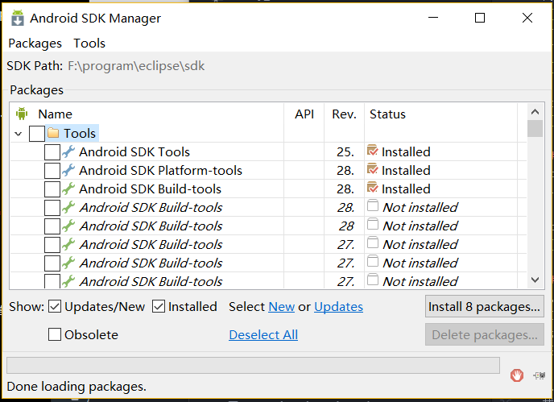 

## 里程碑五 为Eclipse安装ADT插件
前面我们已经配置好了``java``的开发环境，安装了开发``Android``的``IDE``，下载安装了``Android SDK``，但是``Eclipse``还没有和``Android SDK``进行关联，也就是它们现在是互相独立的，就好比枪和子弹分开了。为了使得Android应用的创建，运行和调试更加方便快捷，``Android``的开发团队专门针对``Eclipse IDE``定制了一个插件：``Android Development Tools（ADT）``。 

下面是在线安装ADT的方法： 
启动Eclipse，点击 Help菜单 -> Install New Software… ?，点击弹出对话框中的Add… 按钮。 

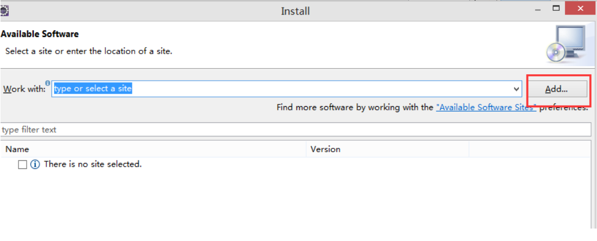 
然后在弹出的对话框中的``Location``中输入：``http://dl-ssl.google.com/android/eclipse/``，``Nam``e可以输入``ADT``，点击“OK”按钮。 

 
在弹出的对话框选择要安装的工具，然后下一步就可以了。 

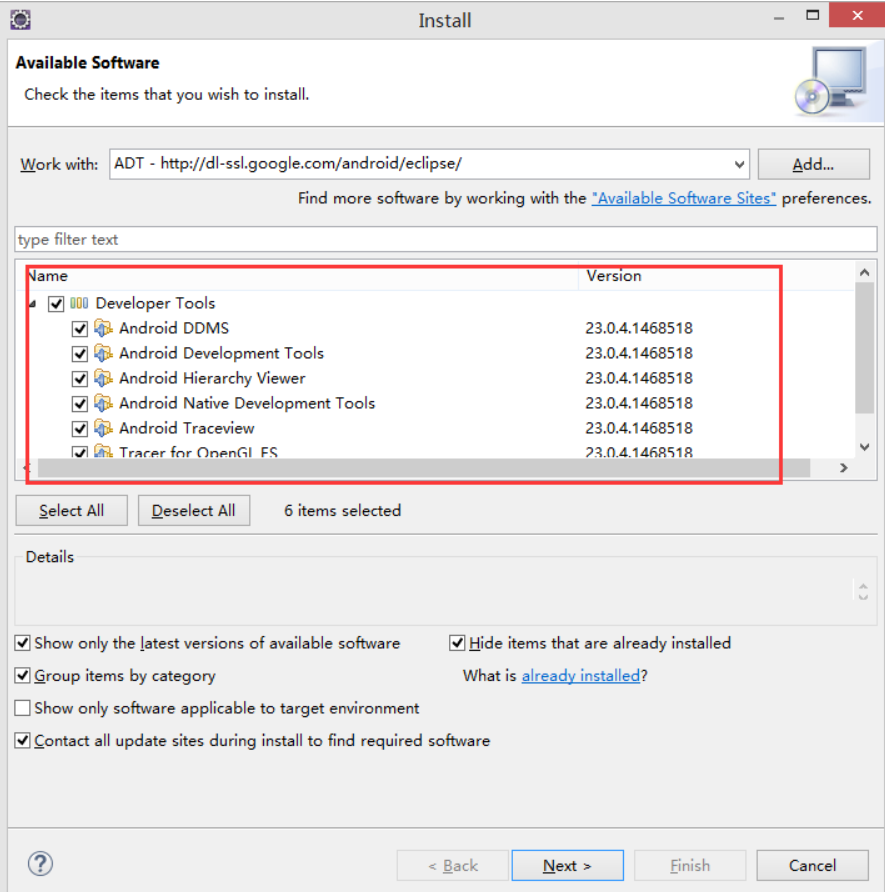 
安装好后会要求你重启``Eclipse，Eclipse``会根据目录的位置智能地和它相同目录下Android sdk进行关联，如果你还没有通过``sdk manager``工具安装``Android``任何版本的的``sdk``，它会提醒立刻安装它们。 
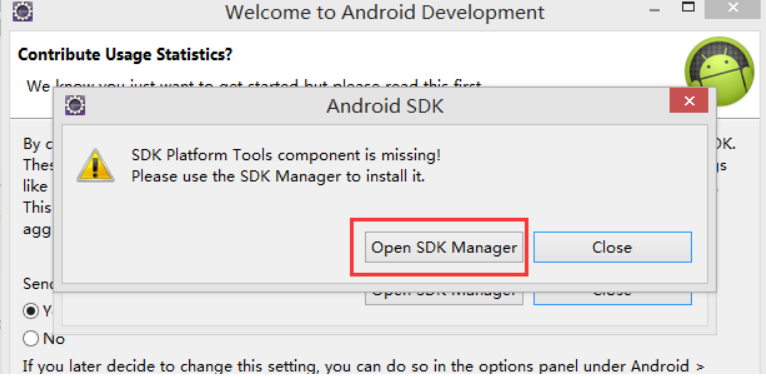 

如果``Eclipse``没有自动关联Android sdk的安装目录，那么你可以在打开的``Eclipse``选择`` Window -> Preferences`` ，在弹出面板中就会看到Android设置项，填上安装的SDK路径，则会出现刚才在SDK中安装的各平台包，按OK完成配置。 
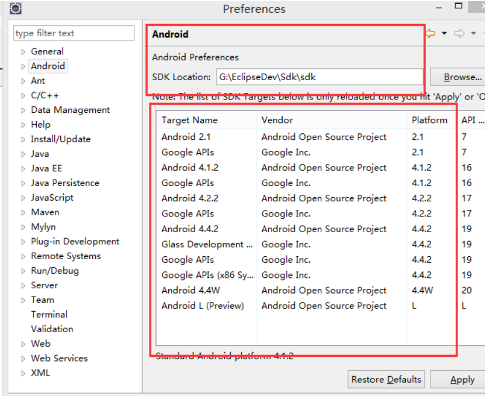 
到这里，我们在``windows``上的``Android``上的开发环境搭建就完成了，这时候，你用``Eclipse``的``File——》New——》Project...``新建一个项目的时候，就会看到建立``Android``项目的选项了。 
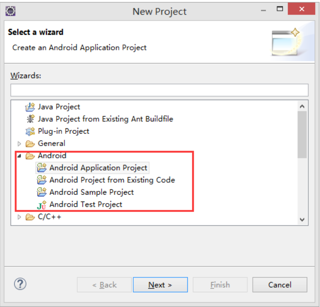 
