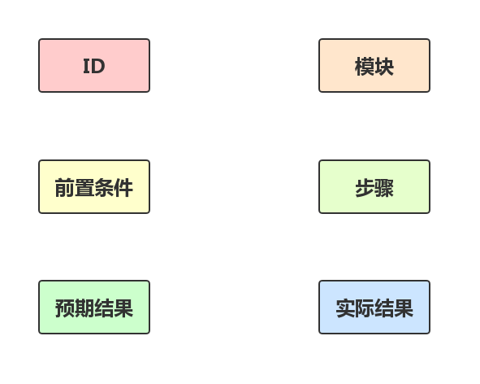
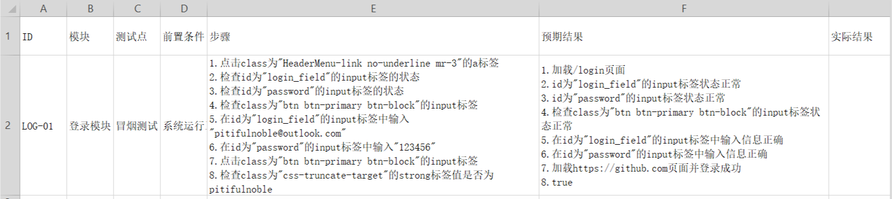
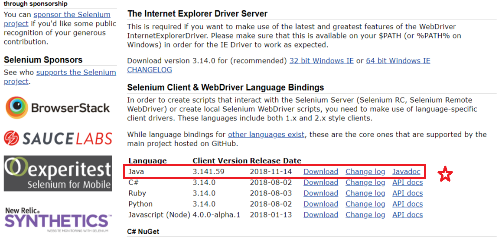
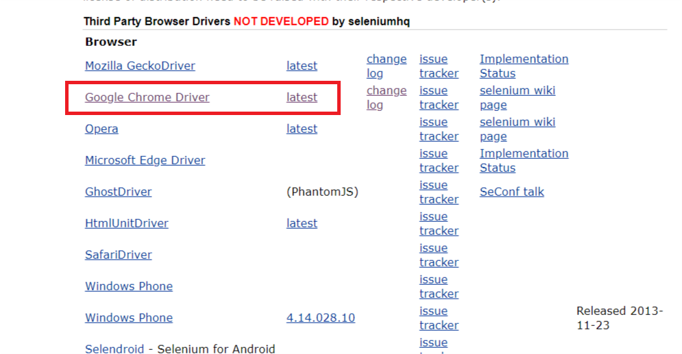

# 1.自动化测试的基本理论

## 1.1.常见的测试流程
<br>

## 1.2.自动化测试用例的要点
<br>

### 1.2.1.自动化测试用例编写举例
<br>

# 2.自动化测试环境搭建
selenium+java<br>

## 2.1.搭建Java开发环境下载eclipse
首先搭建好[JAVA开发环境JDK](https://github.com/pitifulnoble/computer_net/blob/master/JAVA/01JAVA%E5%9F%BA%E7%A1%80/01.%E7%8E%AF%E5%A2%83%E6%90%AD%E5%BB%BA.md)<br>

## 2.2.下载selenium工具
我们以Chrome为例:<br>
在selenium官方网站[https://www.seleniumhq.org/download/](https://www.seleniumhq.org/download/)<br>下载工具<br>

### 2.2.1.下载java语言工具包
<br>

### 2.2.2.下载Chrome浏览器的Driver
<br>

## 2.3.编写测试用例

### 2.3.1.新建Java工程并引入jar包
jar包就在2.2.1中下载的压缩包中<br>

### 2.3.2.编写测试代码
```java
package com.noble;

import org.openqa.selenium.WebDriver;
import org.openqa.selenium.chrome.ChromeDriver;

public class Demo {
	public static void main(String[] args) {
		System.setProperty("webdriver.chrome.driver", "E:\\tools\\eclipse\\selenium\\chromedriver.exe");
		WebDriver driver = new ChromeDriver();
		driver.get("https://www.github.com");
	}
}
```

其中:<br>
```
System.setProperty("webdriver.chrome.driver", "E:\\tools\\eclipse\\selenium\\chromedriver.exe");
```
第一个参数是固定写法,第二个参数是Driver的路径<br>

### 2.3.3.运行测试用例
查看结果<br>
<br>