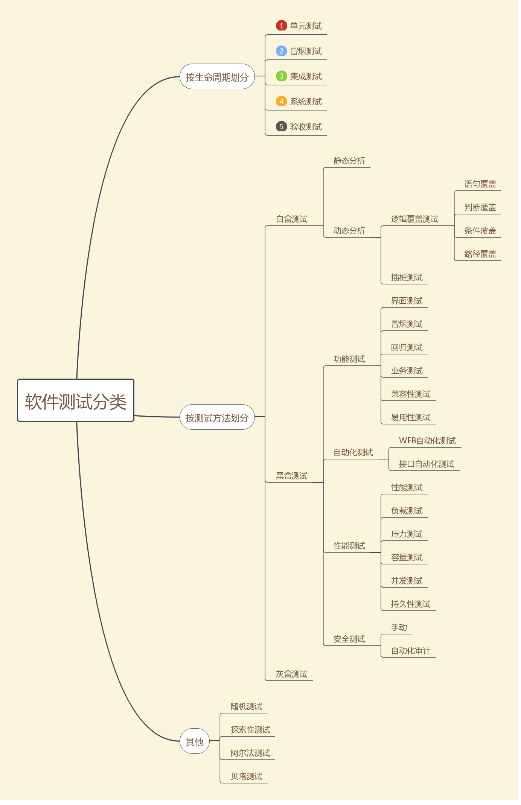

# 软件测试

## 1.软件测试的概念
### 1.经典定义
软件测试(Software Testing),在规定的条件下对程序进行操作，以发现程序错误，衡量软件质量，并对其是否满足设计要求进行评估的过程。 

### 2.标准定义
软件测试是使用人工或自动的手段来运行或猜测某个软件系统的过程，其目的在于检测它是否满足规定的需求或弄清预期结果与实际结果之间的差别。 

### 3.软件测试的目的
软件测试的目的在于发现问题，检测系统是否满足需求。 

## 2.软件测试方法和分类
 

#
