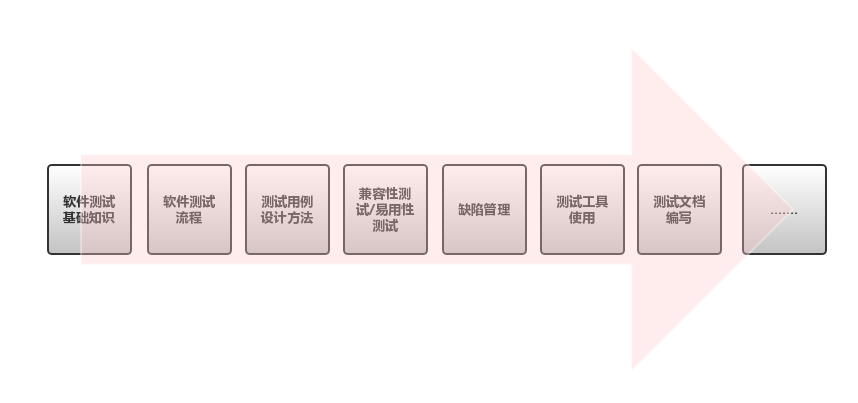
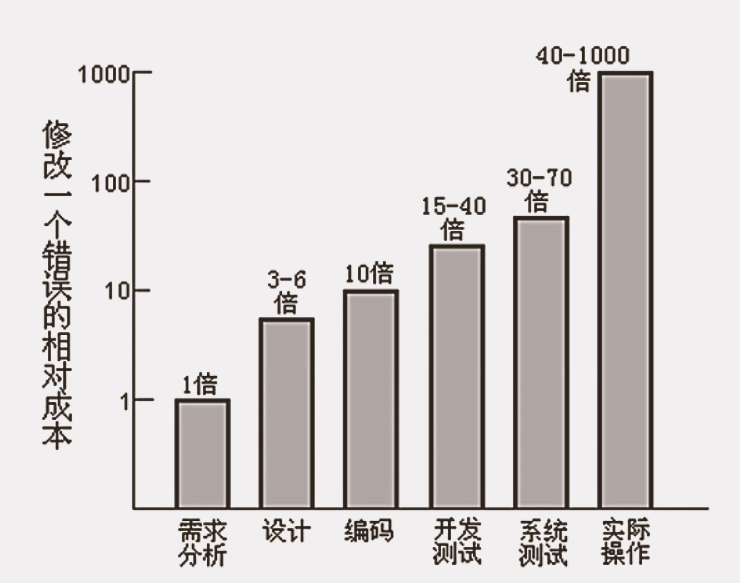

# 软件测试原则

## 1.软件测试人员需要掌握的知识体系
 

## 2.软件测试原则1
#### 所有的测试都应追随到用户需求
“产品缺陷的80%以上是在产品开发过程中的需求定义阶段引入的，如果需求得到了准确的验证，则可以消除80%的返工问题，节省总项目投入费用的45%” 

## 3.软装测试原则2
#### 尽早启动测试工作
 

## 4.软装测试原则3
#### Pareto法则应用于软件测试
Pareto法则是由意大利经济学家pareto提出的，又称为28效率法则。 
测试中的Pareto法则是说一般情况下，在分析、设计、实现阶段的复审和测试工作能够发现和避免80%的缺陷，而系统测试又能找出其余缺陷中的80%，最后4%的缺陷可能只有在用户的大范围、长时间使用后才会暴露出来。 

## 5.软件测试原则4
#### 穷尽测试是不可能的
由于很少有机会对一个应用软件进行所有可能的测试，对大多数软件开发项目来说，利用风险分析是适当的。这需要判断技能、常识、感觉和经验。如果有正当利用，也可以采用正式的方法。 

## 6.软件测试原则5
#### 杀虫剂怪事
为了克服杀虫剂怪事，软件测试员必须不断编写不同的、新的测试程序，对程序的不同部分进行测试，以找出更多的软件缺陷。 

## 7.软件测试原则6
#### 前进两步，后退一步
测试中的一个基本问题是————缺陷修复总会以(20-50)%的几率引入新的缺陷。 
每次修复之后，必须重新运行先前所有的测试用例，从而确保系统不会以隐蔽的方式被破坏。 

## 8.软件测试原则7
#### 三心二意
细心、信心、耐心 
团队合作的沟通意识、时刻保持怀疑的态度且有缺陷防御意识。 

#
