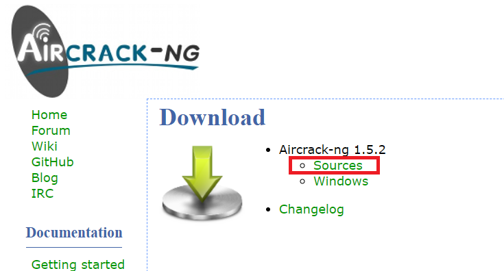

# 使用 Aircrack-ng 暴力破解 WPA/WPA2 加密的 WiFi
## 1.写在前面
目前，主流的 WiFi 加密方式是 WPA/WPA2，使用 Aircrack-ng 工具可以捕获 WPA/​WPA2 握手包并对其进行暴力破解。本文介绍如何使用此工具来对附近的 WiFi 进行监听、抓包和暴力破解。<br>

感兴趣的读者可以提前学习一下 WPA/​WPA2 加密方式的细节，以及无线监听的原理。<br>

在这篇文章中，我们自己建立一个 WPA/​WPA2 加密的、密码不是很强的 WiFi 热点作为我们的目标，然后使用 Air­crack-ng 工具对其进行破解并拿到口令（即 WiFi 密码）。<br>

本文中破解 WiFi 的方法仅用于学习和交流，不得用于非法用途！<br>

## 2.准备
必备环境<br>
```
1.支持监听模式的无线网卡；
2.运行 Linux 的设备（本文以 VMware 虚拟机下的 Centos 为例）；
3.一个包含了常见弱口令的字典。
```

## 3.安装 Aircrack-ng 套件
### 3.1.apt直接从软件源安装
```
sudo apt install aircrack-ng
```

### 3.2.centos源码安装
去官网[https://www.aircrack-ng.org/](https://www.aircrack-ng.org/)<br>
<br>
安装方法也在官网<br>

## 4.开启监听模式
#### 1.首先执行以下命令查看网卡信息：
```
iwconfig
```