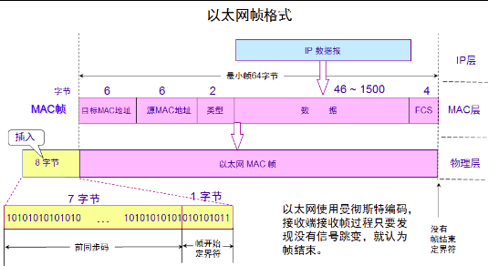

# 数据链路层
## 1.数据链路层要实现3个功能
封装成帧、透明传输、差错检验 

**透明传输的概念** 

帧有开始符(SOH)结束符(EOT)，如果在数据中有开始符和
结束符，数据数据链路层就会加入转移字符(ESC)

## 2.数据链路层协议
对于数据链路层，通过介绍两个简单的协议来了解。 
一个是路由直接通过PPP协议实现传输，还有一个是局域网中的CSMA/CD协议 
## 4.2点到点
__PPP协议__ 
 - 1.简单      不提供可靠传输
 - 2.封装成帧   首部和尾部 帧开始符帧结束符
 - 3.透明传输 加转译字符 受到后去除转译字符
 - 4.差错检验 CRC计算FCS
 - 5.支持多种网络层协议 IPV4 IPV6或其他网络层协议都可以封装到PPP帧中
 - 6.多种类型链路  光纤 铜线 同步传输 异步传输 串行，并行均可
 - 7.检测连接状态
 - 8.最大传输单元 默认1500字节
 - 9.网络层地址协商 能够为拨号的一端分配IP地址 子网掩码 网官和DNS
 - 10.数据压缩传输

透明传输：帧开始字符 帧结束字符 
补充知识： 
 - 同步传输 以帧为单位传输  PPP协议使用0比特填充 凡是发现有5个连续的1就插一个0 (01111110)7E
 - 异步传输 以字节为单位传输 PPP协议使用字节填充 把一个字节拆成2半加D5

__PPP协议__ 
 
使用wireshark抓包时，定界符7E是看不到的在网卡处
被过滤，同样被过滤的还有FCS。 

## 4.2广播信道的数据链路层
对于以太网的概念，有些是这样定义的：使用CSMA/CD带冲突检测的载波侦听多路访问技术通信是以太网(每个地址都有mac地址。) 
**我们要分清局域网和以太网的区别**
局域网是按地域大小划分的，比如一个家就可以使一个局域网。 

但是我们想一个问题，如果一个局域网的所有终端连接的都是交换机，根本没有用到集线器(意思是说，局域网中的计算机发出的非广播数据包，是不会传送到非目标主机上(被交换机阻塞))，那么就没有用到CSMA/CD协议，对于这种网络我们有时也习惯称为以太网。 

__2.冲突解决方法：退避算法__ 
为了实现退避算法，以太网中有最短帧 512b也就是64个字节 
512b可以满足最大传输距离是5000m，而局域网实际不会达到这么远，所以512b足够 
__3.以太网帧没有结束字符编码因为使用的是曼彻斯特编码__ 

__网卡的作用__ 
1.串行数据和并行数据转换 
2.数据链路层的功能，封装成帧，帧的差错检验和CSMA/CD 

__优化以太网__ 

网桥，减小冲突域，但增加了延迟(不多见了，一般直接用交换机，交换机直接接电脑) 

__以太网的帧格式__ 
 
 
