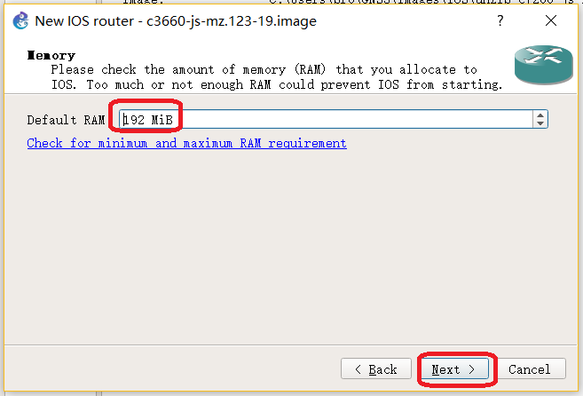

# 计算机网络学习环境搭建

## 1.VMware虚拟软件安装

## 2.Xshell软件安装
可以同时安装上xftp，在官网可以下载免费版。 
[https://www.netsarang.com/download/main.html](https://www.netsarang.com/download/main.html) 

## 3.wireshark软件安装

## 4.GNS3软件安装
从官方网站上下载最新的GNS3软件。 
[https://www.gns3.com/](https://www.gns3.com/) 

在安装过程中会有选择安装组件的步骤。如下： 
 
对组件做一下简要说明： 
- WinPCAP: 抓包必须组件之一，需要安装，如果已经安装可以忽略
- Wireshark:非常优秀的开源抓包工具，如果已经安装可以忽略
- SolarWinds Response Time Viewer for Wireshark:Wireshark的辅助分析工具，需要在线下载，文件大，耗时长，不必安装
- Dynmips:一个用于模拟思科路由器的工具，必须安装
- QEMU:模拟器的自由软件，必须安装
- VPCS:GNS3中的模拟客户端的工具，必须安装
- Cpulimit:一款限制CPU进程的工具软件，可以优化系统资源的占用率
- GNS3:GNS3的核心组件，必须安装

总上，除了SolarWinds Response Time Viewer for Wireshark之外的其他组件全部勾选。 

## 5.GNS3基本配置

### 1.第一步
首先启动GNS3。 
从菜单栏中选择Edit选项中的Preference，打开CNS3参数设置窗口，然后点击General菜单项并单击General选项卡，可以设置项目保存位置，窗口的显示风格等。 
 

对于当前版本，路由器的镜像保存文件在binary images： 
 

### 2.第二步
关联xshell和Wireshark软件 
从Preferences窗口中单击General菜单项，选择Console applications选项卡，可以设置访问路由器控制台端口时使用的终端软件。当然也可以使用GNS3自带的终端软件，不过使用不太方便 
 

配置Wireshark软件的路径： 
 

### 3.第三步
创建一个路由器，在这里我们需要Cisco路由器的系统镜像。我们用3640路由器模拟。 
 
 
上面的这一步点击Yes会将image保存到GNS3默认的img的路径中，在当前环境下就是之前提到的``C:\Users\pro\GNS3\images`` 
 

 
在这里我们给路由器系统命名，我们使用的3660系统，所以platform选择了3600，在下面的chassis选择3660，名字我们给的是c3660，这样当我们使用时，一眼就知道这个路由器的系统了。  

 
 
这一步我们选择路由器的接口，包括串口和并口，这在后期可以更改。  

 
计算idle值，目的是使用模拟器控制路由器模拟时，不会占用过多资源。非常重要。 
然后点击finish，我们的路由器就创建好了。 

# 2.GNS3高级环境搭建
IOU模拟。我们模拟使用路由器会占用很多CPU资源，而且不能模拟三级路由和二层交换。但在GNS3的新版本中存在IOU的虚拟系统来实现这些功能，同时让CPU的占有率最小。 
我们要从GNS3官网下载``GNS3 VM`` 

## 1.环境准备
- 1.虚拟机软件，这里使用``vmware workstation``
- 2.SSH连接终端软件，这里使用``xshell``

## 2.导入虚拟机
__第一步：__ 
打开VMware，把下载下来的系统直接导入到VMware中即可。 

__第二步：__ 
把网络适配器的模式换为NAT模式。 
__这里排个坑：__ 
我们要把vm的CPU虚拟化允许开开： 
 
否则，你在允许系统时会告诉你KVM不可使用。 
并开启虚拟机。 

下面的文档详细介绍了如果建立一个在虚拟机中运行的路由器： 
[https://docs.gns3.com/1wdfvS-OlFfOf7HWZoSXMbG58C4pMSy7vKJFiKKVResc/](https://docs.gns3.com/1wdfvS-OlFfOf7HWZoSXMbG58C4pMSy7vKJFiKKVResc/) 

特别说明的是：如果我们要在VM上面模拟交换器，我们可能会遇到``License section not found in iourc file /tmp/tmpzfpom1n6/iourc``的错误，下面的文档给了详细的解答。 
[https://awal.pro/generate-cisco-iourc-license-on-gns3-vm-using-python-3/](https://awal.pro/generate-cisco-iourc-license-on-gns3-vm-using-python-3/) 
