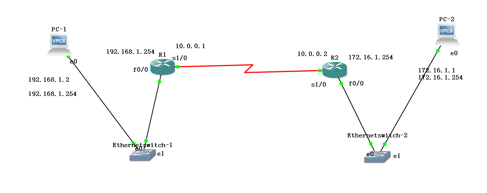
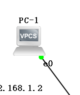

# 思科路由器管理


我们的配置是使用的是下面这个拓扑：<br>
<br>
## 1.GNS3简单的PC配置命令
<br>
GNS3的PC功能很少，我们之后用的更多的是虚拟机来做终端，对于GNS3上的PC我们只需要简单的了解一些基础配置就行。<br>
### 1.IP地址网关的配置命令：<br>
```
PC-1> ip 192.168.1.2 255.255.255.0 192.168.1.254
```

### 2.检查IP的配置命令show
```
PC-1> show ip

NAME        : PC-1[1]
IP/MASK     : 0.0.0.0/0
GATEWAY     : 0.0.0.0
DNS         :
MAC         : 00:50:79:66:68:00
LPORT       : 10006
RHOST:PORT  : 127.0.0.1:10007
MTU:        : 1500
```

### 3.保存IP地址的配置
```
PC-1> save
Saving startup configuration to startup.vpc
.  done
```

**以上这些命令就足够了**<br>


## 2.Cisco路由器的配置命令
关于路由器的配置，我们需要了解的有每个端口的IP设置，同时为了让每个端口知道路由的转发，需要配置路由表。<br>

### 1.端口配置
#### 1.我们要进入配置终端状态
```
R1#configure terminal
Enter configuration commands, one per line.  End with CNTL/Z.
R1(config)#
```

#### 2.我们要配置某一个端口
比如我们要配置快速以太网f0/0端口：<br>
```
R1(config)#interface fastEthernet 0/0
R1(config-if)#
```

退出当前配置状态使用exit命令：<br>
```
R1(config-if)#exit
R1(config)#
```

如果要配置串口s1/0：<br>
```
R1(config)#interface serial 1/0
R1(config-if)#
```

#### 3.配置快速以太网f0/0端口
我们进入到了快速以太网的配置端口终端，现在要配置一下IP等信息。<br>

##### 1.IP地址配置
```
R1(config-if)#ip address 192.168.1.254 255.255.255.0
```

##### 2.开启端口
```
R1(config-if)#no shutdown
R1(config-if)#
*Oct  4 10:22:22.571: %LINK-3-UPDOWN: Interface FastEthernet0/0, changed state to up
*Oct  4 10:22:23.571: %LINEPROTO-5-UPDOWN: Line protocol on Interface FastEthernet0/0, changed state to up
```

#### 4.配置快速广域网s1/0端口
##### 1.进入配置终端
```
R1(config)#interface serial 1/0
R1(config-if)#
```

##### 2.查看DCE和DTE设置
DCE 是时钟设置接口。DTE 是数据接收端口<br>
所以我们要在DCE端口配置时钟频率。<br>
```
R1#show controllers serial 1/0
M8T-X.21: show controller:
PAS unit 0, subunit 0, f/w version 3-101, rev ID 0x2800001, version 1
idb = 0x639E9BDC, ds = 0x639EB36C, ssb=0x639EB720
.................
line state: down
cable type : V.11 (X.21) DCE cable, received clockrate 2015232
..................
```
我们看到``cable type : V.11 (X.21) DCE cable,``表示这里是DCE线缆接口。<br>
我们要在这一端配置时钟频率。<br>

##### 3.配置时钟频率
频率可以设置为哪些呢？<br>
```
R1(config-if)#clock rate ?
  With the exception of the following standard values not subject to rounding,

	  1200 2400 4800 9600 14400 19200 28800 38400
	  56000 64000 128000 2015232

```
配置时钟频率：<br>
```
R1(config-if)#clock rate 64000
```

##### 4.配置IP端口
```
R1(config-if)#ip address 10.0.0.1 255.255.255.0
```

##### 5.启动端口
配置完上述信息我们再开启端口：<br>
```
R1(config-if)#no shutdown
R1(config-if)#
*Oct  4 10:35:04.999: %LINK-3-UPDOWN: Interface Serial1/0, changed state to up
*Oct  4 10:35:05.999: %LINEPROTO-5-UPDOWN: Line protocol on Interface Serial1/0, changed state to up
*Oct  4 10:35:31.379: %LINEPROTO-5-UPDOWN: Line protocol on Interface Serial1/0, changed state to down
```

### 2.路由表的配置

#### 1.检查当前的路由信息
```
R1#show ip route
Codes: C - connected, S - static, R - RIP, M - mobile, B - BGP
       D - EIGRP, EX - EIGRP external, O - OSPF, IA - OSPF inter area
       N1 - OSPF NSSA external type 1, N2 - OSPF NSSA external type 2
       E1 - OSPF external type 1, E2 - OSPF external type 2
       i - IS-IS, su - IS-IS summary, L1 - IS-IS level-1, L2 - IS-IS level-2
       ia - IS-IS inter area, * - candidate default, U - per-user static route
       o - ODR, P - periodic downloaded static route

Gateway of last resort is not set

     172.16.0.0/24 is subnetted, 1 subnets
     10.0.0.0/24 is subnetted, 1 subnets
C       10.0.0.0 is directly connected, Serial1/0
C    192.168.1.0/24 is directly connected, FastEthernet0/0
```
通过上面的信息我们可以看出来有两个connected(直连)网段。<br>

#### 2.静态路由表的配置：
路由表的配置在配置终端进行：<br>
```
R1(config)#ip route 172.16.1.0 255.255.255.0 10.0.0.2
```

删除路由的方法是在上面的命令前面加no<br>
```
R1(config)#no ip route 172.16.1.0 255.255.255.0 10.0.0.2
```


### 3.存盘
我们把上述配置信息配好后，要进行存盘，为了当路由器再次启动时，可以读取硬盘中的配置信息。<br>
下面的命令要在非配置终端状态执行：<br>
```
R1#copy running-config startup-config
Destination filename [startup-config]?
Warning: Attempting to overwrite an NVRAM configuration previously written
by a different version of the system image.
Overwrite the previous NVRAM configuration?[confirm]
Building configuration...
[OK]
```

### 4.检查Cisco路由器的配置信息
```
R2#show running-config
Building configuration...

Current configuration : 1543 bytes
!
version 12.3
service timestamps debug datetime msec
service timestamps log datetime msec
no service password-encryption
!
........
interface FastEthernet0/0
 ip address 172.16.1.254 255.255.255.0
 duplex auto
 speed auto
.........
interface Serial1/0
 ip address 10.0.0.2 255.255.255.0
 serial restart-delay 0
 clock rate 64000
.........
```


## 额外的命令
### 给路由器的某个端口加多个地址
在通常ip地址的添加命令后面加参数。<br>
```
R1(config-if)#ip address 192.168.1.254 255.255.255.0 secondary
```

### 配置动态路由
我们使用最原始和最简单的RIP动态路由协议实验：<br>
```
R1(config)#router rip                    #使用RIP动态路由协议
R1(config-router)#version 2              #使用RIP的v2版本
R1(config-router)#network 192.168.1.0    #确定哪个网段参与该动态路由协议
R1(config-router)#network 10.0.0.0       #确定哪个网段参与该动态路由协议
```

完成以上配置就实现了一台路由器的RIP动态路由协议设置。<br>


#
