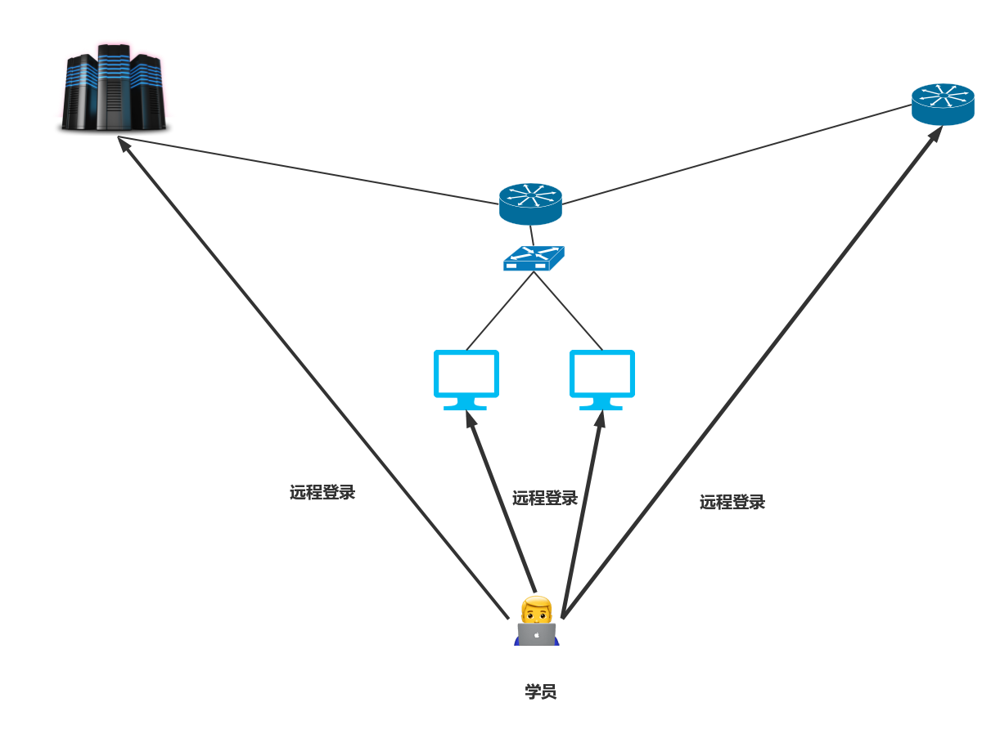
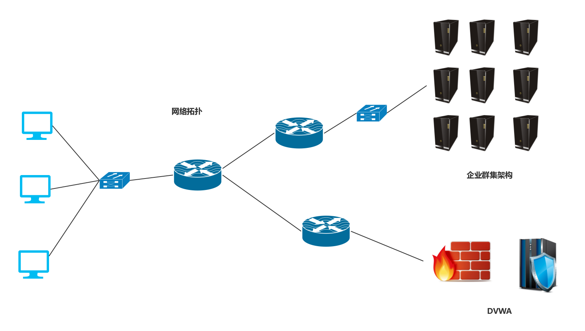

# 1.引言

## 1.1项目简介
网络安全实验室搭建平台项目(简称，网安实验室)，是一款基础性教学工具项目，为企业，学校培训员工和学生搭建的模拟实验环境，平台使用真实的Ciso路由器操作系统搭建网络拓扑图，使用LNMP群集架构模拟企业真实环境。成功解决在企业和学校教学中学员缺乏接触真实设备环境的问题。 

在现实的教学环境中，学员很少有机会接触真实的网络设备(如，交换机，路由器，群集架构等)，但像计算机网络、网络攻防等课程的学习只从书籍和课堂中学习，不去接触真实的物理设备，不自己去动手配置这些设备，那无异于纸上谈兵，而该项目很好的解决了这个问题，他的优势在于，设备的虚拟化，我们需要很少的硬件资源就可以模拟庞大的真实网络环境。学生可以自己登陆到任何一个网络设备进行学习。 

**典型应用场景** 
 

## 1.2项目需求

# 2.需求分析
#### 网络拓扑相关
一个完整的网络拓扑，包括各个局域网，公网规划和IP地址规划 
使用真实的Ciso路由器和交换机操作系统，在虚拟硬件环境上实现路由器和交换机。 
路由器使用相关协议并配置静动态路由确保链路通常 

#### 群集架构相关
使用9台服务器模拟完整的企业集群架构，足够接近真实网络环境 
群集业务的正常运行 

#### 靶机相关
使用LNMP架构搭建一塔DVWN网站服务器，模拟互联网中的漏洞主机。 

#### 软硬件相关
使用GNS3和VMware等软件相结合，足够真实实现计算机网络拓扑。 

## 2.2项目需求分析

## 2.3方案演示

# 3.网安实验室平台总体设计

## 3.1方案特点
- 方便性：使用很小的硬件资源模拟网络环境。
- 规范化：严格遵循各种相关规范设计。
- 最小耦合性：各子系统进行严格功能分解，每个子系统负责单纯的功能，互不干扰。
- 兼容性：兼容各种硬件平台、软件平台
- 灵活性：充分考虑未来业务、技术上的需求，在业务和技术变化时，可平滑升级。

## 3.2.方案架构

### 3.2.1方案原理
使用GNS3和CIso操作系统模拟计算机网络拓扑 
使用VMware软件搭建靶机和群集架构。 
将VMware中的虚拟机和GNS3网络拓扑各节点IP地址绑定。 

### 3.2.2方案部署效果图
#### 第一代作品
 

#### 第二代作品
第二代作品实现了虚拟化模拟Cisco的二级交换机，可以真正模拟现实中企业内部网络的架构。 
 

### 3.2.3方案模块关系

## 3.3方案子系统
### 3.3.1虚拟环境搭建
在已知的路由器和交换机操作系统都存在为了最大化的实现硬件资源的使用率的算法。这就给本地用真实操作系统模拟路由器等相关设备带来了的巨大的麻烦，因为操作系统的CPU资源和内存资源会极大的被这些模拟器占据，影响用户的体验。 
我们采用双层虚拟技术来解决这一难题，在虚拟机中虚拟路由器的硬件资源。 
该实现使用GNS3的虚拟操作系统GNS VM来搭建。 

### 3.3.1方案总系统

### 3.3.2方案总流程
