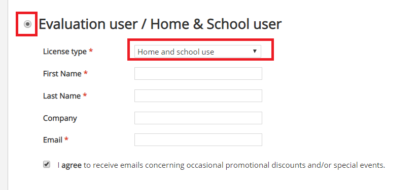

# 环境准备

## 里程碑一 软件安装
安装GNS3和VMware软件。 
GNS3安装地址：[https://www.gns3.com/software/download](https://www.gns3.com/software/download) 

VMware软件：可以在网上找破解方案，建议使用VMware12破解版(可以朝我要)，因为比较稳定。 

Xshell软件：[https://www.netsarang.com/download/down_form.html?code=622](https://www.netsarang.com/download/down_form.html?code=622) 
记得要选择免费的``Home and school use`` 
 

Xftp软件：[https://www.netsarang.com/download/down_form.html?code=623](https://www.netsarang.com/download/down_form.html?code=623) 
安装方式和Xshell一致。 

## 里程碑二 准备Linux系统
该项目使用CentOS6.9操作系统模拟企业群集架构。 

## 里程碑三 准备 集群架构环境统一规划

### 第一步
安装一台CentOS6.9的服务器 

### 第二步
使用Xshell软件连接上Linux系统，这一步自行查找资料解决。 

### 第三步
现在准备Linux系统的克隆模板： 
参考另一篇文档：[Linux系统模板机实现](https://github.com/pitifulnoble/computer_net/blob/master/Linux%E5%AD%A6%E4%B9%A0/%E7%9B%B8%E5%85%B3%E8%AE%BE%E7%BD%AE%E5%92%8C%E5%91%BD%E4%BB%A4/Linux%E5%9F%BA%E7%A1%80/03.CentOS%E4%BC%98%E5%8C%96_vm%E5%85%8B%E9%9A%86.md) 

## 里程碑四 准备路由器和交换机Ciso系统
地址：[https://pan.baidu.com/s/14Wm8yJODZoW7rSe7-TPjPg](https://pan.baidu.com/s/14Wm8yJODZoW7rSe7-TPjPg) 
密码：1ozs 
