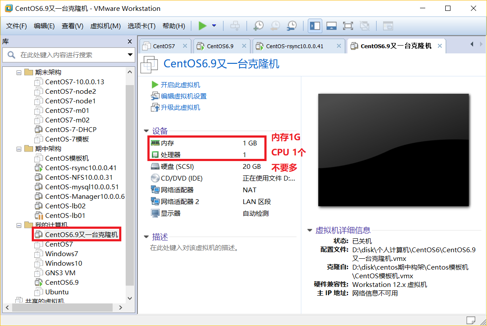

# 环境准备

## 里程碑一 软件下载安装
安装GNS3和VMware软件。<br>
GNS3安装地址：[https://www.gns3.com/software/download](https://www.gns3.com/software/download)<br>

VMware软件：可以在网上找破解方案，建议使用VMware12破解版(可以朝我要)，因为比较稳定。<br>

Xshell软件：[https://www.netsarang.com/download/down_form.html?code=622](https://www.netsarang.com/download/down_form.html?code=622)<br>
记得要选择免费的``Home and school use``<br>
<br>

Xftp软件：[https://www.netsarang.com/download/down_form.html?code=623](https://www.netsarang.com/download/down_form.html?code=623)<br>
安装方式和Xshell一致。<br>


准备路由器和交换机Ciso系统<br>
先下载下来就好。<br>
地址：[https://pan.baidu.com/s/14Wm8yJODZoW7rSe7-TPjPg](https://pan.baidu.com/s/14Wm8yJODZoW7rSe7-TPjPg)<br>
密码：1ozs<br>

## 里程碑二 准备Linux系统
该项目使用CentOS6.9操作系统模拟企业群集架构。<br>

## 里程碑三 准备 集群架构环境统一规划

### 第一步
配置VMware软件。<br>
我们首先做好搭建群集的准备工作。我们使用NAT网络端口配置所有虚拟机的网络，一下简单介绍一下NAT的工作原理。<br>

#### 1.NAT端口映射原理
NAT：中文名是 “网络端口映射”。<br>
在介绍NAT的概念时，先明确公网和私网的区别，私网就是我们熟悉的以192.168开头的网段，除了私网其他的IP地址都是公网(其实以172.开头的也是私网，一般在企业或计算机较多的场合使用)，我们知道在任何一个局域网中都可以使用私网，也就是说你的家里的网络可以是192.168开的的网络地址，你的公司也可以是192.168开头的网段，你的学校和宿舍也可以是192.168.168开头的网段。换言之在网络中可以有多个192.169169开头的。<br>
那么问题来了，我们知道计算机相互通信是依据IP地址进行通信的，每个计算机通过DNS把域名(如：百度的``www.baidu.com``)转换为IP地址(百度域名对应的IP地址：``220.181.111.188``)，而IP地址唯一的标识目标计算机的位置，这样我们的电脑就可以找到要通信的目标计算机了。但是网络上有那么多的192.168.开头的网段，我们的计算机是怎么找到目标主机的呢?<br>
这就是是使用了NAT技术了。我们想象把私网中的所有计算机全部圈起来，只给他们一个出口(路由器)，如下图：<br>
<br>
通过上图我们看到在私网中每个计算机如果要上网，都必须通过这个唯一的路由器，这就是网关的由来，而路由器却不止有一个IP地址，我们在图中开的这个路由器有两个IP地址，事实上路由器有几个端口就有几个IP地址。私网中的计算机访问外网(外网就是公网，同等概念)，路由器首先在本地寄一条记录，记录私网中的计算机的IP地址和端口号，然后将这个地址转换成公网地址，也就是上图中的``10.0.0.3``，然后使用这个公网地址访问外面的服务器。<br>
下面举一个例子方便大家理解：<br>
我们假设私网或者局域网中的计算机A(``192.168.0.4``)和计算机B(``192.168.0.6``)要和公网上的主机(``220.181.111.188``)通信。如下图：<br>

<br>
首先A计算机要和服务器通信，A计算机随便设置一个端口(我们假设是5050如上图)，他要找``220.181.111.188``IP地址的主机，发现和自己的网段不同，便把数据包发送给网关也就是路由器的``192.168.0.1``端口。这时路由器把数据包发送到自己的公网端口``10.0.0.3``公网端口将数据包中的源IP地址更改为自己的IP地址，也就是``10.0.0.3``，同时随即产生一个端口号(我们假设12345如上图)，然后把数据包发送出去。同时在本地维护一张表，表中记录着类似如图所示的信息``1--192.168.0.4:5050--10.0.0.3:12345``。当公网上的服务器返回给A计算机数据包时，将数据包发送到路由器的公网端口``10.0.0.3``同时目标端口号时``12345``。路由器查表发现，端口号是``12345``对应的是计算机A的IP地址``192.168.0.4:5050``，并将数据包中的IP地址和端口号改为``192.168.0.4:5050``。这样就实现了私网计算机和服务器之间的通信。<br>
计算机B和公网服务器通信也是这样的原理。所以对私网的计算机来说，它是不知道自己的通信还有NAT转换这一步，NAT端口映射对私网计算机是透明的。同样对公网服务器来说，A和B两个在同一个私网的计算机对自己的访问 源IP地址都是一样的在上图中是``10.0.0.3``，就好像是同一台计算机对自己的两次访问。以上就是端口映射的具体技术原理。<br>

#### 2.VMware网络配置
流程如下图：<br>
<br>
<br>
<br>
<br>
全部确定和应用。VMware网络配置就成功了<br>
我们可以检查一下：<br>
<br>


### 第二步
#### 1.配置CentOS6.9虚拟机。<br>
我们的CentOS虚拟机要使用两个网卡，一个私网一个公网，配置过程如下：<br>

首先将虚拟机关机。<br>
<br>
<br>
<br>
<br>

然后我们开启虚拟机<br>
#### 2.更改网络配置文件

##### 1.备份
```
cp /etc/sysconfig/network-scripts/ifcfg-eth0{,.bak}
cp /etc/sysconfig/network-scripts/ifcfg-eth1{,.bak}
```
如果提示没有``/etc/sysconfig/network-scripts/ifcfg-eth1``文件，就创建它。<br>
```
touch /etc/sysconfig/network-scripts/ifcfg-eth1
```
##### 2.修改
将``/etc/sysconfig/network-scripts/ifcfg-eth0``文件清空。<br>
将下面内容拷贝到``/etc/sysconfig/network-scripts/ifcfg-eth0``文件中<br>
```
DEVICE=eth0
TYPE=Ethernet
ONBOOT=yes
NM_CONTROLLED=no
BOOTPROTO=none
IPADDR=10.0.0.200
NETMASK=255.255.255.0
DNS2=223.6.6.6
GATEWAY=10.0.0.254
DNS1=223.5.5.5
USERCTL=no
PEERDNS=yes
IPV6INIT=no
```
将``/etc/sysconfig/network-scripts/ifcfg-eth1``文件清空。<br>
将下面内容拷贝到``/etc/sysconfig/network-scripts/ifcfg-eth1``文件中<br>

```
DEVICE=eth1
TYPE=Ethernet
ONBOOT=yes
NM_CONTROLLED=no
BOOTPROTO=none
IPADDR=172.16.1.200
NETMASK=255.255.255.0
USERCTL=no
PEERDNS=yes
IPV6INIT=no
```
完成上面的操作后执行如下命令：<br>
```
/etc/init.d/network restart
```
正常情况是会显示几个``[OK]``如果出错说明有问题，重新配置。<br>

**现在关闭防火墙**<br>
```
/etc/init.d/iptables stop
/etc/init.d/iptables stop
chkconfig iptables off
```


**关闭SElinux**：<br>
```
sed -i.bak 's/SELINUX=enforcing/SELINUX=disabled/' /etc/selinux/config
grep SELINUX=disabled /etc/selinux/config
setenforce 0
getenforce
```
执行最后一条命令会有disable输出，否则selinux关闭失败。<br>

这时使用本地主机ping地址10.0.0.200或者使用虚拟机ping百度官网，如果能ping通说明配置成功，如果不成功则配置失败。<br>
经过多次尝试，如果还是不成功就重装VMware，如果重装VMware不成功，就重装操作系统。<br>

### 第三步
使用Xshell连接虚拟机<br>

### 第四步
现在准备Linux系统的克隆模板：<br>
参考另一篇文档：[Linux系统模板机实现](https://github.com/pitifulnoble/computer_net/blob/master/Linux%E5%AD%A6%E4%B9%A0/%E7%9B%B8%E5%85%B3%E8%AE%BE%E7%BD%AE%E5%92%8C%E5%91%BD%E4%BB%A4/Linux%E5%9F%BA%E7%A1%80/03.CentOS%E4%BC%98%E5%8C%96_vm%E5%85%8B%E9%9A%86.md)<br>
上面文档中的每一步都要实现。<br>

### 第五步
创建克隆虚拟机<br>

#### 1.关闭CentOS虚拟机并做快照
关闭做快照后，给个适合的名字；<br>
<br>
模板机准备好后我们应该永远不会启动它了。<br>

现在开始克隆虚拟机：<br>
<br>
<br>
<br>
<br>
<br>
<br>

我们把这台虚拟机当做Rscyc服务器，做一个实例给大家：<br>
#### 2.给虚拟机改名
<br>
**注意名称的规划，必须包含Rsync字样和公网IP地址10.0.0.41**<br>
**现阶段所以服务器的IP地址规划和我保持一致**<br>


#### 3.优化克隆服务器
然后一路确认，并开机克隆好的虚拟机。<br>
虚拟机成功启动后，现在VMware里的中端登录,如下图(地址是10.0.0.41图中错误)。<br>
<br>
并执行命令``reboot``重启克隆好的虚拟机,因为克隆机的网络配置需要重启，**非常重要**<br>

重启之后使用Xshell连接上虚拟机，但要注意这个时候我们的克隆机的IP地址是``10.0.0.200``而不是``10.0.0.41``，如下图。<br>
<br>
<br>
顺利登陆上克隆机后我们要对这个克隆机做一下优化，让它变成我们的Rcync服务器。<br>
**1.更改主机名为rsync**<br>
```
hostname rsync
```
并修改配置文件``/etc/sysconfig/network``：<br>
```
NETWORKING=yes
HOSTNAME=rsync
```
**修改IP地址为10.0.0.41**<br>
```
sed -i 's#200#41#g' /etc/sysconfig/network-scripts/ifcfg-eth[10]
```
然后重启网卡服务：<br.
```
/etc/init.d/network restart
```
正常情况下我们的Xshell已经和服务器断开连接了，因为服务器的IP地址变成了``10.0.0.41``。<br>
我们用Xshell在创建一个连接来连接我们的Rsync服务器：<br>
<br>
<br>
成功连接！！！！！！！！！！！！！<br>

给刚配置好的克隆机做一个快照。<br>
这样我们的克隆工作就成功完成了。<br>


模仿上面的克隆操作再克隆8个服务器出来：<br>
<br>
<br>
完成所有的虚拟机的克隆操作。<br>


#
